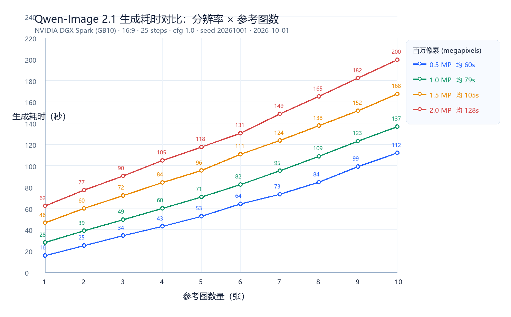

# Qwen-Image 2.1 分辨率 × 参考图数 生成耗时基准报告

> 测试日期：2026-10-01  
> 执行环境：NVIDIA DGX Spark（gx10-8e22 · GB10 · 128GB 统一内存）  
> 测试矩阵：**4 档百万像素（0.5 / 1.0 / 1.5 / 2.0）× 1–10 参考图 = 40 用例**  
> 结论：**40/40 用例全部成功（HTTP 200）**；档内耗时随参考图数线性增长，档间随像素量低幅上扬

---

## 一、测试环境与固定参数

```text
主机:     gx10-8e22（NVIDIA DGX Spark, GB10, 128GB unified memory）
服务:     comfyui_api_service.py @ http://127.0.0.1:6000
ComfyUI:  http://127.0.0.1:8188（v0.37.0）
模型:     qwen_image_2.1_int8_convrot + qwen3vl_8b_int8_convrot + qwen_image_2.1_vae_bf16

aspect_ratio: 16:9 (Widescreen)
megapixels:   0.5 / 1.0 / 1.5 / 2.0（四档）
steps:        25（生产档，未降步数）
cfg:          1.0
seed:         20261001（全矩阵固定）
提示词:       人数一致性模板（16:9 一字排开 + 逐人点名枚举，人数 = 参考图数）
参考图:       person_01–10.png（10 位互不相同女性人像，text2img 生成）
```

## 二、全矩阵结果（单位：秒）

| 参考图数 | 0.5 MP | 1.0 MP | 1.5 MP | 2.0 MP |
|---:|---:|---:|---:|---:|
| 1 | 15.8 | 28.0 | 46.4 | 62.2 |
| 2 | 25.2 | 38.9 | 59.9 | 77.1 |
| 3 | 34.4 | 49.4 | 72.0 | 90.4 |
| 4 | 43.2 | 60.1 | 84.4 | 105.0 |
| 5 | 52.6 | 70.8 | 95.6 | 117.6 |
| 6 | 64.3 | 82.4 | 110.9 | 130.6 |
| 7 | 73.2 | 95.2 | 123.7 | 148.8 |
| 8 | 84.5 | 108.9 | 137.6 | 165.0 |
| 9 | 99.3 | 123.2 | 151.6 | 182.3 |
| 10 | 112.0 | 136.7 | 167.6 | 199.5 |
| **均值** | **60.5** | **79.4** | **105.0** | **127.9** |
| 全档合计 | 604.5 | 793.6 | 1049.7 | 1278.5 |



## 三、规律分析

### 3.1 档内：耗时随参考图数严格线性

每增加 1 张参考图的边际耗时（首末差 ÷ 9）：

| MP 档 | 边际耗时/图 | 区间 |
|---|---:|---|
| 0.5 | +10.7s | 15.8 → 112.0s |
| 1.0 | +12.1s | 28.0 → 136.7s |
| 1.5 | +13.5s | 46.4 → 167.6s |
| 2.0 | +15.3s | 62.2 → 199.5s |

### 3.2 档间：相对像素量呈"低幅上扬"

以 0.5 MP 为基准换算放大倍数：

| MP 档 | 像素倍数 | 耗时倍数 | 说明 |
|---|---:|---:|---|
| 1.0 | ×2.0 | **×1.31** | 固定开销（排队/文本编码/传输）摊薄 |
| 1.5 | ×3.0 | **×1.74** | 计算主体近线性，固定项占比下降 |
| 2.0 | ×4.0 | **×2.11** | 略超线性，开始出现大图额外开销 |

### 3.3 输出文件大小随像素档同步增长

均值约 0.84MB（0.5MP）→ 1.64MB（1.0MP）→ 2.35MB（1.5MP）→ 3.25MB（2.0MP），
与像素量基本成正比，未见异常膨胀。

## 四、选型建议（与使用指南决策准则互证）

1. **1.0 MP 仍为首选默认**：构图稳健、单图 28–137s，性价比最高；
2. **1.5 MP 折衷档**：细节增强约 +32% 耗时（相对 1.0），适合特写与复杂纹理；
3. **2.0 MP 高清档**：耗时约 ×1.61（相对 1.0），10 图满载约 3.3 分钟/图，仅在明确需要微距质感时使用；
4. **0.5 MP 不建议**：速度虽最快，但指南决策准则明确画质会严重模糊涂抹——仅适合链路冒烟测试；
5. 多参考图场景预算公式（16:9 / 25 steps）：**耗时 ≈ 基准耗时(档) + 9 × 边际耗时(档)**，
   例：1.0 MP 十图 ≈ 137s（实测 136.7s，吻合）。

## 五、产物归档

```text
comfyui-bridge/q21_mp_benchmark_results_spark.csv   # 40 用例原始数据（mp|refs|endpoint|http|seconds|bytes）
comfyui-bridge/q21_mp_benchmark_chart.png           # 对比图（本报告图 1）
comfyui-bridge/run_mp_benchmark.sh                  # 可复现测试脚本
# 节点（gx10-8e22）
/home1/wuzi/Kelvoy/comfyui-bridge/output_image/q21_mp_benchmark_20261001/  # 40 张输出 PNG
/home1/wuzi/Kelvoy/comfyui-bridge/logs/q21_mp_benchmark.log                # 运行日志
```
