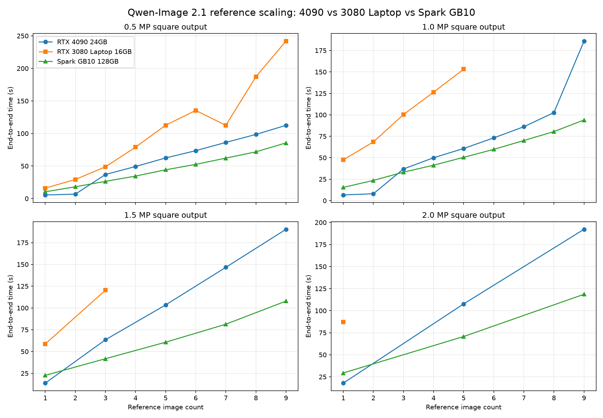

# Qwen-Image-2.1 Spark GB10 参考图数量梯度与三平台对比报告

日期：2026-09-29  
模型：Qwen-Image-2.1 int8 convrot  
测试对象：RTX 4090 24GB、RTX 3080 Laptop 16GB、Spark GB10 128GB unified memory。

---

## 1. 执行摘要

本轮在 Spark GB10 上完成了与 4090 相同计划的 Qwen-Image-2.1 参考图数量梯度测试：

```text
0.5MP: 1–9 参考图全量
1.0MP: 1–9 参考图全量
1.5MP: 1 / 3 / 5 / 7 / 9 参考图抽样
2.0MP: 1 / 5 / 9 参考图抽样
```

Spark 结果：

```text
26 / 26 成功
0 失败
无 OOM
无 ComfyUI 进程崩溃
无 NVIDIA 驱动复位
```

核心结论：

1. **Spark GB10 是三套环境中多参考图扩展性最好的平台。**
2. **单参考图时，4090 仍明显快于 Spark。**
3. **3 张以上参考图时，Spark 通常反超 4090。**
4. **高参考图 + 高分辨率场景下，Spark 优势最大。**
5. **Spark 的耗时曲线非常平滑，没有 4090 的 3 参考图断崖和 9 参考图第二断崖。**
6. **3080 Laptop 16GB 只适合低/中分辨率少量参考图；Spark 和 4090 均可覆盖 26 组计划，但 Spark 高负载速度更稳定。**

典型结果：

| 场景 | 4090 | Spark GB10 | 3080 Laptop |
|---|---:|---:|---|
| 1.0MP / 9 refs | 185.916 s | 94.004 s | 不稳定 |
| 1.5MP / 9 refs | 190.285 s | 107.860 s | 不稳定 |
| 2.0MP / 9 refs | 192.232 s | 118.574 s | 不稳定 |

---

## 2. 测试环境与方法

### 2.1 Spark 环境

```text
主机: gx10-8e22
系统: Linux aarch64
GPU: NVIDIA GB10
统一内存: 128GB
ComfyUI: 0.37.0
Python: 3.12.13
PyTorch: 2.12.1+cu130
ComfyUI API: http://192.168.199.107:8188
```

### 2.2 模型

```text
Diffusion Model:
qwen_image_2.1_int8_convrot.safetensors

Text Encoder:
qwen3vl_8b_int8_convrot.safetensors

VAE:
qwen_image_2.1_vae_bf16.safetensors
```

### 2.3 固定任务条件

```text
参考图: 9 张固定确定性彩色图形
seed: 20260928
steps: 10
CFG: 1.0
sampler: euler
scheduler: simple
TextEncodeQwenImage21.resolution: 1024
QwenImage21Cache.device: auto
QwenImage21Cache.dtype: default
```

对 `n` 张参考图的测试，始终使用前 `n` 张。

### 2.4 计时方式

本轮 Spark 测试直接连接 ComfyUI API，不经过 Flask 6000 桥接层，因此结果是 ComfyUI 生成耗时，不受 HTTP 桥接包装影响。

计时字段：

```text
wall_s:          提交 prompt 到 WebSocket 收到执行成功
pre_ksampler_s:  提交到 KSampler 开始前
ksampler_s:      KSampler 执行时间
post_ksampler_s: KSampler 结束到任务完成
```

正式测试前执行了一次不计入结果的 warmup：

```text
0.5MP / 1 ref / 1 step
耗时: 7.066 s
```

warmup 使用不同 prompt，避免正式任务被 ComfyUI 节点缓存跳过。

---

## 3. Spark 全量结果



### 3.1 0.5MP / 728×728

| 参考图数 | 端到端 | pre-KSampler | KSampler | post-KSampler | 状态 |
|---:|---:|---:|---:|---:|---|
| 1 | 10.396 s | 4.652 s | 5.067 s | 0.677 s | ✅ |
| 2 | 18.081 s | 10.451 s | 7.023 s | 0.607 s | ✅ |
| 3 | 26.421 s | 16.144 s | 9.613 s | 0.664 s | ✅ |
| 4 | 34.536 s | 21.628 s | 12.187 s | 0.721 s | ✅ |
| 5 | 44.182 s | 28.605 s | 14.861 s | 0.717 s | ✅ |
| 6 | 52.504 s | 34.449 s | 17.324 s | 0.730 s | ✅ |
| 7 | 62.142 s | 40.935 s | 20.168 s | 1.039 s | ✅ |
| 8 | 71.766 s | 47.876 s | 23.273 s | 0.617 s | ✅ |
| 9 | 85.516 s | 56.209 s | 28.679 s | 0.627 s | ✅ |

线性拟合：

```text
端到端 ≈ 9.182 × ref_count - 0.852
R² = 0.9948

pre-KSampler ≈ 6.348 × ref_count - 2.748
R² = 0.9970

KSampler ≈ 2.824 × ref_count + 1.235
R² = 0.9851
```

### 3.2 1.0MP / 1024×1024

| 参考图数 | 端到端 | pre-KSampler | KSampler | post-KSampler | 状态 |
|---:|---:|---:|---:|---:|---|
| 1 | 15.424 s | 4.719 s | 9.527 s | 1.178 s | ✅ |
| 2 | 23.571 s | 10.640 s | 11.805 s | 1.125 s | ✅ |
| 3 | 33.206 s | 16.939 s | 15.277 s | 0.991 s | ✅ |
| 4 | 41.283 s | 22.104 s | 17.813 s | 1.366 s | ✅ |
| 5 | 50.483 s | 28.295 s | 21.186 s | 1.002 s | ✅ |
| 6 | 59.749 s | 34.690 s | 24.313 s | 0.746 s | ✅ |
| 7 | 70.078 s | 41.429 s | 27.629 s | 1.020 s | ✅ |
| 8 | 80.482 s | 48.190 s | 31.153 s | 1.139 s | ✅ |
| 9 | 94.004 s | 55.855 s | 37.043 s | 1.106 s | ✅ |

线性拟合：

```text
端到端 ≈ 9.621 × ref_count + 3.926
R² = 0.9955

pre-KSampler ≈ 6.313 × ref_count - 2.357
R² = 0.9979

KSampler ≈ 3.322 × ref_count + 5.140
R² = 0.9890
```

### 3.3 1.5MP / 1256×1256

| 参考图数 | 端到端 | pre-KSampler | KSampler | post-KSampler | 状态 |
|---:|---:|---:|---:|---:|---|
| 1 | 22.632 s | 5.062 s | 15.726 s | 1.844 s | ✅ |
| 3 | 41.732 s | 16.628 s | 23.439 s | 1.664 s | ✅ |
| 5 | 60.676 s | 28.325 s | 30.772 s | 1.579 s | ✅ |
| 7 | 81.332 s | 41.142 s | 38.821 s | 1.369 s | ✅ |
| 9 | 107.860 s | 55.742 s | 50.106 s | 2.012 s | ✅ |

线性拟合：

```text
端到端 ≈ 10.503 × ref_count + 10.332
R² = 0.9947

pre-KSampler ≈ 6.294 × ref_count - 2.089
R² = 0.9975

KSampler ≈ 4.207 × ref_count + 10.737
R² = 0.9919
```

### 3.4 2.0MP / 1448×1448

| 参考图数 | 端到端 | pre-KSampler | KSampler | post-KSampler | 状态 |
|---:|---:|---:|---:|---:|---|
| 1 | 29.387 s | 4.731 s | 22.652 s | 2.003 s | ✅ |
| 5 | 70.675 s | 28.417 s | 40.091 s | 2.167 s | ✅ |
| 9 | 118.574 s | 55.843 s | 60.727 s | 2.003 s | ✅ |

线性拟合：

```text
端到端 ≈ 11.148 × ref_count + 17.137
R² = 0.9982

pre-KSampler ≈ 6.389 × ref_count - 2.281
R² = 0.9982

KSampler ≈ 4.759 × ref_count + 17.360
R² = 0.9977
```

---

## 4. Spark 性能变化分析

### 4.1 pre-KSampler 是多参考图的主要固定增量

不同分辨率下，pre-KSampler 拟合斜率几乎相同：

| 分辨率 | pre-KSampler斜率 | R² |
|---|---:|---:|
| 0.5MP | 6.348 s/张 | 0.9970 |
| 1.0MP | 6.313 s/张 | 0.9979 |
| 1.5MP | 6.294 s/张 | 0.9975 |
| 2.0MP | 6.389 s/张 | 0.9982 |

这说明参考图 TE 推理、参考图 VAE encode、reference latent 构建和 prefix 准备的成本主要由参考图数量决定，几乎不受目标输出分辨率影响。

### 4.2 KSampler 成本随目标分辨率上升

| 分辨率 | KSampler斜率 |
|---|---:|
| 0.5MP | 2.824 s/张 |
| 1.0MP | 3.322 s/张 |
| 1.5MP | 4.207 s/张 |
| 2.0MP | 4.759 s/张 |

目标图越大，每个参考图对 attention、prefix cache 和 target rows 计算的额外影响越大。

### 4.3 阶段占比

| 场景 | pre-KSampler占比 | KSampler占比 |
|---|---:|---:|
| 0.5MP / 1 ref | 44.7% | 48.7% |
| 0.5MP / 9 refs | 65.7% | 33.5% |
| 1.0MP / 1 ref | 30.6% | 61.8% |
| 1.0MP / 9 refs | 59.4% | 39.4% |
| 1.5MP / 1 ref | 22.4% | 69.5% |
| 1.5MP / 9 refs | 51.7% | 46.5% |
| 2.0MP / 1 ref | 16.1% | 77.1% |
| 2.0MP / 9 refs | 47.1% | 51.2% |

结论：

```text
单参考图时，目标 latent 计算是主瓶颈。
多参考图时，参考图编码与 prefix 准备逐渐成为主瓶颈。
```

### 4.4 Spark 没有明显性能断崖

4090 上出现过两个明显断崖：

```text
2→3 参考图断崖
1.0MP / 8→9 参考图第二断崖
```

Spark 上没有类似现象：

```text
0.5MP: 1→9 几乎线性，R² = 0.9948
1.0MP: 1→9 几乎线性，R² = 0.9955
1.5MP: 1/3/5/7/9 几乎线性，R² = 0.9947
2.0MP: 1/5/9 几乎线性，R² = 0.9982
```

这与 GB10 的 128GB 统一内存有关。Qwen prefix cache 和中间状态不需要像 24GB/16GB 独立显存设备那样在 GPU 显存与系统内存之间做激进换页。

---

## 5. 三平台对比

### 5.1 0.5MP / 728×728

| 参考图数 | 4090 | 3080 Laptop | Spark GB10 | Spark/4090 | Spark/3080 |
|---:|---:|---:|---:|---:|---:|
| 1 | 5.525 s | 16.040 s | 10.396 s | 1.88× | 0.65× |
| 2 | 6.789 s | 29.311 s | 18.081 s | 2.66× | 0.62× |
| 3 | 36.962 s | 48.802 s | 26.421 s | 0.72× | 0.54× |
| 4 | 49.242 s | 78.885 s | 34.536 s | 0.70× | 0.44× |
| 5 | 62.382 s | 112.579 s | 44.182 s | 0.71× | 0.39× |
| 6 | 73.525 s | 135.428 s | 52.504 s | 0.71× | 0.39× |
| 7 | 86.222 s | 112.556 s | 62.142 s | 0.72× | 0.55× |
| 8 | 98.535 s | 187.147 s | 71.766 s | 0.73× | 0.38× |
| 9 | 112.505 s | 241.886 s | 85.516 s | 0.76× | 0.35× |

说明：

```text
1–2 ref: 4090 最快。
3–9 ref: Spark 最快。
3080 在 0.5MP 可跑 1–9，但整体最慢。
```

3080 的 7 参考图耗时低于 6 参考图，因为其顺序测试在 7 参考图附近发生进程重启；7 参考图是在新进程中执行的，不能视为严格同进程连续曲线。

### 5.2 1.0MP / 1024×1024

| 参考图数 | 4090 | 3080 Laptop | Spark GB10 | Spark/4090 | Spark/3080 |
|---:|---:|---:|---:|---:|---:|
| 1 | 6.616 s | 47.575 s | 15.424 s | 2.33× | 0.32× |
| 2 | 8.029 s | 68.403 s | 23.571 s | 2.94× | 0.34× |
| 3 | 36.896 s | 100.257 s | 33.206 s | 0.90× | 0.33× |
| 4 | 49.964 s | 126.379 s | 41.283 s | 0.83× | 0.33× |
| 5 | 60.766 s | 153.216 s | 50.483 s | 0.83× | 0.33× |
| 6 | 73.132 s | 不稳定 | 59.749 s | 0.82× | — |
| 7 | 86.128 s | 不稳定 | 70.078 s | 0.81× | — |
| 8 | 102.634 s | 不稳定 | 80.482 s | 0.78× | — |
| 9 | 185.916 s | 不稳定 | 94.004 s | 0.51× | — |

结论：

```text
1.0MP / 9 refs:
Spark 比 4090 快约 1.98 倍。
3080 无法稳定完成。
```

### 5.3 1.5MP / 1256×1256

| 参考图数 | 4090 | 3080 Laptop | Spark GB10 | Spark/4090 | Spark/3080 |
|---:|---:|---:|---:|---:|---:|
| 1 | 13.698 s | 58.645 s | 22.632 s | 1.65× | 0.39× |
| 3 | 63.507 s | 120.367 s | 41.732 s | 0.66× | 0.35× |
| 5 | 103.463 s | 不稳定 | 60.676 s | 0.59× | — |
| 7 | 146.618 s | 不稳定 | 81.332 s | 0.56× | — |
| 9 | 190.285 s | 不稳定 | 107.860 s | 0.57× | — |

### 5.4 2.0MP / 1448×1448

| 参考图数 | 4090 | 3080 Laptop | Spark GB10 | Spark/4090 | Spark/3080 |
|---:|---:|---:|---:|---:|---:|
| 1 | 17.843 s | 87.150 s | 29.387 s | 1.65× | 0.34× |
| 5 | 107.661 s | 不稳定 | 70.675 s | 0.66× | — |
| 9 | 192.232 s | 不稳定 | 118.574 s | 0.62× | — |

---

## 6. 三平台能力与稳定性对比

| 项目 | RTX 4090 24GB | RTX 3080 Laptop 16GB | Spark GB10 128GB |
|---|---|---|---|
| 计划完成度 | 26/26 | 17/26 | 26/26 |
| 0.5MP / 1–9 | ✅ | ✅ | ✅ |
| 1.0MP / 1–9 | ✅ | 只稳定到 5 | ✅ |
| 1.5MP 抽样 | ✅ | 只稳定到 3 | ✅ |
| 2.0MP 抽样 | ✅ | 只稳定到 1 | ✅ |
| 单参考图延迟 | 最快 | 最慢 | 中等 |
| 多参考图速度 | 中等 | 最慢 | 最快 |
| 高分辨率多参考图 | 可用但有第二拐点 | 不稳定 | 最稳、最快 |
| 曲线形态 | 1–2 快速；3+ 断崖；1.0MP/9 第二断崖 | 高压力下崩溃 | 1–9 平滑线性 |
| 适用定位 | 交互式单图/少图编辑 | 低负载辅助卡 | 高参考图、高分辨率、重负载 |

---

## 7. 机制分析

### 7.1 为什么 4090 单参考图最快？

4090 拥有更高独立 GPU 算力。1–2 张参考图时：

```text
prefix 较小
QwenImage21Cache(auto) 可留在 GPU
后续 step 主要计算 target rows
```

因此 4090 能在几秒内完成 10 steps。

### 7.2 为什么 4090 多参考图出现断崖？

当参考图数量增加：

```text
prefix cache 变大
attention 序列变长
24GB 独立显存开始受限
cache auto 策略可能进入 CPU pinned / host-device 传输路径
```

因此 4090 在 3 参考图后和 1.0MP/9 参考图处出现明显拐点。

### 7.3 为什么 Spark 多参考图更平滑？

Spark GB10 有：

```text
128GB unified memory
无传统独立显存与系统内存之间的 WDDM 换页边界
```

因此 reference prefix、VAE latent、cache 和模型状态可以留在同一统一地址空间中。耗时主要来自真实计算，而不是 cache 换页。

### 7.4 为什么 Spark 单参考图不如 4090？

Spark 的单次推理吞吐仍不如 4090。例如：

```text
2.0MP / 1 ref:
4090 17.843 s
Spark 29.387 s
```

但参考图数量增加后，Spark 的统一内存优势抵消了单点算力劣势。

### 7.5 为什么 3080 高参考图不稳定？

3080 Laptop 只有 16GB VRAM，而 Qwen 模型文件合计约 17.28GB。再叠加 reference vision tokens、reference latents、prefix cache 和高分辨率目标 latent，高参考图任务会触发：

```text
Fault failed: 2
aimdo memory compile error
ComfyUI process exit
```

因此 3080 不能作为高参考图主力平台。

---

## 8. 调度建议

### 8.1 交互式单图或少图任务

推荐：

```text
RTX 4090
```

适合：

```text
1–2 张参考图
快速交互式编辑
低延迟图像生成
```

### 8.2 多参考图融合

推荐：

```text
Spark GB10
```

适合：

```text
3–9 张参考图
角色群像
多元素融合
复杂参考关系
```

### 8.3 高分辨率多参考图

推荐：

```text
Spark GB10
```

典型场景：

```text
1.5MP / 9 refs
2.0MP / 5–9 refs
```

Spark 均可稳定完成，且速度优于 4090。

### 8.4 3080 Laptop 定位

建议只作为辅助卡：

```text
0.5MP / 1–9 refs
1.0MP / 1–5 refs
1.5MP / 1–3 refs
2.0MP / 单参考图
```

不建议运行：

```text
1.0MP + 6–9 refs
1.5MP + 5–9 refs
2.0MP + 5–9 refs
```

---

## 9. 平台选择结论

```text
如果追求单次少参考图最低延迟:
选择 4090

如果追求 3–9 参考图、高分辨率、高稳定性:
选择 Spark GB10

如果只是低负载辅助生成:
可以使用 3080 Laptop

如果任务同时包含少图交互和多图批处理:
4090 负责交互式任务
Spark 负责高参考图批处理
3080 只做低负载兜底
```

综合排序：

### 多参考图生成能力

```text
Spark GB10 > RTX 4090 > RTX 3080 Laptop
```

### 单参考图延迟

```text
RTX 4090 > Spark GB10 > RTX 3080 Laptop
```

### 稳定承载高分辨率多参考图

```text
Spark GB10 ≈ RTX 4090 >> RTX 3080 Laptop
```

### 高参考图实际速度

```text
Spark GB10 > RTX 4090 >> RTX 3080 Laptop
```

---

## 10. 输出与原始数据

### Spark 原始结果

```text
F:\ComfyUI\q21_refscale_benchmark_results_spark.csv
F:\ComfyUI\q21_refscale_benchmark_results_spark.jsonl
```

### Spark 基准脚本

```text
F:\ComfyUI\benchmark_q21_refscale_spark.py
```

### 三平台合并数据

```text
F:\ComfyUI\q21_refscale_multi_platform.csv
```

### 三平台图表

```text
F:\ComfyUI\ComfyUI\output\q21_refscale\q21_refscale_spark_4090_3080_chart.png
```

### Spark 输出目录

```text
/home1/wuzi/ComfyUI/output/q21_refscale_spark/
```

---

## 11. 局限性

1. 每组只执行一次，没有多次重复取平均。
2. Spark 使用 10 steps 测量相对趋势，不等价于生产默认 25 steps。
3. Spark 正式测试前做了一次 1 step warmup；4090 此前服务也处于 Qwen 模型已加载状态；两者均非完全冷启动。
4. 3080 的 1.5MP/2.0MP 成功点来自独立进程 + 1 step warmup 方法，与 4090/Spark 的连续顺序测试方法不完全一致。
5. 3080 0.5MP / 7 参考图后的数据来自进程重启后的新进程。
6. 本轮重点是速度、扩展性和稳定性，没有重新做 PSNR / SSIM / IoU 质量评分。
