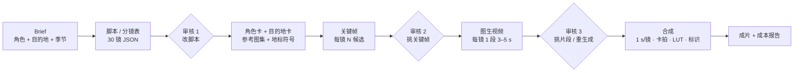
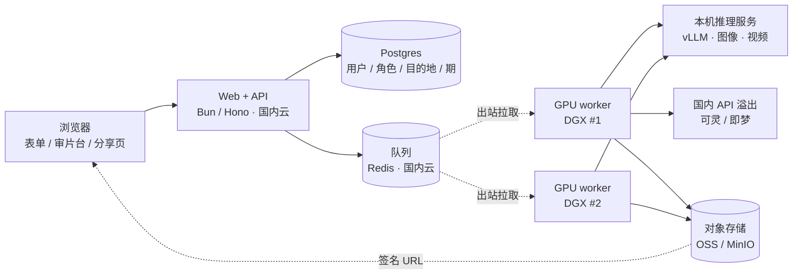

# AI 旅行 Vlog 生产工作台 PRD v0.1

2026-09-22 · @Someone

## 1. 产品定义与目标

一句话定义：一个对外销售的 AI 旅行 vlog 生产工具——用户定一个虚拟出镜角色，选一个旅游目的地（城市、景区、海岛、小镇），在三个节点做选择（脚本、关键帧、片段），得到一期 30 镜、约 30 秒、9:16 的目的地 vlog；同一角色走遍不同目的地，形成一个旅行账号的内容。

**为什么做**：两条参考片验证了"静帧锁一致性 + 1 秒一镜"的方法可稳定出片，而且两条片本质是同一件事——一个虚拟角色去不同地方；参考作者已把它当服务卖给各地 SNS 负责人，此前营销 Agent 那单的甲方也明确提过"AIGC 复刻 TikTok 内容"。需求存在，但市面工具不是"一键生成一条视频"就是"通用剪辑器"，没有人把"一个角色持续生产 vlog"做成产品。

**定位（差异点）**：不做通用 AI 视频生成器，做"虚拟角色 × 旅游目的地"的 vlog 生产——角色是账号级资产（人设、外形跨期一致），目的地是共享资产（地标、地方饮食、交通、住宿、季节的地域符号包），叙事骨架模板 + 三个审核点 + 成本可控。护城河不在模型，在角色资产、目的地库和跨期一致性：参考作者真正的本钱是对日本各地的了解，目的地库就是把这件事显式化、可复用。

**MVP 目标**

- 用户从 brief 到成片：操作 ≤ 30 分钟，等待 ≤ 2 小时
- 单期 GPU 时间 ≤ 30 分钟（H100 级单卡折算，M0 实测后修正）、溢出到国内 API 的费用 ≤ ¥20，这是定价空间的底
- 人物 / 服装 30 镜一致性人工评审通过率 ≥ 90%
- 上线 8 周内 10 个付费用户（种子来源见第 3 节）

**MVP 明确不做**

- 一键成片（无人工审核）——参考片本身也是人挑出来的
- 通用剪辑器：不做时间线编辑，只做分镜工作台
- 真人肖像、真实店铺（用户确认为自有店铺除外）
- 平台自动发布：导出 + 分享链接即可
- 团队协作、模板市场（P1）

## 2. 形态决策：skill / web / agent

结论：产品本体是 web（P0）；流水线引擎先做成命令行 / skill 供内部验证和批量出样片（M1，长期保留，不对外）；agent / API 接入放 P2，等有付费用户再做。三者共用同一引擎，web 只是壳。

| 形态 | 角色 | 阶段 |
| --- | --- | --- |
| Web 应用 | 产品本体：brief 表单、审片台、进度、积分、导出与分享 | P0，M2 上线 |
| CLI / skill | 内部工具：验证方法、跑模型评测、批量出样片做营销素材 | M1 先做 |
| Agent / API | 代运营团队批量接入、模板自动化 | P2 |

直说风险：通用"AI 视频生成"是红海——Google Vids、CapCut、Canva 在原生打包，AI video generator 站已经成堆。产品成立的前提是垂直到底：只做"虚拟角色 × 旅游目的地"的 vlog 这一种体裁，只对旅游博主账号和文旅机构这一类买家，用模板库积累别人抄不走的"叙事骨架 + 镜头语法"。所以 M0 之前不写 web 代码：先手工出 3 条样片，找 10 个目标用户验证付费意愿（第 10 节）。

## 3. 目标用户与 P0 场景

P0 用户是要持续产出旅游目的地内容、又不想或不能真人出镜的人：虚拟旅游博主账号、文旅机构与目的地营销方、服务文旅客户的代运营。市场是大陆，首批目的地：无锡（南长街、拈花湾、灵山大佛）、泰山、黄山这类——无锡做首发城市，本地能实拍参考图、能上门谈景区。

| 用户 | 痛点 | 用产品做什么 | 付费方式 |
| --- | --- | --- | --- |
| 虚拟旅游博主 / faceless 旅行账号 | 要周更，人设跨期一致，人去不了那么多地方 | 一个角色每周去 3–5 个目的地各出一期 | 月订阅 |
| 文旅机构 / 目的地营销（景区、地方文旅 SNS）——参考作者的买家 | 缺素材缺人手，要覆盖辖区内多个景点并持续更新 | 一个"本地向导"角色，按目的地库批量出辖区景点系列 | 月订阅 / 年度采购 |
| 服务文旅客户的代运营 / 广告工作室 | 拍摄成本高、交付慢、客户预算小 | 给每个文旅客户建一个角色，持续交付目的地 vlog | 月订阅（多角色） |
| 旅行社 / OTA / 民宿与景区运营（P1） | 需要线路或住宿的种草内容 | 用目的地模板出"线路一日""住宿一晚" | 按期 / 积分包 |

硬约束：所有输出带可见 AI 标识并注明"虚构角色、真实目的地"；公共地标（车站、地标建筑、寺社、商店街、海岸）允许并鼓励出现——观众要一眼认出目的地；私营店铺一律虚构（用户确认自有店铺除外）；不生成真人肖像。

## 4. 核心流程

六阶段流水线，三个人工审核点（脚本、关键帧、片段），每阶段每镜可单独重跑。



读法：不确定性全部压在 B–D 的静帧阶段（迭代便宜），E 只让模型"动一下"，F 用剪辑节奏收尾。

**关键帧阶段（D）的两种模式**

| 模式 | 做法 | 来源 | 取舍 |
| --- | --- | --- | --- |
| 逐镜生成（默认） | 先出横版 10 格网格做策划稿、锁一致性，再逐镜生成竖版关键帧 | 参考片一（名古屋） | 质量高、可控，图片调用量 ×2 |
| 网格直出（草稿） | 直接出竖版 10 格网格，裁切每格当关键帧 | 参考片二（濑户内，28 镜与网格一一对应） | 省一步、更便宜，分辨率受限需放大 |

**每个审核点的动作**

- 审核 1：改镜头顺序、动作、景别；删镜（参考片二从 30 镜删到 28 镜）
- 审核 2：每镜从 N 候选中点选一张，或标记重生成并改 prompt
- 审核 3：每段 3–5 s 视频里选 1 秒起点，或标记重生成

## 5. 功能需求

15 条 FR 按阶段排列，每条带可测的验收标准；FR-02 的叙事骨架、FR-03 的角色资产、FR-14 的目的地库和 FR-07 的 1 秒规则是这套方法的核心，用户不可配置掉。

| 编号 | 阶段 | 需求 | 验收标准 |
| --- | --- | --- | --- |
| FR-01 | Brief | 一期 = 选角色 + 从目的地库选目的地 + 季节 / 时段 + 语气 + 禁止项；可从模板预填 | 缺字段给默认值并在项目里标注 |
| FR-02 | 脚本 | LLM 按目的地类型选叙事骨架（名山登顶 / 城市街区夜游 / 主题小镇 / 大型景区 / 古镇水乡 / 海岛）生成 30 镜分镜表；每镜一个动作 beat；景别按 远 / 中 / 近 / 特写 / POV 轮换；地标镜头必须引用目的地库里的地标条目 | 通过 schema 校验；同景别不连续超过 2 镜；每镜动作 ≤ 1 个动词；≥ 5 镜出现可识别地标 |
| FR-03 | 角色资产 | 角色是账号级对象：固定文字描述 + 3–7 张参考图（正 / 侧 / 全身 / 细节）+ 默认穿搭与道具；每期可换穿搭，脸型、发型、体态锁定 | 同一角色跨期人工一致性评审通过率 ≥ 90% |
| FR-04 | 关键帧 | 每镜 N 候选（默认 2），9:16；地标镜头以目的地库的实景参考图为条件生成，不允许无参考的"想象地标"；支持逐镜模式与网格模式 | 候选进入审片台；失败自动重试 ≤ 2 次 |
| FR-05 | 审片台 | 网页并排候选：点选、标记重生成、改 prompt、选片段起点；地标镜头旁并排显示实景参考图便于比对；进度实时 | 一镜决策 ≤ 10 秒 |
| FR-06 | 视频 | 以选定关键帧为首帧生成 3–5 s；prompt = 动作 beat + 镜头运动；可选首尾帧插值做转场 | 每段可在线播放；坏镜由用户一键报告 |
| FR-07 | 合成 | 每镜截 1.0 s（0.8–2.0 可选）；卡拍；账号级统一 LUT；标题字样（目的地名）；AI 标识水印 + 元数据；配乐；输出 1080×1920 30 fps | 成片时长 = 镜数 × 单镜时长 ± 0.5 s |
| FR-08 | 状态 | 每镜独立状态机 draft → kf\_ready → clip\_ready → approved / rejected；任一镜任一阶段可重跑 | 重跑不动已 approved 的镜 |
| FR-09 | 成本 | 每次调用记录模型、耗时、费用；按期汇总为积分消耗；超额前拦截 | 积分记录与供应商账单误差 ≤ 10% |
| FR-10 | 模板 | 内置骨架按目的地类型（同 FR-02）；用户可把骨架、LUT、片头片尾存为私有模板 | 新的一期从模板起步 ≤ 5 分钟 |
| FR-11 | 账号 | 注册登录、角色列表、期列表、积分余额与消耗明细、积分包购买 | 积分不足在提交前拦截 |
| FR-12 | 交付 | mp4 下载、分享链接（可关闭）、分镜表 PDF | 分享页不含账号信息，可嵌入 |
| FR-13 | 系列与批量 | 一次提交 N 个目的地，用同一角色批量出 N 期；系列内自动沿用 LUT、标题样式、片头片尾 | 10 期批量提交后无需逐期配置 |
| FR-14 | 目的地库 | 每个目的地一个符号包：地标清单（每个地标 3–10 张实景参考图 + 最佳机位 / 时段 + 必须保真的特征）、动线、季节、地方饮食、交通、住宿；官方维护，首批：无锡（南长街、拈花湾、灵山大佛）、泰山、黄山 | 每个地标 ≥ 3 张实景参考图；一个新目的地入库 ≤ 1 个工作日 |
| FR-15 | 模板市场（P1） | 官方模板免费，用户模板可发布；目的地库开放用户提交，审核后入库 | MVP 不做 |

参考片印证：两条片的镜头语法完全同构（走近→拉门/进门→落座→器具→食物特写→吃或喝→抬头笑；渡轮→骑车→符号→食→宿→星空→睡），只换了地点符号和角色，FR-10 的模板就是把这个骨架显式化。

## 6. 数据模型

三个核心对象：角色（账号级，跨期复用）、目的地（共享资产，官方维护）、期（一次生产）。都是 Postgres 一条记录 + 对象存储一个目录，字段可扩但不可删；期里的 shots 数组是流水线的工作面。目的地示例里的具体条目是示意，入库前逐条核实。

```json
// 角色（账号级资产）
{
  "persona_id": "c_001",
  "owner_id": "u_123",
  "name": "小岛",
  "desc": "30 岁男性，短发，中等身材，温和表情",
  "locked": ["脸型", "发型", "体态"],
  "default_outfit": "浅灰亚麻衬衫，卡其长裤，帆布斜挎包，挂脖相机，白球鞋",
  "refs": ["persona/c_001/front.png", "persona/c_001/side.png", "persona/c_001/full.png"],
  "style": { "lut": "lut/warm_film.cube", "title_style": "serif-center" }
}

// 目的地（共享资产，官方维护）——示例，条目待核
{
  "destination_id": "d_wuxi_lingshan",
  "name": "灵山大佛", "city": "无锡", "type": "大型景区",
  "season_best": ["春", "秋"],
  "landmarks": [
    { "id": "l1", "name": "灵山大佛", "refs": ["dest/lingshan/buddha_01.jpg", "dest/lingshan/buddha_02.jpg"],
      "best_time": "上午顺光", "must_keep": ["比例", "手印", "莲花座"] },
    { "id": "l2", "name": "九龙灌浴", "refs": ["..."], "best_time": "表演时段" },
    { "id": "l3", "name": "梵宫", "refs": ["..."], "best_time": "室内" }
  ],
  "route": ["山门", "九龙灌浴", "登阶", "大佛", "梵宫"],
  "food": ["素斋", "无锡小笼"],
  "transport": "地铁 + 公交 / 自驾",
  "stay": "景区周边民宿"
}

// 期（一次生产）
{
  "episode_id": "e_20260922_0001",
  "persona_id": "c_001",
  "destination_id": "d_wuxi_lingshan",
  "series_id": "s_wuxi",
  "credits_used": 42,
  "share": { "enabled": true, "slug": "wuxi-lingshan" },
  "brief": {
    "season": "秋", "aspect": "9:16", "duration_s": 30,
    "tone": "松弛", "outfit_override": null,
    "banned": ["私营店名", "真人", "可读文字"]
  },
  "template": "scenic-area-day",
  "scenes": [
    { "id": "s1", "name": "到达", "time": "morning", "landmarks": [] },
    { "id": "s2", "name": "登阶见佛", "time": "noon", "landmarks": ["l1"] },
    { "id": "s3", "name": "梵宫与素斋", "time": "afternoon", "landmarks": ["l3"] }
  ],
  "shots": [
    {
      "no": 7, "scene": "s2", "size": "wide", "beat": "仰望大佛",
      "camera": "push", "landmark": "l1",
      "kf_prompt": "...", "motion_prompt": "...",
      "duration_s": 1.0,
      "candidates": ["kf/07_a.png", "kf/07_b.png"], "kf_selected": "kf/07_a.png",
      "clip": "clip/07.mp4", "trim_start_s": 0.4,
      "status": "approved", "cost_usd": 0.42,
      "model": { "image": "...", "video": "..." }
    }
  ],
  "music": { "file": "music/track.mp3", "bpm": 60, "license": "..." },
  "render": { "res": "1080x1920", "fps": 30, "title": "无锡 · 灵山", "ai_label": true }
}
```

枚举：`size` ∈ wide / medium / close / detail / pov；`camera` ∈ static / pan / push / follow；`status` ∈ draft / kf\_ready / clip\_ready / approved / rejected。`banned` 里的"可读文字"是硬规则：两条参考片的招牌、菜单都是幻觉字，默认用无字构图。

## 7. 模型与工具适配层

以自部署开源模型为主（跑在 2 台 DGX 上），国内商用 API 做弹性溢出和对照，海外闭源模型只用于内部对照评测，不进产品铽路。每个环节一个接口、多个实现；真实地标还原度和角色跨期一致性是最重要的评测项，M0 在 DGX 上用实景基准测。下表的开源候选按我目前掌握的版本列，M0 前重新核最新版本。

| 环节 | 接口 | 自部署开源（主，DGX） | 国内 API（溢出 / 对照） | 选型要点 |
| --- | --- | --- | --- | --- |
| 脚本 / 分镜 | brief + 目的地包 → shots JSON | Qwen3 / DeepSeek，vLLM 服务 | DeepSeek / Qwen / 豆包 API | 结构化输出 + schema 校验；地标条目必须来自目的地库，不许模型自己编 |
| 角色一致性 | 角色参考图 → 跨镜 / 跨期身份保持 | PuLID / InstantID 类 ID 保持适配器；Qwen-Image-Edit / FLUX Kontext 做参考编辑 | 即梦 / 可灵的参考图能力 | 跨期脸型一致是硬指标，单独评测，不和画质混在一起 |
| 关键帧 | text + 角色参考 + 地标实景图 → image 9:16 | Qwen-Image / FLUX.1 / HunyuanImage | 即梦 / 通义万相 / Seedream | 地标还原度基准（大佛比例、迎客松形态、清名桥结构）；可读文字关闭 |
| 图生视频 | image (+prompt) → video 3–5 s | Wan 2.x（I2V，VACE 做参考控制）/ HunyuanVideo I2V / CogVideoX | 可灵 / 即梦 / Vidu | 只用 1 秒；测每镜 GPU 分钟数、人物走动和地标不变形；最可能长期溢出到 API 的环节 |
| 放大 / 修复 | image / video → 高清 | Real-ESRGAN 类超分；RIFE 插帧 | — | 网格模式裁切后必经 |
| 音乐 | prompt → audio | ACE-Step / YuE 类开源音乐模型，或素材库授权曲 | — | 非关键路径，MVP 先素材库 |
| 合成 | files → mp4 | ffmpeg（自研） | — | 卡拍、LUT、标识、字幕全在 ffmpeg 里 |

**Omni 1.1 Flash 已核实的参数**（[Atlas Cloud 模型页](https://www.atlascloud.ai/models/google/gemini-omni-1.1-flash/reference-to-video)，2026-09-22）：单段 3–10 秒、支持 9:16、360p 草稿档、最多 10 张参考图保持角色一致、输出自带 SynthID 与 C2PA 标识；该平台标价 $0.037 / 秒。按每镜生成 3 秒算，30 镜一遍约 $3.3，翻倍返工也不到 $10——视频费用不是成本重心，人工挑片时间才是。其他平台按分辨率计价更高，M0 时逐一核。

溢出策略：DGX 队列排队超过阈值（初值 30 分钟）或单镜连续失败 2 次，自动切到国内 API 的同接口实现；每个 provider 记录 GPU 分钟或调用费用，供第 8 节 COGS 核算和第 5 节 FR-09 积分扣减。上面 Omni 的参数只作为海外对照的基线保留。

## 8. 非功能需求

七条硬约束，合规、内容安全和质量红线不可配置。

- **成本 / 毛利**：主路径在自有 DGX 上，COGS = GPU 时间（折旧 + 电费 + 运维）+ 溢出到国内 API 的调用费；目标单期 ≤ 30 GPU 分钟（30 镜 × 2 张关键帧候选 + 30 段 3–5 s 视频 + 50% 返工，H100 级单卡折算），溢出 API 单期 ≤ ¥20；积分按 GPU 分钟等价计价，定价 ≥ 5 × COGS；用户超额重生成扣积分，坏镜报告免费重生成一次。
- **时长**：提交后 ≤ 30 分钟拿到关键帧候选，全片 ≤ 2 小时；单用户并发 ≤ 2 个项目；单次模型调用超时 5 分钟进入重试。
- **可重跑 / 幂等**：每镜产物独立落对象存储；重跑跳过已 approved 的镜；记录 prompt、seed、模型版本、参考图哈希，成片可复现。
- **合规**：成片带可见 AI 标识 + 文件元数据（模型自带的 SynthID / C2PA 保留不剥离）；不生成真人肖像；不生成他人商标；音乐只用授权曲；按《人工智能生成合成内容标识办法》（2025 年 9 月起施行）加显式与隐式标识；网站上线前完成 ICP 备案；模型主要自部署在自有 DGX 上，对外提供服务时我们自己就是模型服务提供者，算法备案 / 大模型备案大概率落在自己头上，比套壳调第三方 API 更重；M2 前请专业人士核——这是上线前置条件，不是可选项。
- **内容安全**：上传参考图做人脸检测拦截真人；prompt 与产物过审（NSFW、未成年人、暴力）；违规账号封停。
- **质量红线**：人物 / 服装漂移、手部崩坏、可读幻觉文字、真实地标失真（大佛比例、迎客松形态、桥梁结构这类一眼能看出的错）、违反物理的动作（参考片里牛奶入黑咖啡出对称花纹）——命中任一条该镜标记重生成，不允许进入成片。
- **安全 / 数据**：多租户隔离；模型密钥只在 worker；用户素材默认 90 天后清理，付费用户可延长；分享页不暴露账号信息。

## 9. 技术架构与目录结构

MVP 是"云上 web + 队列 + 本地 DGX GPU worker 池 + 对象存储"：web、API、数据库放国内云（备案域名），2 台 DGX 在本地作为 GPU worker，只向外连队列拉任务、向对象存储推产物，不开任何入站端口。Bun/TS 写 web 与编排（与 tiktok-automation 同栈），模型推理是常驻的 Python 服务（vLLM + diffusers / ComfyUI API），worker 通过 HTTP 调本机推理服务。



读法：web 不碰模型；DGX 只做出站连接，公网上没有攻击面；一台 DGX 宕机容量减半但不停服，队列超阈值自动溢出到国内 API；ffmpeg 合成也在 worker 上跑。

```
vlog-factory/
  apps/web/              # 前端 + API：brief、审片台、角色、目的地库、积分、分享页（国内云）
  apps/worker/           # GPU worker（跑在 DGX）：拉队列、调本机推理服务、落对象存储、回写状态
  services/inference/    # Python 推理服务：llm(vLLM) · image(diffusers / ComfyUI) · video(Wan / Hunyuan) · upscale
  packages/engine/       # 流水线核心（worker / CLI 共用）：stages/  providers/  schema/  templates/
    providers/           # local-llm  local-image  local-video  kling-api  jimeng-api  …
  packages/cli/          # 内部工具：run <stage> --episode <id>
  infra/                 # 云：Postgres、Redis、OSS、备案域名；本地：DGX 容器编排、模型权重管理
```

**模块边界**

- `engine` 不做任何 IO 假设：输入期 JSON 与文件句柄，输出更新后的 JSON 与产物路径；worker 和 CLI 都只是调用方。
- `providers/*` 只做一件事：把统一接口翻译成本机推理服务或各家 API，记录 GPU 分钟或调用费用；换模型不改上层。
- `services/inference` 常驻加载权重，避免每次冷启动；GPU 按环节分配（LLM、图像、视频各占几张卡），比例 M0 实测后定。
- 审片台只改期 JSON 里的 `kf_selected / trim_start_s / status`，改完写一条任务进队列。
- `compose` 是唯一调用 ffmpeg 的地方，在 worker 上跑：切片、拼接、卡拍、LUT、字幕、标识、封装。
- 分享页静态化（成片 + 分镜表），不依赖登录态。

## 10. 里程碑与验收 Demo

五个里程碑，M0 到 M3 约 6–8 周；M0 不写一行产品代码——先手工出片、先找人付钱，方法或需求任一不成立，后面都不用做。

| 里程碑 | 交付 | 验收 | 工作量 |
| --- | --- | --- | --- |
| M0 需求与方法验证 | 照参考片的方法，用同一个角色手工做无锡 3 期（南长街夜游 / 拈花湾 / 灵山大佛），验证跨期一致性和真实地标还原度；先实拍三地的参考图建第一份目的地包；访谈 10 个目标用户（景区、文旅账号、本地代运营），记录付费意愿与价格锚点；用大佛、迎客松、清名桥做基准，在 DGX 上评测 2 个开源图像 + 2 个开源视频模型，同时测 1 个国内 API 作对照；记录每镜 GPU 分钟数 | ≥ 3 人愿意预付；一页选型结论（漂移率、地标还原度、每镜 GPU 分钟、失败率，开源 vs API 并排） | 1 周 |
| M1 引擎 + CLI | 六阶段流水线、providers（开源自部署 + 国内 API 溢出）、DGX 推理服务化与队列、schema、ffmpeg 合成、GPU 时间与费用记录，全部命令行 | 第二条片人工操作 ≤ 30 分钟；任一镜可单独重跑 | 1–2 周 |
| M2 Web MVP | 登录、积分、brief 表单、审片台、进度、导出、分享链接、3 个内置模板 | 10 个种子用户不经指导完整跑通一条 | 2–3 周 |
| M3 付费上线 | 微信 / 支付宝支付、定价页、落地页（同一角色 3 期 + 公开分享链接）、备案完成；冷启动：无锡景区与文旅账号上门 + 小红书 / 抖音旅行创作者社群 | 8 周内 10 个付费用户 | 1–2 周 + 持续运营 |
| M4 模板市场与团队（P1） | 用户模板发布、代运营多客户管理、API | 视 M3 数据决定 | 待定 |

**验收 Demo**：落地页上同一角色的 3 期 vlog 各带一个公开分享链接；一个陌生用户从注册到拿到第一条成片 ≤ 30 分钟操作，中途不需要人工指导。

## 11. 风险与开放问题

最大的风险是同质化和获客，不是技术：方法能出片已被参考片证明，但"能出片"不构成产品，模板库和目标用户的信任才是。

| 风险 | 影响 | 对策 |
| --- | --- | --- |
| 通用 AI 视频工具红海，大厂原生打包 | 无差异，被免费功能替代 | 只做"虚拟角色 × 真实目的地"这一种体裁；目的地库持续积累——模型别人抄得走，库抄不走 |
| 真实地标失真 | 观众和景区一眼看出假，账号信任崩 | 地标镜头必须以实景参考图为条件；质量红线单列；M0 用灵山大佛 / 迎客松 / 清名桥做基准 |
| 开源模型质量落后于商用 API | 人物动作、地标质量不够，返工率高 | M0 用同一基准并排测开源与国内 API；不达标的环节允许长期走 API（视频生成最可能），不硬扛 |
| 2 台 DGX 是单点 | 一台宕机容量减半，两台都挂即停服 | 队列超阈值自动溢出国内 API；镜像与权重在云 GPU 上冷备 |
| 自部署 = 自己是模型服务提供者 | 备案责任更重，上不了线 | 与 ICP、支付一起在 M2 前办完，找专业人士核 |
| 景区、文旅局对 AI 内容的态度 | 被要求下架，或反过来成为客户 | 先把景区做成客户（授权 + 联名账号），不做未经授权的商业投放；片头注明"虚构角色、真实目的地" |
| 获客成本高于客单价 | 亏损 | 无锡本地上门 + 样片即广告；文旅机构走年度采购 |
| 内容滥用：真人、私营店铺、虚假宣传 | 法律与平台风险 | 人脸检测拦截、AI 标识默认开、用户协议明确责任 |
| 内容空洞，用户做了没人看 | 留存差 | 模板强制带信息槽位（地标名 / 动线 / 时段 / 吃什么）；系列有账号级人设线 |

**开放问题**

- [ ] DGX 具体型号、显存、卡数、所在位置与公网带宽——决定并发容量、模型选型和产物回传速度
- [ ] 推理服务用 ComfyUI API 还是自研 diffusers 管线
- [ ] 哪些环节允许长期走国内 API（视频生成最可能）
- [ ] 首批目的地：无锡三地 + 泰山 + 黄山，M0 够不够？名山类和城市类各至少一个
- [ ] 目的地库谁来建：自建（实拍 + 授权图）还是用户共建？实景参考图的版权来源
- [ ] 备案路径：ICP 之外，自部署模型的算法 / 大模型备案怎么办，找谁核
- [ ] 支付与备案主体：用现有个体户还是新设公司
- [ ] 定价：按期、积分包还是订阅？文旅机构走年度采购？M0 访谈定锚点
- [ ] 种子用户：无锡景区 / 文旅账号 / 本地代运营，谁先上门
- [ ] 要不要先以"样片服务"收费验证需求，再做产品？这是参考作者的路径，也是 M0 的自然延伸
- [ ] 产品中文名与备案域名
