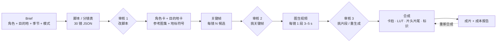
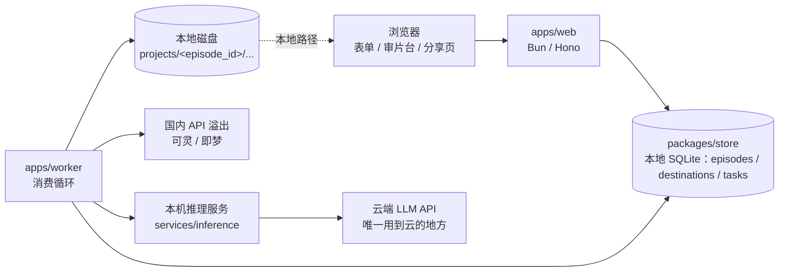

# AI 旅行 Vlog 生产工作台 PRD v0.2

2026-09-23 · 基于 v0.1（2026-09-22）+ 28 条缺口问答合并而成。v0.1 保留不动，文末 §12 是逐条变更表。

> **2026-09-23 补丁**：§6/§8/§9/§10 按 [ADR-0004](decisions/0004-local-sqlite-no-cloud-infra.md) 原地改过——MVP 不用云端基础设施（除了 LLM），数据存本地 SQLite（`packages/store`），产物存本地磁盘，任务队列是 SQLite 表不是 Redis，worker 和 web 之间没有 HTTP 内部 API。之前"云上 web + Postgres + Redis + 对象存储"的架构描述已替换，不再是当前设计。

## 1. 产品定义与目标

一句话定义：一个对外销售的 AI 旅行 vlog 生产工具——用户定一个虚拟出镜角色，选一个旅游目的地（景区级：一个景区一期），在三个节点做选择（脚本、关键帧、片段），得到一期 24–30 镜、约 30 秒、9:16 的目的地 vlog；同一角色走遍不同目的地，形成一个旅行账号的内容。

**为什么做**：两条参考片验证了"静帧锁一致性 + 1 秒一镜"的方法可稳定出片，而且两条片本质是同一件事——一个虚拟角色去不同地方；参考作者已把它当服务卖给各地 SNS 负责人，此前营销 Agent 那单的甲方也明确提过"AIGC 复刻 TikTok 内容"。需求存在，但市面工具不是"一键生成一条视频"就是"通用剪辑器"，没有人把"一个角色持续生产 vlog"做成产品。

**定位（差异点）**：不做通用 AI 视频生成器，做"虚拟角色 × 旅游目的地"的 vlog 生产——角色是账号级资产（人设、外形跨期一致），目的地是共享资产（地标、地方饮食、交通、住宿、季节的地域符号包），叙事骨架模板 + 三个审核点 + 成本可控。护城河不在模型，在角色资产、目的地库和跨期一致性。

**MVP 目标**

- 用户从 brief 到成片：操作 ≤ 30 分钟，单期等待 ≤ 2 小时（批量场景按单期计，见 §8）
- 单期 GPU 时间目标：待 M0 在 DGX Spark 上实测后定（v0.1 的"30 分钟 / H100 单卡折算"作废，硬件不是 H100）；溢出到国内 API 的费用 ≤ ¥20——口径是"整期所有环节都走 API"的上限，不是部分溢出的典型值，M0 按国内 API 实价复核
- 人物 / 服装一致性人工评审通过率 ≥ 90%：评审集 = M0 无锡 3 期全量（约 90 镜），内部 1–2 人逐镜按脸型 / 发型 / 体态 / 服装四项打分；以后每换模型重跑同一评审集
- 上线 8 周内 10 个付费用户（种子来源见第 3 节）

**MVP 明确不做**

- 一键成片（无人工审核）——参考片本身也是人挑出来的；批量出片也逐期过三个审核点
- 通用剪辑器：不做时间线编辑，只做分镜工作台
- 审核 1 新增镜（只能改、删；下限 24 镜）
- 自有店铺例外：私营店铺一律虚构，"自有店铺"核验放 P1
- 平台自动发布：导出 + 分享链接即可
- 团队协作、模板市场（P1）
- 微信 / 手机号登录、系统生成角色参考图、云厂商内容审核 API（P1 / 上线前）

## 2. 形态决策：skill / web / agent

结论不变：产品本体是 web（P0）；流水线引擎先做成命令行供内部验证和批量出样片（M1，长期保留，不对外）；agent / API 接入放 P2。三者共用同一引擎（`packages/engine`），web 只是壳。

| 形态 | 角色 | 阶段 |
| --- | --- | --- |
| Web 应用 | 产品本体：brief 表单、审片台、进度、积分、导出与分享 | P0，M2 上线 |
| CLI | 内部工具：`run <stage> --episode <id>`、`import-destination <json>`、跑模型评测、批量出样片 | M1 先做 |
| Agent / API | 代运营团队批量接入、模板自动化 | P2 |

直说风险：通用"AI 视频生成"是红海。产品成立的前提是垂直到底：只做"虚拟角色 × 旅游目的地"这一种体裁，只对旅游博主账号和文旅机构这一类买家。所以 M0 之前不写 web 代码：先手工出 3 条样片，找 10 个目标用户验证付费意愿（第 10 节）。

## 3. 目标用户与 P0 场景

P0 用户是要持续产出旅游目的地内容、又不想或不能真人出镜的人：虚拟旅游博主账号、文旅机构与目的地营销方、服务文旅客户的代运营。市场是大陆，首批目的地（景区级）：无锡南长街、无锡拈花湾、无锡灵山大佛、泰山、黄山——无锡做首发城市，本地能实拍参考图、能上门谈景区。

| 用户 | 痛点 | 用产品做什么 | 付费方式 |
| --- | --- | --- | --- |
| 虚拟旅游博主 / faceless 旅行账号 | 要周更，人设跨期一致，人去不了那么多地方 | 一个角色每周去 3–5 个目的地各出一期 | 月订阅 |
| 文旅机构 / 目的地营销（景区、地方文旅 SNS） | 缺素材缺人手，要覆盖辖区内多个景点并持续更新 | 一个"本地向导"角色，按目的地库批量出辖区景点系列 | 月订阅 / 年度采购 |
| 服务文旅客户的代运营 / 广告工作室 | 拍摄成本高、交付慢、客户预算小 | 给每个文旅客户建一个角色，持续交付目的地 vlog | 月订阅（多角色） |
| 旅行社 / OTA / 民宿与景区运营（P1） | 需要线路或住宿的种草内容 | 用目的地模板出"线路一日""住宿一晚" | 按期 / 积分包 |

硬约束：

- 所有输出带可见 AI 标识并注明"虚构角色、真实目的地"。
- 公共地标（车站、地标建筑、寺社、商店街、海岸）允许并鼓励出现——观众要一眼认出目的地；私营店铺一律虚构。
- **角色参考图允许用户上传真人照片**，肖像权与合规责任由用户自行确认并承担，用户协议明确责任划分；系统不凭空生成与上传图无关的真实人物肖像。（v0.1 的"不生成真人肖像 / 人脸检测拦截真人"改为此条，备案与合规评估要按这个口径重做，见 §8。）

## 4. 核心流程

**前置：建角色**（独立于六阶段流水线，一个账号做一次，之后跨期复用）

角色 = 固定文字描述 + 3–7 张参考图（正 / 侧 / 全身 / 细节）+ 默认穿搭与道具 + 视觉风格（LUT、标题样式）。参考图由用户上传（允许真人照片，责任见 §3）；系统按文字描述生成候选参考图的能力放 P1。脸型、发型、体态锁定；每期可换穿搭。角色每次修改 `version + 1`，已生成的期记录生成时的版本快照，不受后续修改影响。

**六阶段流水线**，三个人工审核点，每阶段每镜可单独重跑：



读法：不确定性全部压在 B–D 的静帧阶段（迭代便宜），E 只让模型"动一下"，F 用剪辑节奏收尾。F 是期级操作：成片出来后用户可"重新合成"（换配乐、改标题、改片头片尾、改单镜时长），只重跑 F，不动已选关键帧和片段。

**关键帧阶段（D）的两种模式**（brief 里选，默认逐镜）

| 模式 | 做法 | 来源 | 取舍 |
| --- | --- | --- | --- |
| 逐镜生成（默认） | 先出横版 10 格网格做策划稿、锁一致性，再逐镜生成竖版关键帧。网格策划稿落本地磁盘、`Episode.grid_refs` 引用，审片台可查看，**不设审核点** | 参考片一（名古屋） | 质量高、可控，图片调用量 ×2 |
| 网格直出（草稿） | 直接出竖版 10 格网格，裁切每格当关键帧，裁切后必经放大 | 参考片二（濑户内，28 镜与网格一一对应） | 省一步、更便宜，分辨率受限 |

**每个审核点的动作**

- 审核 1（脚本）：可改镜头顺序、动作 beat、景别、地标引用；可删镜，下限 24 镜；**不可新增镜**。删镜后重新跑 FR-02 的校验（景别不连续 > 2、地标镜头 ≥ 5）。
- 审核 2（关键帧）：每镜从 N 候选中点选一张，或标记重生成并改 prompt。
- 审核 3（片段）：播放器 + 可拖拽的起点滑块，拖动时实时预览那 1 秒；或标记重生成。
- 任一审核点标记"重生成"= 该镜 `status → rejected`，记录 `regen_stage`，worker 从对应阶段重跑；用户报告"坏镜"每镜免费一次、报即生效，之后重生成扣积分。

## 5. 功能需求

15 条 FR 按阶段排列，每条带可测的验收标准；FR-02 的叙事骨架、FR-03 的角色资产、FR-14 的目的地库和 FR-07 的卡拍规则是这套方法的核心，用户不可配置掉。

| 编号 | 阶段 | 需求 | 验收标准 |
| --- | --- | --- | --- |
| FR-01 | Brief | 一期 = 选角色 + 从目的地库选目的地 + 季节 + 语气 + 禁止项 + 关键帧模式（逐镜 / 网格，默认逐镜）；可从模板预填；提交前按 FR-09 粗估积分，余额不足拦截 | 缺字段给默认值并在项目里标注；估价展示在提交按钮旁 |
| FR-02 | 脚本 | LLM 按 `Destination.type`（六值枚举，见 §6）选叙事骨架生成 30 镜分镜表；每镜一个动作 beat；景别按 远 / 中 / 近 / 特写 / POV 轮换；地标镜头必须引用目的地库里的地标条目；`Scene.time` 取固定枚举 | 通过 schema 校验；同景别不连续超过 2 镜；每镜动作 ≤ 1 个动词；≥ 5 镜出现可识别地标；审核 1 删镜后仍 ≥ 24 镜且上述校验重新通过 |
| FR-03 | 角色资产 | 角色是账号级对象，见 §4"建角色"；参考图由用户上传（允许真人照片，责任归用户）；每期可换穿搭，脸型、发型、体态锁定；角色带版本号，期记录版本快照 | 同一角色跨期人工一致性评审通过率 ≥ 90%（评审方法见 §1） |
| FR-04 | 关键帧 | 每镜 N 候选（默认 2），9:16；地标镜头以目的地库的实景参考图为条件生成，不允许无参考的"想象地标"；逐镜模式先出网格策划稿（可看不审）；本地失败自动重试 ≤ 2 次，仍失败切国内 API，API 也失败则该镜 `failed` 交用户 | 候选进入审片台；重试 / 溢出链路按上述顺序可在 shot.model 里追溯 |
| FR-05 | 审片台 | 网页并排候选：点选、标记重生成、改 prompt、拖拽选片段起点；地标镜头旁并排显示实景参考图；网格策划稿可查看；进度 2–5 秒轮询刷新；批量场景提供"待审队列"视图 | 一镜决策 ≤ 10 秒 |
| FR-06 | 视频 | 以选定关键帧为首帧生成 3–5 s；prompt = 动作 beat + 镜头运动；可选首尾帧插值做转场 | 每段可在线播放；坏镜由用户一键报告，每镜免费重生成一次、报即生效，后台记录报告率供抽查 |
| FR-07 | 合成 | 配乐按 `brief.tone` 自动从授权素材库选曲，用户可换；**卡拍优先**：`duration_s` 是目标值，实际单镜时长在 0.8–2.0 s 内对齐节拍；账号级统一 LUT；片头片尾（模板默认，期内可覆盖）；标题字样（目的地名）；AI 标识水印 + 元数据；输出 1080×1920 30 fps | 成片时长 = Σ 单镜实际时长 + 片头片尾 ± 0.5 s；每个切点落在节拍上 |
| FR-08 | 状态 | 期级与镜级两套状态机，见 §6；任一镜任一阶段可重跑；期级可重新合成 | 重跑不动已 approved 的镜；重新合成不动任何镜 |
| FR-09 | 成本 | 每次调用记录 provider、模型、版本、耗时、费用（见 `shot.model`）；积分按固定汇率换算：1 积分 = X GPU 分钟等价（X 待 M0 定），溢出 API 费用按同汇率折算、不加价；提交前粗估 = 镜数 × 候选数 × 单位成本 × 1.5 返工系数，超额拦截 | 积分记录与供应商账单 / GPU 时间误差 ≤ 10%；粗估与实际消耗偏差 ≤ 30%（M0 校准常量） |
| FR-10 | 模板 | 模板对象 = 骨架（六值枚举之一）+ LUT + 片头 + 片尾 + 标题样式，见 §6；官方模板 `owner_id = null`；用户可把当前期的这些存为私有模板；M2 内置三个：大型景区、古镇水乡、名山登顶 | 新的一期从模板起步 ≤ 5 分钟 |
| FR-11 | 账号 | 用户名密码注册登录（微信 / 手机号 P1）、角色列表、期列表、积分余额与消耗明细、积分包购买 | 积分不足在提交前拦截 |
| FR-12 | 交付 | mp4 下载、分享链接（可关闭）、分镜表 PDF；成片与分享链接不随 90 天清理失效 | 分享页不含账号信息，可嵌入 |
| FR-13 | 系列与批量 | 一次提交 N 个目的地，用同一角色批量出 N 期；系列内自动沿用模板（LUT、标题样式、片头片尾）；批量进队列排队，同一用户同时最多 2 期在跑；每期仍逐个过三个审核点 | 10 期批量提交后无需逐期配置 |
| FR-14 | 目的地库 | 颗粒度为景区（一个景区一条记录，`city` 只作归组）；每条一个符号包：地标清单（每个地标 3–10 张实景参考图 + 最佳机位 / 时段 + 必须保真的特征）、动线、季节、地方饮食、交通、住宿；`type` 为六值枚举；官方维护，M1 用 CLI `import-destination <json>` 录入，参考图手动放本地 `projects/` 目录；首批五个景区见 §3 | 每个地标 ≥ 3 张实景参考图；一个新目的地入库 ≤ 1 个工作日 |
| FR-15 | 模板市场（P1） | 官方模板免费，用户模板可发布；目的地库开放用户提交，审核后入库 | MVP 不做 |

参考片印证：两条片的镜头语法完全同构（走近→拉门/进门→落座→器具→食物特写→吃或喝→抬头笑；渡轮→骑车→符号→食→宿→星空→睡），只换了地点符号和角色，FR-10 的模板就是把这个骨架显式化。

## 6. 数据模型

四个持久对象：角色（账号级）、目的地（共享资产，官方维护）、模板（官方 / 私有）、期（一次生产）。都是本地 SQLite 一条记录（期 JSON 存一列，**SQLite 是唯一真源**，见 ADR-0004）+ 本地磁盘一个目录，字段可扩但不可删；期里的 `shots[]` 是流水线的工作面。队列任务是瞬态对象，只带引用不带正文，存在同一个 SQLite 库的一张表里。TS 类型在 `packages/engine/src/schema/`，与本节一一对应；持久化实现在 `packages/store/`。

**枚举**

- `DestinationType`（= 叙事骨架 = 模板骨架，三者同一套）：`mountain_summit`（名山登顶）/ `city_night`（城市街区夜游）/ `theme_town`（主题小镇）/ `scenic_area`（大型景区）/ `water_town`（古镇水乡）/ `island`（海岛）
- `EpisodeMode`：`per_shot` / `grid`
- `SceneTime`：`morning` / `noon` / `afternoon` / `evening` / `night`
- `size` ∈ wide / medium / close / detail / pov；`camera` ∈ static / pan / push / follow
- `banned` 里的"可读文字"是硬规则：默认无字构图；FR-07 合成阶段叠加的标题字样不受此限

**期级状态机**（`Episode.status`）

`draft → scripting → script_review → assets → keyframing → kf_review → clipping → clip_review → composing → done`，任一生成态可进 `failed`；`failed` 从失败的阶段重跑；`done` 可回到 `composing`（重新合成）。审核态 → 下一生成态由用户在审片台点"继续"触发。

**镜级状态机**（`Shot.status`）

`draft → generating_kf → kf_ready → kf_selected → generating_clip → clip_ready → approved`；任一生成态可进 `failed`；用户在审核 2 / 3 标记重生成 → `rejected` 并记 `regen_stage`（`keyframe` / `video`），worker 拾取后回到对应生成态。删镜是审核 1 的显式操作，从 `shots[]` 移除并记入 `removed_shots[]`，不是状态。重跑跳过 `approved`。

```json
// 角色（账号级资产）
{
  "persona_id": "c_001",
  "owner_id": "u_123",
  "version": 3,
  "name": "小岛",
  "desc": "30 岁男性，短发，中等身材，温和表情",
  "locked": ["脸型", "发型", "体态"],
  "default_outfit": "浅灰亚麻衬衫，卡其长裤，帆布斜挎包，挂脖相机，白球鞋",
  "refs": ["persona/c_001/front.png", "persona/c_001/side.png", "persona/c_001/full.png"],
  "style": { "lut": "lut/warm_film.cube", "title_style": "serif-center" }
}

// 目的地（景区级，共享资产，官方维护）——示例，条目待核
{
  "destination_id": "d_wuxi_lingshan",
  "version": 1,
  "name": "灵山大佛", "city": "无锡", "type": "scenic_area",
  "season_best": ["春", "秋"],
  "landmarks": [
    { "id": "l1", "name": "灵山大佛", "refs": ["dest/lingshan/buddha_01.jpg", "dest/lingshan/buddha_02.jpg"],
      "best_time": "上午顺光", "must_keep": ["比例", "手印", "莲花座"] },
    { "id": "l2", "name": "九龙灌浴", "refs": ["..."], "best_time": "表演时段" },
    { "id": "l3", "name": "梵宫", "refs": ["..."], "best_time": "室内" }
  ],
  "route": ["山门", "九龙灌浴", "登阶", "大佛", "梵宫"],
  "food": ["素斋", "无锡小笼"],
  "transport": "地铁 + 公交 / 自驾",
  "stay": "景区周边民宿"
}

// 模板（owner_id 为 null 即官方内置）
{
  "template_id": "t_scenic_area_day",
  "owner_id": null,
  "name": "大型景区 · 一日",
  "skeleton": "scenic_area",
  "lut": "lut/warm_film.cube",
  "intro": "intro/default.mp4",
  "outro": null,
  "title_style": "serif-center"
}

// 期（一次生产）
{
  "episode_id": "e_20260922_0001",
  "owner_id": "u_123",
  "persona_id": "c_001", "persona_version": 3,
  "destination_id": "d_wuxi_lingshan", "destination_version": 1,
  "series_id": "s_wuxi",
  "template_id": "t_scenic_area_day",
  "status": "kf_review",
  "mode": "per_shot",
  "created_at": "2026-09-22T10:00:00+08:00",
  "estimated_credits": 45,
  "credits_used": 42,
  "share": { "enabled": true, "slug": "wuxi-lingshan" },
  "brief": {
    "season": "秋", "aspect": "9:16", "duration_s": 30,
    "tone": "松弛", "outfit_override": null,
    "banned": ["私营店名", "真人", "可读文字"]
  },
  "grid_refs": ["grid/plan_01.png", "grid/plan_02.png", "grid/plan_03.png"],
  "scenes": [
    { "id": "s1", "name": "到达", "time": "morning", "landmarks": [] },
    { "id": "s2", "name": "登阶见佛", "time": "noon", "landmarks": ["l1"] },
    { "id": "s3", "name": "梵宫与素斋", "time": "afternoon", "landmarks": ["l3"] }
  ],
  "shots": [
    {
      "no": 7, "scene": "s2", "size": "wide", "beat": "仰望大佛",
      "camera": "push", "landmark": "l1",
      "kf_prompt": "...", "motion_prompt": "...",
      "duration_s": 1.0,
      "candidates": ["kf/07_a.png", "kf/07_b.png"], "kf_selected": "kf/07_a.png",
      "clip": "clip/07.mp4", "trim_start_s": 0.4,
      "status": "approved", "regen_stage": null,
      "bad_shot_reported": false,
      "model": {
        "image": { "provider": "local", "model": "qwen-image", "version": "2.1", "seed": 8813,
                   "prompt": "...", "ref_hashes": ["sha256:..."], "attempts": 1, "cost_usd": 0.10 },
        "video": { "provider": "kling", "model": "kling-v2", "version": "2.6", "seed": 4102,
                   "prompt": "...", "ref_hashes": ["sha256:..."], "attempts": 3, "cost_usd": 0.32 }
      }
    }
  ],
  "removed_shots": [],
  "music": { "file": "music/track.mp3", "bpm": 60, "license": "..." },
  "render": { "res": "1080x1920", "fps": 30, "title": "无锡 · 灵山",
              "intro": "intro/default.mp4", "outro": null, "ai_label": true }
}

// 队列任务（SQLite tasks 表，瞬态；worker 凭 episode_id 调 packages/store 取期 JSON）
{ "task_id": "tk_...", "episode_id": "e_20260922_0001", "stage": "keyframe", "shot_no": 7, "attempt": 1 }
```

`shot.model.*.provider` ∈ `local` / `kling` / `jimeng` / …；`attempts` 含本地重试与溢出总次数；复现键 = (episode_id, shot_no, stage, provider, model, version, seed, prompt 哈希, ref_hashes)。

## 7. 模型与工具适配层

硬件是 **2 台单 GPU 的 DGX Spark**（统一内存架构，具体算力以实机为准），不是多卡服务器。后果：

- 不存在"LLM / 图像 / 视频各占几张卡"。每台 Spark 上三类模型要么常驻切换、要么每台只跑一到两类，分配方案 M0 实测后定。
- v0.1 按 H100 折算的 GPU 时间目标作废；M0 必须实测 §7 表里每个开源候选在 Spark 上跑不跑得动、每镜多少分钟。
- 视频环节长期走国内 API 的概率很高；溢出不是兜底，是常态之一，定价要按这个前提算（§8）。

以自部署开源模型为主，国内商用 API 做弹性溢出和对照，海外闭源模型只用于内部对照评测，不进产品链路。每个环节一个接口、多个实现（`packages/engine/src/providers/`）。

| 环节 | 接口 | 自部署开源（Spark，待 M0 验证可行性） | 国内 API（溢出 / 对照） | 选型要点 |
| --- | --- | --- | --- | --- |
| 脚本 / 分镜 | brief + 目的地包 → shots JSON | Qwen3 / DeepSeek 蒸馏版，vLLM 服务 | DeepSeek / Qwen / 豆包 API | 结构化输出 + schema 校验；地标条目必须来自目的地库；prompt 用中文 |
| 角色一致性 | 角色参考图 → 跨镜 / 跨期身份保持 | PuLID / InstantID 类适配器；Qwen-Image-Edit / FLUX Kontext | 即梦 / 可灵的参考图能力 | 跨期脸型一致是硬指标，单独评测 |
| 关键帧 | text + 角色参考 + 地标实景图 → image 9:16 | Qwen-Image / FLUX.1 / HunyuanImage | 即梦 / 通义万相 / Seedream | 地标还原度基准（大佛比例、迎客松形态、清名桥结构）；可读文字关闭 |
| 图生视频 | image (+prompt) → video 3–5 s | Wan 2.x / HunyuanVideo I2V / CogVideoX——Spark 上大概率跑不动或极慢 | 可灵 / 即梦 / Vidu | 只用 1 秒；最可能长期走 API 的环节 |
| 放大 / 修复 | image / video → 高清 | Real-ESRGAN 类超分；RIFE 插帧 | — | 网格模式裁切后必经 |
| 音乐 | tone → 授权曲 | 素材库检索（不生成） | — | 非关键路径 |
| 合成 | files → mp4 | ffmpeg（自研，跑在 worker） | — | 卡拍、LUT、片头片尾、标识、字幕全在 ffmpeg 里 |

**重试与溢出**：单镜本地失败先重试，≤ 2 次；仍失败自动切到国内 API 的同接口实现；API 也失败则该镜 `failed`。另外 DGX 队列排队超过阈值（初值 30 分钟，常量写在配置里，MVP 不做管理后台）也直接溢出。每次调用记 provider、模型、版本、seed、prompt、参考图哈希、耗时、费用到 `shot.model`。

海外闭源模型（如 Omni 1.1 Flash，$0.037 / 秒）只作内部对照基线，不进产品链路，其价格不用于 §8 的成本假设。

## 8. 非功能需求

- **成本 / 毛利**：COGS = Spark GPU 时间（折旧 + 电费 + 运维）+ 国内 API 调用费。单期 GPU 时间目标待 M0 定；国内 API 费用上限 ¥20 / 期，口径为整期所有环节都走 API。积分按固定汇率：1 积分 = X GPU 分钟等价，X 由 M0 实测 COGS 按"定价 ≥ 5 × COGS"倒推；溢出 API 费用按同汇率折算计入，不对用户加价。用户超额重生成扣积分，坏镜报告每镜免费重生成一次。
- **时长与并发**：单期口径：提交后 ≤ 30 分钟拿到关键帧候选，全片 ≤ 2 小时；单用户同时在跑 ≤ 2 期，超出的排队（批量 10 期 = 排队跑）；单次模型调用超时 5 分钟进入重试。
- **可重跑 / 幂等**：每镜产物独立落本地磁盘（`projects/<episode_id>/...`）；重跑跳过已 approved 的镜；复现键见 §6；成片可复现。
- **版本与清理**：角色、目的地带版本号，期记录生成时快照，后续修改不影响老期；用户素材默认 90 天后清理**中间产物**（候选图、网格、未选片段），成片、分镜表、分享链接保留；付费用户可延长。
- **合规**：成片带可见 AI 标识 + 文件元数据（模型自带的 SynthID / C2PA 保留不剥离）；AI 标识 MVP 形式：右下角半透明文字"AI 生成 · 虚构角色 · 真实目的地"+ 元数据字段，按《人工智能生成合成内容标识办法》（2025 年 9 月起施行）加显式与隐式标识；不生成他人商标；音乐只用授权曲；网站上线前完成 ICP 备案；模型自部署 → 我们自己是模型服务提供者，算法备案 / 大模型备案大概率落在自己头上，M2 前请专业人士核。**角色参考图允许真人照片**这一决定会加重肖像权与备案侧的审查，合规评估要按 v0.2 口径重做——这是上线前置条件。
- **内容安全**：MVP 只做 prompt 层关键词拦截（v0.1 的"产物过审、人脸检测"降级）；云厂商内容安全 API（文本 + 图片）在 M3 上线前接入；违规账号封停。
- **质量红线**：人物 / 服装漂移、手部崩坏、可读幻觉文字、真实地标失真、违反物理的动作——命中任一条该镜标记重生成，不允许进入成片。MVP 靠人工审核点执行，自动检测器不在 MVP 范围。
- **安全 / 数据**：多租户隔离用行级 `owner_id` 过滤；模型与 API 密钥只在 worker；分享页不暴露账号信息。
- **运维**：日志落文件；SQLite 文件定期打包备份（本地，脚本待补）；本地磁盘不做异地冗余，MVP 阶段可接受，上线前重新评估（ADR-0004）。

## 9. 技术架构与目录结构

**MVP 不用云端基础设施，除了 LLM 调用**（ADR-0004，取代本节此前"云上 web + 队列 + 对象存储"的方案）：web、worker、推理服务暂时都跑在同一台机器上（DGX 或自己的服务器），数据是本地 SQLite（`packages/store` 统一管），产物文件是本地磁盘目录，任务队列是 SQLite 里的一张表，不是 Redis。web 和 worker 之间没有 HTTP 内部 API，都直接调 `packages/store` 的函数——这层函数保持 `async`，是刻意留出的边界：以后如果要把生图 / 生视频 / ffmpeg 拆到不同 DGX 上，只需要把 `packages/store` 的实现换成网络调用，上层代码不用动。Bun/TS 写 web 与编排，模型推理是常驻的 Python 服务，worker 通过 HTTP 调本机推理服务（这条 HTTP 是本机内网调用，不是"内部 API"那种跨机器协议）。



**真源与写回**

- 期 JSON 存本地 SQLite（`episodes.doc`），是唯一真源；产物文件（关键帧、片段、成片）落本地磁盘 `projects/<episode_id>/kf/07_a.png` 这种路径，角色与目的地的参考图各在自己的目录。
- 队列任务只带 `{episode_id, stage, shot_no?, attempt}`（§6），存在 SQLite 的 `tasks` 表里。worker 出队后直接调 `packages/store` 的 `getEpisode`/`replaceEpisode`（带乐观锁 `row_version`）读写期数据，不经过 HTTP。
- 审片台只改期 JSON 里的 `kf_selected / trim_start_s / status / regen_stage / bad_shot_reported`，改完写一条任务进队列；进度靠浏览器 2–5 秒轮询 `apps/web`，`apps/web` 读同一个 SQLite。
- 单机部署意味着当前没有"一台机器宕机不停服"这种冗余——MVP 阶段接受，上线前重新评估；队列超阈值自动溢出到国内 API；ffmpeg 合成也在 worker 上跑。

**目录结构**（已落地，见仓库根目录、`docs/decisions/0002`、`docs/decisions/0004`）

```
Kelvoy/
  apps/web/              # Hono API（src/server）+ React/Vite 前端（src/frontend），调 packages/store，没有 /internal/*
  apps/worker/           # 消费循环：轮询 packages/store 的 tasks 表、调本机推理服务、落本地磁盘、写回、跑 ffmpeg
  services/inference/    # Python 常驻推理服务：llm · image · video · upscale
  packages/engine/       # 流水线核心（worker / CLI 共用）：stages/ providers/ schema/ state/ rules/，不碰 IO
  packages/store/        # 唯一拥有 SQLite 的地方：episodes / destinations / tasks，apps/web 和 apps/worker 都调它
  packages/cli/          # 内部工具：run <stage> --episode <id>；import-destination <json>
  infra/                 # 本地：Spark/DGX 编排笔记，不需要容器编排（没有 Postgres/Redis/对象存储要起）
```

**模块边界**

- `engine` 不做任何 IO 假设：输入期 JSON 与文件句柄，输出更新后的 JSON 与产物路径；`store`、worker 和 CLI 都只是调用方。
- `store` 是唯一拥有 SQLite 连接的地方：不实现业务规则，状态转移合法性调 `engine` 的判断函数，自己只管读写和乐观锁。
- `providers/*` 只做一件事：把统一接口翻译成本机推理服务或各家 API，记录 provider / 模型 / 版本 / seed / 费用；换模型不改上层。
- `services/inference` 常驻加载权重；本机上三类模型怎么分配 M0 实测后定。
- `compose` 是唯一调用 ffmpeg 的地方，在 worker 上跑：切片、卡拍对齐、拼接、片头片尾、LUT、字幕、标识、封装。
- 分享页静态化（成片 + 分镜表），不依赖登录态，不随 90 天清理失效。

## 10. 里程碑与验收 Demo

团队 2–3 人（产品 / 引擎 / Web，owner 按人定），M0 到 M3 约 6–8 周；M0 不写一行产品代码——先手工出片、先找人付钱，方法或需求任一不成立，后面都不用做。

| 里程碑 | 交付 | 验收 | 工作量 |
| --- | --- | --- | --- |
| M0 需求与方法验证 | 照参考片的方法，用同一个角色手工做无锡 3 期（南长街夜游 / 拈花湾 / 灵山大佛），验证跨期一致性和真实地标还原度；实拍三地参考图建第一份目的地包（景区级三条）；访谈 10 个目标用户，记录付费意愿与价格锚点；**在 Spark 上**用大佛、迎客松、清名桥做基准，评测 2 个开源图像 + 2 个开源视频模型 + 1 个国内 API，记录每镜 GPU 分钟数与哪些模型根本跑不动；用 3 期全量做一致性评审集，内部逐镜打分 | ≥ 3 人愿意预付；一页选型结论（漂移率、地标还原度、每镜 GPU 分钟、失败率、开源 vs API 并排、Spark 可行性）；积分汇率 X 与估价常量初值 | 1 周 |
| M1 引擎 + CLI | 六阶段流水线、两套状态机、providers（Spark 自部署 + 国内 API 溢出 + 重试链路）、推理服务化、本地 SQLite 存储与任务队列（`packages/store`，ADR-0004）、schema、ffmpeg 合成（卡拍、片头片尾）、费用记录与积分换算、`import-destination` 录入五个景区，全部命令行 | 第二条片人工操作 ≤ 30 分钟；任一镜可单独重跑；任一期可重新合成 | 1–2 周 |
| M2 Web MVP | 用户名密码登录、积分与估价拦截、建角色、brief 表单（含模式）、审片台（三个审核点 + 网格查看 + 拖拽选点 + 待审队列）、轮询进度、重新合成、导出、分享链接、3 个内置模板（大型景区 / 古镇水乡 / 名山登顶） | 10 个种子用户不经指导完整跑通一条 | 2–3 周 |
| M3 付费上线 | 微信 / 支付宝支付、定价页、落地页（同一角色 3 期 + 公开分享链接）、ICP 与模型备案、云厂商内容审核 API 接入、用户协议（含真人参考图责任条款）；冷启动：无锡景区与文旅账号上门 + 小红书 / 抖音旅行创作者社群 | 8 周内 10 个付费用户 | 1–2 周 + 持续运营 |
| M4 模板市场与团队（P1） | 用户模板发布、代运营多客户管理、API、微信登录、系统生成角色参考图、自有店铺核验 | 视 M3 数据决定 | 待定 |

**验收 Demo**：落地页上同一角色的 3 期 vlog 各带一个公开分享链接；一个陌生用户从注册到拿到第一条成片 ≤ 30 分钟操作，中途不需要人工指导。

## 11. 风险与开放问题

最大的风险是同质化和获客，不是技术；v0.2 新增的第二大风险是硬件：两台 Spark 的算力决定了视频环节大概率长期走 API，毛利模型要按这个前提立。

| 风险 | 影响 | 对策 |
| --- | --- | --- |
| 通用 AI 视频工具红海，大厂原生打包 | 无差异，被免费功能替代 | 只做"虚拟角色 × 真实目的地"这一种体裁；目的地库持续积累 |
| **Spark 跑不动视频模型** | 视频环节全走 API，COGS 抬高，¥20 上限吃紧 | M0 第一件事实测；定价按"视频全 API"立 COGS；图像 / LLM 留在本地 |
| 真实地标失真 | 观众和景区一眼看出假，账号信任崩 | 地标镜头必须以实景参考图为条件；质量红线单列；M0 用灵山大佛 / 迎客松 / 清名桥做基准 |
| 开源模型质量落后于商用 API | 返工率高 | M0 同一基准并排测；不达标的环节允许长期走 API |
| 2 台 Spark 是单点 | 一台宕机容量减半，两台都挂即停服 | 队列超阈值自动溢出国内 API；镜像与权重在云 GPU 上冷备 |
| **允许真人参考图** | 肖像权纠纷、备案审查加重、平台下架 | 用户协议明确责任；上线前合规评估按此口径重做；保留随时收紧为"仅生成图"的开关 |
| 自部署 = 自己是模型服务提供者 | 备案责任更重 | 与 ICP、支付一起在 M2 前办完 |
| 景区、文旅局对 AI 内容的态度 | 被要求下架，或反过来成为客户 | 先把景区做成客户；片头注明"虚构角色、真实目的地" |
| 获客成本高于客单价 | 亏损 | 无锡本地上门 + 样片即广告；文旅机构走年度采购 |
| 内容滥用 | 法律与平台风险 | MVP 关键词拦截 + AI 标识默认开 + 用户协议；M3 前接云厂商审核 |
| 内容空洞，用户做了没人看 | 留存差 | 模板强制带信息槽位；系列有账号级人设线 |

**开放问题**

- [ ] Spark 的实际算力、所在位置与公网带宽——决定产物回传速度与并发
- [ ] 推理服务用 ComfyUI API 还是自研 diffusers 管线
- [ ] 视频环节是否直接放弃自部署、只走 API（M0 实测后定）
- [ ] 积分汇率 X、估价常量、单期 GPU 分钟目标（M0 实测后定）
- [ ] 首批五个景区 M0 够不够；目的地库实景参考图的版权来源
- [ ] 备案路径：ICP 之外，自部署模型的算法 / 大模型备案怎么办；允许真人参考图对备案的影响
- [ ] 支付与备案主体：用现有个体户还是新设公司
- [ ] 定价：按期、积分包还是订阅？文旅机构走年度采购？M0 访谈定锚点
- [ ] 种子用户：无锡景区 / 文旅账号 / 本地代运营，谁先上门
- [ ] 要不要先以"样片服务"收费验证需求，再做产品
- [ ] 产品中文名与备案域名
- [ ] `SceneTime` 五值枚举是 v0.2 拟定，脚本生成实测后可调

## 12. v0.1 → v0.2 变更表

| 条目 | v0.1 | v0.2 | 落点 |
| --- | --- | --- | --- |
| 硬件 | "2 台 DGX"，按环节分卡，H100 折算 | 2 台单 GPU DGX Spark；不分卡；GPU 时间目标待 M0 实测 | §1 §7 §8 §9 §10 |
| 期状态机 | 无 | `Episode.status` 十态 + 重新合成入口 | §4 §6 FR-08 |
| 镜状态机 | 5 态 | 9 态；rejected = 待重生成 + `regen_stage`；删镜进 `removed_shots` | §4 §6 FR-08 |
| 期 JSON 真源与回写 | 未定 | Postgres jsonb 唯一真源；worker 出站调内部 API；队列只带引用 | §6 §9 |
| 角色参考图 | 上传做人脸检测拦截真人 | 允许上传真人照片，责任归用户；系统生成放 P1 | §3 §4 FR-03 §8 §11 |
| 目的地颗粒度 | 城市 / 景区混用 | 景区级，`city` 只作归组 | §3 FR-14 §6 |
| type / 骨架 / 模板命名 | 三套 | 合并为 `DestinationType` 六值枚举 | FR-02 FR-10 FR-14 §6 |
| 网格策划稿 | 未建模 | `Episode.grid_refs`，可看不审 | §4 FR-04 FR-05 §6 |
| 复现字段 | `model: {image, video}` 字符串 | image / video 各一份结构化记录（provider/model/version/seed/prompt/ref_hashes/attempts/cost） | §6 FR-09 §8 |
| 积分换算 | 未定 | 固定汇率 1 积分 = X GPU 分钟等价，溢出不加价 | FR-09 §8 |
| 超额拦截估价 | 未定 | 镜数 × 候选数 × 单位成本 × 1.5 | FR-01 FR-09 |
| 审核 1 范围 | 顺序 / 动作 / 景别 / 删镜 | + 地标引用；不可新增；下限 24 镜；删后重校验 | §4 FR-02 |
| 重试与溢出 | 两处各说各的 | 本地重试 ≤ 2 → API → failed；排队超阈值直接溢出 | FR-04 §7 |
| 模板 | 无结构 | 模板对象（skeleton/lut/intro/outro/title_style/owner_id）；M2 内置三种 | FR-10 §6 §10 |
| 配乐与卡拍 | 未定 | 按 tone 自动选可换；卡拍优先，`duration_s` 为目标值 | FR-07 |
| 片头片尾 | 只在 FR-10/13 提到 | `render.intro/outro`，模板默认、期可覆盖 | FR-07 §6 |
| 批量 | 与并发 / 时长数字冲突 | 排队、同时 ≤ 2 期、单期时长口径、逐期审核、待审队列 | FR-05 FR-13 §8 |
| 进度与选点 | 未定 | 2–5 秒轮询；审核 3 拖拽滑块实时预览 | §4 FR-05 §9 |
| 坏镜 | "免费一次"无边界 | 每镜一次、报即生效、后台记报告率 | §4 FR-06 |
| 登录 | 未定 | 用户名密码；微信 / 手机号 P1 | FR-11 §10 |
| 目的地录入 | 未定 | CLI `import-destination <json>` | §2 FR-14 §10 |
| 内容审核 | 产物过审 + 人脸检测（硬约束） | MVP 关键词拦截；云厂商 API M3 前接入 | §8 §11 |
| 版本与清理 | 素材 90 天清理 | 角色 / 目的地版本快照；只清中间产物，成片与分享保留 | §4 §8 FR-12 |
| 一致性评审 | 只有指标 | M0 三期全量、内部逐镜四项打分 | §1 FR-03 §10 |
| 溢出费用口径 | 未定 | 不加价；¥20 = 整期全走 API 上限 | §1 §8 |
| 团队 | 未提 | 2–3 人，工期保持 | §10 |
| 运维 / 合规细节 | 未定 | 日志文件 + 云监控 + 每日快照；AI 标识右下角文字；行级 owner_id；自有店铺 MVP 不支持 | §1 §8 |
| `Scene.time` | 自由文本 | `SceneTime` 五值枚举（拟定） | FR-02 §6 §11 |
| 目录结构 | vlog-factory 示意 | 对齐已落地的 Kelvoy 仓库 | §9 |
