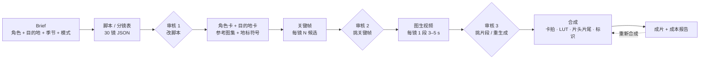
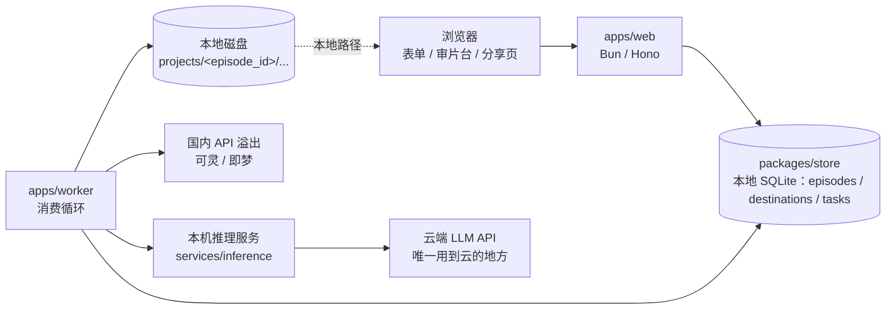

# AI 旅行 Vlog 生产工作台 PRD v0.2

2026-09-23 · 基于 v0.1（2026-09-22）+ 28 条缺口问答合并而成。v0.1 保留不动，文末 §12 是逐条变更表。

> **2026-09-23 补丁**：§6/§8/§9/§10 按 [ADR-0004](decisions/0004-local-sqlite-no-cloud-infra.md) 原地改过——MVP 不用云端基础设施（除了 LLM），数据存本地 SQLite（`packages/store`），产物存本地磁盘，任务队列是 SQLite 表不是 Redis，worker 和 web 之间没有 HTTP 内部 API。之前"云上 web + Postgres + Redis + 对象存储"的架构描述已替换，不再是当前设计。

> **2026-09-24 当前阶段说明（读全文前先看这条）**
>
> 这是一个纯粹的黑客松参赛项目，**没有付费环节**。正文只讲当前要做的事：角色资产、目的地库、六阶段生成、三个人工审核点、成片输出。积分计费与支付、ICP / 算法 / 大模型备案、云厂商内容审核接入、冷启动获客、公司主体选择、定价与付费用户指标——这些商业化设想**没有删除**，团队之前认真推过，整体挪到文末**附录 A**，供以后真要产品化时参考，正文不再穿插引用。数据模型（§6）、核心流程（§4）、流水线技术设计（§7）、架构与目录（§9）以及 M0–M2 的技术交付不受影响。这次改动的变更明细见 §15；§13 是上一版"原地标注"做法的记录，保留作历史。

## 1. 产品定义与目标

一句话定义：一个 AI 旅行 vlog 生产工具——用户定一个虚拟出镜角色，选一个旅游目的地（景区级：一个景区一期），在三个节点做选择（脚本、关键帧、片段），得到一期 24–30 镜、约 30 秒、可选 9:16 或 16:9 的目的地 vlog；同一角色走遍不同目的地，形成一个旅行账号的内容。

**为什么做**：两条参考片验证了"静帧锁一致性 + 1 秒一镜"的方法可稳定出片，而且两条片本质是同一件事——一个虚拟角色去不同地方；参考作者已把它当服务卖给各地 SNS 负责人，此前营销 Agent 那单的甲方也明确提过"AIGC 复刻 TikTok 内容"。需求存在，但市面工具不是"一键生成一条视频"就是"通用剪辑器"，没有人把"一个角色持续生产 vlog"做成产品。

**定位（差异点）**：不做通用 AI 视频生成器，做"虚拟角色 × 旅游目的地"的 vlog 生产——角色是账号级资产（人设、外形跨期一致），目的地是共享资产（地标、地方饮食、交通、住宿、季节的地域符号包），叙事骨架模板 + 三个审核点 + 成本可控。护城河不在模型，在角色资产、目的地库和跨期一致性。

**MVP 目标**

- 用户从 brief 到成片：操作 ≤ 30 分钟，单期等待 ≤ 2 小时（批量场景按单期计，见 §8）
- 单期 GPU 时间目标：待 M0 在 DGX Spark 上实测后定（v0.1 的"30 分钟 / H100 单卡折算"作废，硬件不是 H100）；溢出到国内 API 的费用 ≤ ¥20——口径是"整期所有环节都走 API"的上限，不是部分溢出的典型值，M0 按国内 API 实价复核
- 人物 / 服装一致性人工评审通过率 ≥ 90%：评审集 = M0 无锡 3 期全量（约 90 镜），内部 1–2 人逐镜按脸型 / 发型 / 体态 / 服装四项打分；以后每换模型重跑同一评审集
- 比赛 demo 验收：同一角色至少 2–3 期不同目的地的成片，能现场走一遍三个审核点并展示成本报告；验收细节见 §10

**MVP 明确不做**

- 一键成片（无人工审核）——参考片本身也是人挑出来的；批量出片也逐期过三个审核点
- 通用剪辑器：不做时间线编辑，只做分镜工作台
- 审核 1 新增镜（只能改、删；下限 24 镜）
- 自有店铺例外：私营店铺一律虚构，"自有店铺"核验放 P1
- 平台自动发布：导出 + 分享链接即可
- 发布物料建议（按平台生成封面 / 文案 / 标签）：设计稿里出现过，MVP 不做，P1 再看（§14）
- 候选自动打分 / 淘汰（"裁判模型"）：质量红线只靠 §8 的人工审核点执行，见 §14
- 团队协作、模板市场（P1）——第二版设计稿的设置页又画了一次"成员邀请 / 角色协作"，仍排除，见 §16
- 微信 / 手机号登录、系统生成角色参考图、云厂商内容审核 API（P1，附录 A 有展开）
- 对外销售、注册开放、付费与合规——附录 A

## 2. 形态决策：skill / web / agent

结论不变：产品本体是 web（P0）；流水线引擎先做成命令行供内部验证和批量出样片（M1，长期保留，不对外）；agent / API 接入放 P2。三者共用同一引擎（`packages/engine`），web 只是壳。

| 形态 | 角色 | 阶段 |
| --- | --- | --- |
| Web 应用 | 产品本体：brief 表单、审片台、进度、成本展示、导出与分享 | P0，M2 |
| CLI | 内部工具：`run <stage> --episode <id>`、`import-destination <json>`、跑模型评测、批量出样片 | M1 先做 |
| Agent / API | 代运营团队批量接入、模板自动化 | P2 |

直说风险：通用"AI 视频生成"是红海。产品成立的前提是垂直到底：只做"虚拟角色 × 旅游目的地"这一种体裁，只对旅游博主账号和文旅机构这一类买家。所以 M0 之前不写 web 代码：先手工出 3 条样片验证方法。

## 3. 目标用户与 P0 场景

P0 用户是要持续产出旅游目的地内容、又不想或不能真人出镜的人：虚拟旅游博主账号、文旅机构与目的地营销方、服务文旅客户的代运营。市场是大陆，首批目的地（景区级）：无锡南长街、无锡拈花湾、无锡灵山大佛、泰山、黄山——无锡做首发城市，本地能实拍参考图、能上门谈景区。

下表的"用户"与"痛点"是 demo 要讲清楚的故事——目标用户和场景是真实的，只是这轮不做付费验证（用户对应的付费方式设想见附录 A）。

| 用户 | 痛点 | 用产品做什么 |
| --- | --- | --- |
| 虚拟旅游博主 / faceless 旅行账号 | 要周更，人设跨期一致，人去不了那么多地方 | 一个角色每周去 3–5 个目的地各出一期 |
| 文旅机构 / 目的地营销（景区、地方文旅 SNS） | 缺素材缺人手，要覆盖辖区内多个景点并持续更新 | 一个"本地向导"角色，按目的地库批量出辖区景点系列 |
| 服务文旅客户的代运营 / 广告工作室 | 拍摄成本高、交付慢、客户预算小 | 给每个文旅客户建一个角色，持续交付目的地 vlog |
| 旅行社 / OTA / 民宿与景区运营（P1） | 需要线路或住宿的种草内容 | 用目的地模板出"线路一日""住宿一晚" |

硬约束：

- 所有输出带可见 AI 标识并注明"虚构角色、真实目的地"。
- 公共地标（车站、地标建筑、寺社、商店街、海岸）允许并鼓励出现——观众要一眼认出目的地；私营店铺一律虚构。
- **角色参考图允许用户上传真人照片**，肖像权与合规责任由用户自行确认并承担；系统不凭空生成与上传图无关的真实人物肖像。团队自己上传的真人照片自己确认授权即可（用户协议、备案影响见附录 A）。

## 4. 核心流程

**前置：建角色**（独立于六阶段流水线，一个账号做一次，之后跨期复用）

角色 = 固定文字描述 + 3–7 张参考图（正 / 侧 / 全身 / 细节）+ 默认穿搭与道具 + 视觉风格（LUT、标题样式）。私人参考图由用户上传（允许真人照片，责任见 §3）；系统按文字描述生成候选参考图的能力放 P1。脸型、发型、体态锁定；每期可换穿搭。`owner_id: null` 是官方角色，所有登录账号可选用和读取参考图，仅内部 CLI 可创建或修改；私人角色及其图片只对所有者可见。角色每次实际修改 `version + 1`，完整 Persona JSON 写入不可变 `persona_versions(persona_id, version, doc)`；期记录所选版本，worker 与审片台都按该版本加载角色描述、参考图和风格，后续修改不会改变已建期的生成条件。期详情 API 返回该版本的角色快照，不返回其他账号的私人角色。新版参考图另存路径，旧版本引用的文件不得覆盖或删除。

首批演示库由内部 `seed-catalog` 显式导入：官方虚构角色阿澄、阿岚，以及无锡南长街、拈花湾、灵山大佛、泰山、黄山五个真实目的地。素材和保守的地标元数据见 `assets/demo/catalog.json`，图片来源与许可见 `assets/demo/README.md`。命令只导入角色、目的地和 21 张参考图，不创建账号或期；重复运行不会覆盖已有素材或运营更新。

旧库升级时，旧 `personas.owner_id NOT NULL` 表迁为可空；旧库没有历史角色文档，迁移会把当前角色内容冻结到旧期引用但缺失的版本，标记 `compatibility_approximation = 1`。这是不可恢复历史的兼容近似，不宣称还原了当时内容；冻结后绝不随当前角色修改而重写。新建及更新的角色版本均在同一 SQLite 事务内写入当前表与版本表。

**六阶段流水线**，三个人工审核点，每阶段每镜可单独重跑：



读法：不确定性全部压在 B–D 的静帧阶段（迭代便宜），E 只让模型"动一下"，F 用剪辑节奏收尾。F 是期级操作：成片出来后用户可"重新合成"（换配乐、改标题、改片头片尾、改单镜时长），只重跑 F，不动已选关键帧和片段。

**关键帧阶段（D）：新期只开放逐镜模式**。旧 `grid` 期保留读取和已有产物下载；任何新的阶段生成都拒绝。

| 模式 | 做法 | 来源 | 取舍 |
| --- | --- | --- | --- |
| 逐镜生成（默认） | 先出横版 10 格网格做策划稿、锁一致性，再逐镜生成所选画幅的关键帧。网格策划稿落本地磁盘、`Episode.grid_refs` 引用，审片台可查看，**不设审核点** | 参考片一（名古屋） | 质量高、可控；调用量随候选数变化 |
| 网格直出（规划，未开放） | 直接出 10 格网格，裁切每格当关键帧，裁切后必经放大 | 参考片二（濑户内，28 镜与网格一一对应） | 当前不允许新建或运行；旧期只读和下载已有产物 |

**每个审核点的动作**

- 审核 1（脚本）：可改镜头顺序、动作 beat、景别、地标引用；可删镜，下限 24 镜；**不可新增镜**。删镜后重新跑 FR-02 的校验（景别不连续 > 2、地标镜头 ≥ 5）。
- 审核 2（关键帧）：每镜从 N 候选中点选一张，或标记重生成并改 prompt。
- 审核 3（片段）：播放器 + 可拖拽的起点滑块，拖动时实时预览那 1 秒；或标记重生成。
- 任一审核点标记"重生成"= 该镜 `status → rejected`，记录 `regen_stage`，worker 从对应阶段重跑；用户报告"坏镜"每镜免费一次、报即生效，之后重生成目前只记录成本、不扣任何东西（扣费机制设想见附录 A）。

## 5. 功能需求

15 条 FR 按阶段排列，每条带可测的验收标准；FR-02 的叙事骨架、FR-03 的角色资产、FR-14 的目的地库和 FR-07 的卡拍规则是这套方法的核心，用户不可配置掉。

| 编号 | 阶段 | 需求 | 验收标准 |
| --- | --- | --- | --- |
| FR-01 | Brief | 一期 = 命名 + 选角色 + 从目的地库选目的地 + 季节 + 语气 + 创作要求 + 禁止项 + 画幅（9:16 / 16:9，默认 9:16）+ 每镜候选数（1–3，默认 3，可取账号设置）+ 逐镜生成（当前唯一开放模式）；可从模板预填；提交前按 FR-09 粗估成本并展示 | 缺字段给默认值并在项目里标注；估价展示在提交按钮旁 |
| FR-02 | 脚本 | LLM 按 `Destination.type`（六值枚举，见 §6）选叙事骨架生成 30 镜分镜表；每镜一个动作 beat；景别按 远 / 中 / 近 / 特写 / POV 轮换；地标镜头必须引用目的地库里的地标条目；`Scene.time` 取固定枚举 | 通过 schema 校验；同景别不连续超过 2 镜；每镜动作 ≤ 1 个动词；≥ 5 镜出现可识别地标；审核 1 删镜后仍 ≥ 24 镜且上述校验重新通过 |
| FR-03 | 角色资产 | 私人角色属账号级；官方角色 `owner_id = null` 由内部 CLI 维护、登录账号可选；参考图可由用户上传（允许真人照片，责任归用户）；每期可换穿搭，脸型、发型、体态锁定；角色的完整版本文档不可变，期按所选版本读取 | 同一角色跨期人工一致性评审通过率 ≥ 90%（评审方法见 §1） |
| FR-04 | 关键帧 | 每镜 N 候选（新期默认 3、可选 1–3；旧期缺失字段时按 2），按 `brief.aspect` 生成 9:16 或 16:9；地标镜头以目的地库的实景参考图为条件生成，不允许无参考的"想象地标"；逐镜模式先出网格策划稿（可看不审）；本地失败自动重试 ≤ 2 次，仍失败切国内 API，API 也失败则该镜 `failed` 交用户 | 候选进入审片台；重试 / 溢出链路按上述顺序可在 shot.model 里追溯 |
| FR-05 | 审片台 | 网页并排候选：点选、标记重生成、改 prompt、拖拽选片段起点；地标镜头旁并排显示实景参考图；网格策划稿可查看；进度 2–5 秒轮询刷新；批量场景提供"待审队列"视图 | 一镜决策 ≤ 10 秒 |
| FR-06 | 视频 | 以选定关键帧为首帧生成 3–5 s；prompt = 动作 beat + 镜头运动；可选首尾帧插值做转场 | 每段可在线播放；坏镜由用户一键报告，每镜免费重生成一次、报即生效，后台记录报告率供抽查 |
| FR-07 | 合成 | 配乐按 `brief.tone` 自动从授权素材库选曲，用户可换；**卡拍优先**：`duration_s` 是目标值，实际单镜时长在 0.8–2.0 s 内对齐节拍；账号级统一 LUT；片头片尾（模板默认，期内可覆盖）；标题字样（目的地名）；AI 标识水印 + 元数据；按 `brief.aspect` 输出 1080×1920 或 1920×1080、30 fps | 成片时长 = Σ 单镜实际时长 + 片头片尾 ± 0.5 s；每个切点落在节拍上 |
| FR-08 | 状态 | 期级与镜级两套状态机，见 §6；任一镜任一阶段可重跑；期级可重新合成 | 重跑不动已 approved 的镜；重新合成不动任何镜 |
| FR-09 | 成本 | 每次调用记录 provider、模型、版本、耗时、费用（见 `shot.model`），期级汇总成"成本报告"（GPU 分钟 + API 费用），提交前粗估 = 镜数 × 候选数 × 单位成本 × 1.5 返工系数、只展示，不扣费（积分换算设想见附录 A） | 成本记录与供应商账单 / GPU 时间误差 ≤ 10%；粗估与实际消耗偏差 ≤ 30%（M0 校准常量） |
| FR-10 | 模板 | 模板对象 = 骨架（六值枚举之一）+ LUT + 片头 + 片尾 + 标题样式，见 §6；官方模板 `owner_id = null`；用户可把当前期的这些存为私有模板；M2 内置三个：大型景区、古镇水乡、名山登顶 | 新的一期从模板起步 ≤ 5 分钟 |
| FR-11 | 账号 | 用户名密码登录，不开放公开注册——比赛期间共用一个可公网访问的地址，开放注册会让其他参赛队误入项目；账号由团队用 `packages/cli create-user` 预置（见 M2-2、§13），角色列表、期列表、期级成本明细（FR-09）；账号级的出片默认值 / 改密码（设置页）与跨期成本聚合（用量页）见 §16、M2-15 / M2-16（开放注册、积分账户等设想见附录 A） | 预置账号登录后能看到自己的角色与期 |
| FR-12 | 交付 | mp4 下载、分享链接（可关闭）、分镜表 PDF；成片与分享链接不随 90 天清理失效 | 分享页不含账号信息，可嵌入 |
| FR-13 | 系列与批量 | 一次提交 N 个目的地，用同一角色批量出 N 期；系列内自动沿用模板（LUT、标题样式、片头片尾）；批量进队列排队，同一用户同时最多 2 期在跑；每期仍逐个过三个审核点。"系列"作为浏览分组不依赖批量提交——按 `persona_id` 归组即可展示，不是新增表，见 §14 | 10 期批量提交后无需逐期配置 |
| FR-14 | 目的地库 | 颗粒度为景区（一个景区一条记录，`city` 只作归组）；每条一个符号包：地标清单（每个地标 3–10 张实景参考图 + 最佳机位 / 时段 + 必须保真的特征）、动线、季节、地方饮食、交通、住宿；`type` 为六值枚举；官方维护，M1 用 CLI `import-destination <json>` 录入，参考图手动放本地 `projects/` 目录；首批五个景区见 §3 | 每个地标 ≥ 3 张实景参考图；一个新目的地入库 ≤ 1 个工作日 |
| FR-15 | 模板市场（P1） | 官方模板免费，用户模板可发布；目的地库开放用户提交，审核后入库 | MVP 不做 |

参考片印证：两条片的镜头语法完全同构（走近→拉门/进门→落座→器具→食物特写→吃或喝→抬头笑；渡轮→骑车→符号→食→宿→星空→睡），只换了地点符号和角色，FR-10 的模板就是把这个骨架显式化。

## 6. 数据模型

五个持久对象：账号（User）、角色（账号级）、目的地（共享资产，官方维护）、模板（官方 / 私有）、期（一次生产）。都是本地 SQLite 一条记录（期 JSON 存一列，**SQLite 是唯一真源**，见 ADR-0004）+ 本地磁盘一个目录，字段可扩但不可删；期里的 `shots[]` 是流水线的工作面。队列任务和登录 session 是瞬态对象，只带引用不带正文，各存在同一个 SQLite 库的一张表里（`tasks`、`sessions`）。TS 类型在 `packages/engine/src/schema/`，与本节一一对应；持久化实现在 `packages/store/`。

账号（User）只有登录必需的字段 + 一列 `settings`（出片默认值：默认语气 / 默认每镜候选数，设置页写入、新建一期页读来预填，见 §16、M2-15；两项都可缺省；历史 `default_mode` 字段可读，新设置只接受 `per_shot`，新建期忽略旧 `grid` 默认；未设置候选数的新期默认 3，旧期 JSON 缺 candidate_count 时仍按 2 解析）——积分余额与消耗明细（FR-11）现在加只是空占位，不如不加，要不要加见附录 A。期上的 `estimated_credits` / `credits_used` 两个字段保留不动：填的是成本估算与实际消耗的等价值（口径见 FR-09），不涉及扣费。

**枚举**

- `DestinationType`（= 叙事骨架 = 模板骨架，三者同一套）：`mountain_summit`（名山登顶）/ `city_night`（城市街区夜游）/ `theme_town`（主题小镇）/ `scenic_area`（大型景区）/ `water_town`（古镇水乡）/ `island`（海岛）
- `EpisodeMode`：`per_shot` / `grid`；`grid` 仅用于旧 JSON 的读取和既有文件下载，新建、估价与阶段生成只接受 `per_shot`
- `EpisodeAspect`：`9:16` / `16:9`；服务端据此派生 `render.res`
- `SceneTime`：`morning` / `noon` / `afternoon` / `evening` / `night`
- `size` ∈ wide / medium / close / detail / pov；`camera` ∈ static / pan / push / follow
- `banned` 里的"可读文字"是硬规则：默认无字构图；FR-07 合成阶段叠加的标题字样不受此限

**期级状态机**（`Episode.status`）

`draft → scripting → script_review → assets → keyframing → kf_review → clipping → clip_review → composing → done`，任一生成态可进 `failed`；`failed` 从失败的阶段重跑；`done` 可回到 `composing`（重新合成）。审核态 → 下一生成态由用户在审片台点"继续"触发：关键帧全部选定后才能进入 `clipping`，片段全部批准后才能进入 `composing`。从 `clip_review` 重生成关键帧时回到 `kf_review`；从 `done` 重生成关键帧或片段时分别回到 `kf_review` / `clip_review`，其他已批准镜头保持不变。

**镜级状态机**（`Shot.status`）

`draft → generating_kf → kf_ready → kf_selected → generating_clip → clip_ready → approved`；任一生成态可进 `failed`；用户在审核 2 / 3 标记重生成 → `rejected` 并记 `regen_stage`（`keyframe` / `video`），worker 拾取后回到对应生成态。删镜是审核 1 的显式操作，从 `shots[]` 移除并记入 `removed_shots[]`，不是状态。重跑跳过 `approved`。

```json
// 账号
{
  "user_id": "u_123",
  "username": "dannei",
  "password_hash": "$argon2id$...",
  "created_at": "2026-09-23T10:00:00+08:00",
  "settings": { "default_tone": "松弛", "default_candidates": 3 }
}

// 角色（私人 owner_id 为账号 ID；官方为 null）
{
  "persona_id": "c_001",
  "owner_id": "u_123",
  "version": 3,
  "name": "小岛",
  "desc": "30 岁男性，短发，中等身材，温和表情",
  "locked": ["脸型", "发型", "体态"],
  "default_outfit": "浅灰亚麻衬衫，卡其长裤，帆布斜挎包，挂脖相机，白球鞋",
  "refs": ["persona/c_001/front.png", "persona/c_001/side.png", "persona/c_001/full.png"],
  "style": { "lut": "lut/warm_film.cube", "title_style": "serif-center" }
}

// 目的地（景区级，共享资产，官方维护）——结构示例；首批实际条目以 assets/demo/catalog.json 为准
{
  "destination_id": "d_wuxi_lingshan",
  "version": 1,
  "name": "灵山大佛", "city": "无锡", "type": "scenic_area",
  "season_best": ["春", "秋"],
  "landmarks": [
    { "id": "lingshan_view", "name": "灵山大佛", "refs": ["dest/lingshan/01.jpg", "dest/lingshan/02.jpg", "dest/lingshan/03.jpg"],
      "best_time": "以实拍光照与开放时间为准", "must_keep": ["佛像外形与实景比例"] }
  ],
  "route": ["景区内步行游览"],
  "food": ["素斋", "无锡小笼"],
  "transport": "出行前以景区与当地交通公告为准",
  "stay": "选择周边正规住宿，出行前核实营业情况"
}

// 模板（owner_id 为 null 即官方内置）
{
  "template_id": "t_scenic_area_day",
  "owner_id": null,
  "name": "大型景区 · 一日",
  "skeleton": "scenic_area",
  "lut": "lut/warm_film.cube",
  "intro": "intro/default.mp4",
  "outro": null,
  "title_style": "serif-center"
}

// 期（一次生产；旧 JSON 缺 name / requirements / candidate_count 时，读取时分别由 render.title（空则 destination_id）/ 空字符串 / 2 补齐；旧画幅按 9:16 解析）
{
  "episode_id": "e_20260922_0001",
  "owner_id": "u_123",
  "persona_id": "c_001", "persona_version": 3,
  "destination_id": "d_wuxi_lingshan", "destination_version": 1,
  "series_id": "s_wuxi",
  "template_id": "t_scenic_area_day",
  "status": "kf_review",
  "name": "灵山秋日",
  "mode": "per_shot", "candidate_count": 3,
  "created_at": "2026-09-22T10:00:00+08:00",
  "estimated_credits": 45,
  "credits_used": 42,
  "share": { "enabled": true, "slug": "wuxi-lingshan" },
  "brief": {
    "season": "秋", "aspect": "9:16", "requirements": "突出地标全景", "duration_s": 30,
    "tone": "松弛", "outfit_override": null,
    "banned": ["私营店名", "真人", "可读文字"]
  },
  "grid_refs": ["grid/plan_01.png", "grid/plan_02.png", "grid/plan_03.png"],
  "scenes": [
    { "id": "s1", "name": "到达", "time": "morning", "landmarks": [] },
    { "id": "s2", "name": "登阶见佛", "time": "noon", "landmarks": ["l1"] },
    { "id": "s3", "name": "梵宫与素斋", "time": "afternoon", "landmarks": ["l3"] }
  ],
  "shots": [
    {
      "no": 7, "scene": "s2", "size": "wide", "beat": "仰望大佛",
      "camera": "push", "landmark": "l1",
      "kf_prompt": "...", "motion_prompt": "...",
      "duration_s": 1.0,
      "candidates": ["kf/07_a.png", "kf/07_b.png"], "kf_selected": "kf/07_a.png",
      "clip": "clip/07.mp4", "trim_start_s": 0.4,
      "status": "approved", "regen_stage": null,
      "bad_shot_reported": false,
      "model": {
        "image": { "provider": "local", "model": "qwen-image", "version": "2.1", "seed": 8813,
                   "prompt": "...", "ref_hashes": ["sha256:..."], "attempts": 1, "cost_usd": 0.10 },
        "video": { "provider": "kling", "model": "kling-v2", "version": "2.6", "seed": 4102,
                   "prompt": "...", "ref_hashes": ["sha256:..."], "attempts": 3, "cost_usd": 0.32 }
      }
    }
  ],
  "removed_shots": [],
  "music": { "file": "music/track.mp3", "bpm": 60, "license": "..." },
  "render": { "res": "1080x1920", "fps": 30, "title": "无锡 · 灵山",
              "intro": "intro/default.mp4", "outro": null, "ai_label": true }
}

// 队列任务（SQLite tasks 表，瞬态；worker 凭 episode_id 调 packages/store 取期 JSON）
{ "task_id": "tk_...", "episode_id": "e_20260922_0001", "stage": "keyframe", "shot_no": 7, "attempt": 1 }

// 登录 session（SQLite sessions 表，瞬态；httpOnly cookie 存 session_id）
{ "session_id": "sess_...", "user_id": "u_123", "expires_at": "2026-09-30T10:00:00+08:00" }
```

`shot.model.*.provider` ∈ `local` / `kling` / `jimeng` / …；`attempts` 含本地重试与溢出总次数；复现键 = (episode_id, shot_no, stage, provider, model, version, seed, prompt 哈希, ref_hashes)。

## 7. 模型与工具适配层

硬件是 **2 台单 GPU 的 DGX Spark**（统一内存架构，具体算力以实机为准），不是多卡服务器。后果：

- 不存在"LLM / 图像 / 视频各占几张卡"。每台 Spark 上三类模型要么常驻切换、要么每台只跑一到两类，分配方案 M0 实测后定。
- v0.1 按 H100 折算的 GPU 时间目标作废；M0 必须实测 §7 表里每个开源候选在 Spark 上跑不跑得动、每镜多少分钟。
- 视频环节长期走国内 API 的概率很高；溢出不是兜底，是常态之一，成本报告要如实体现。

以自部署开源模型为主，国内商用 API 做弹性溢出和对照，海外闭源模型只用于内部对照评测，不进产品链路。每个环节一个接口、多个实现（`packages/engine/src/providers/`）。

| 环节 | 接口 | 自部署开源（Spark，待 M0 验证可行性） | 国内 API（溢出 / 对照） | 选型要点 |
| --- | --- | --- | --- | --- |
| 脚本 / 分镜 | brief + 目的地包 → shots JSON | Qwen3 / DeepSeek 蒸馏版，vLLM 服务 | DeepSeek / Qwen / 豆包 API | 结构化输出 + schema 校验；地标条目必须来自目的地库；prompt 用中文 |
| 角色一致性 | 角色参考图 → 跨镜 / 跨期身份保持 | PuLID / InstantID 类适配器；Qwen-Image-Edit / FLUX Kontext | 即梦 / 可灵的参考图能力 | 跨期脸型一致是硬指标，单独评测 |
| 关键帧 | text + 角色参考 + 地标实景图 → image 9:16 / 16:9 | Qwen-Image / FLUX.1 / HunyuanImage | 即梦 / 通义万相 / Seedream | 地标还原度基准（大佛比例、迎客松形态、清名桥结构）；可读文字关闭 |
| 图生视频 | image (+prompt) → video 3–5 s | Wan 2.x / HunyuanVideo I2V / CogVideoX——Spark 上大概率跑不动或极慢 | 可灵 / 即梦 / Vidu | 只用 1 秒；最可能长期走 API 的环节 |
| 放大 / 修复 | image / video → 高清 | Real-ESRGAN 类超分；RIFE 插帧 | — | 网格模式裁切后必经 |
| 音乐 | tone → 授权曲 | 素材库检索（不生成） | — | 非关键路径 |
| 合成 | files → mp4 | ffmpeg（自研，跑在 worker） | — | 卡拍、LUT、片头片尾、标识、字幕全在 ffmpeg 里 |

**重试与溢出**：单镜本地失败先重试，≤ 2 次；仍失败自动切到国内 API 的同接口实现；API 也失败则该镜 `failed`。另外 DGX 队列排队超过阈值（初值 30 分钟，常量写在配置里，MVP 不做管理后台）也直接溢出。每次调用记 provider、模型、版本、seed、prompt、参考图哈希、耗时、费用到 `shot.model`。

海外闭源模型（如 Omni 1.1 Flash，$0.037 / 秒）只作内部对照基线，不进产品链路，其价格不用于 §8 的成本假设。

## 8. 非功能需求

- **成本**：COGS = Spark GPU 时间（折旧 + 电费 + 运维）+ 国内 API 调用费。单期 GPU 时间目标待 M0 定；国内 API 费用上限 ¥20 / 期，口径为整期所有环节都走 API——这条现在是团队自己的预算约束，不是定价依据。毛利 / 积分汇率等定价设想见附录 A。
- **时长与并发**：单期口径：提交后 ≤ 30 分钟拿到关键帧候选，全片 ≤ 2 小时；单用户同时在跑 ≤ 2 期，超出的排队（批量 10 期 = 排队跑）；单次模型调用超时 5 分钟进入重试。
- **可重跑 / 幂等**：每镜产物独立落本地磁盘（`projects/<episode_id>/...`）；重跑跳过已 approved 的镜；复现键见 §6；成片可复现。
- **版本与清理**：角色、目的地带版本号，期记录生成时快照，后续修改不影响老期；用户素材默认 90 天后清理**中间产物**（候选图、网格、未选片段），成片、分镜表、分享链接保留。
- **合规**：成片带可见 AI 标识 + 文件元数据（模型自带的 SynthID / C2PA 保留不剥离）；AI 标识 MVP 形式：右下角半透明文字"AI 生成 · 虚构角色 · 真实目的地"+ 元数据字段，按《人工智能生成合成内容标识办法》（2025 年 9 月起施行）加显式与隐式标识——成本低、demo 里也该有；不生成他人商标；音乐只用授权曲。ICP / 算法备案等对外上线才需要的合规工作见附录 A。
- **内容安全**：prompt 层关键词拦截（v0.1 的"产物过审、人脸检测"降级）；云厂商内容审核 API 见附录 A。
- **质量红线**：人物 / 服装漂移、手部崩坏、可读幻觉文字、真实地标失真、违反物理的动作——命中任一条该镜标记重生成，不允许进入成片。MVP 靠人工审核点执行，自动检测器不在 MVP 范围。
- **安全 / 数据**：多租户隔离用行级 `owner_id` 过滤；模型与 API 密钥只在 worker；分享页不暴露账号信息。
- **运维**：日志落文件；SQLite 文件定期打包备份（本地，脚本待补）；本地磁盘不做异地冗余，MVP 阶段可接受，上线前重新评估（ADR-0004）。

## 9. 技术架构与目录结构

**MVP 不用云端基础设施，除了 LLM 调用**（ADR-0004，取代本节此前"云上 web + 队列 + 对象存储"的方案）：web、worker、推理服务暂时都跑在同一台机器上（DGX 或自己的服务器），数据是本地 SQLite（`packages/store` 统一管），产物文件是本地磁盘目录，任务队列是 SQLite 里的一张表，不是 Redis。web 和 worker 之间没有 HTTP 内部 API，都直接调 `packages/store` 的函数——这层函数保持 `async`，是刻意留出的边界：以后如果要把生图 / 生视频 / ffmpeg 拆到不同 DGX 上，只需要把 `packages/store` 的实现换成网络调用，上层代码不用动。Bun/TS 写 web 与编排，模型推理是常驻的 Python 服务，worker 通过 HTTP 调本机推理服务（这条 HTTP 是本机内网调用，不是"内部 API"那种跨机器协议）。



**真源与写回**

- 期 JSON 存本地 SQLite（`episodes.doc`），是唯一真源；产物文件（关键帧、片段、成片）落本地磁盘 `projects/<episode_id>/kf/07_a.png` 这种路径，角色与目的地的参考图各在自己的目录。
- 队列任务只带 `{episode_id, stage, shot_no?, attempt}`（§6），存在 SQLite 的 `tasks` 表里。worker 出队后直接调 `packages/store` 的 `getEpisode`/`replaceEpisode`（带乐观锁 `row_version`）读写期数据，不经过 HTTP。
- 审片台只改期 JSON 里这几处：审核决策与产物指针 `kf_selected / trim_start_s / status / regen_stage / bad_shot_reported`，审核 1/2 人工可改的脚本字段 `beat / size / camera / landmark / kf_prompt / motion_prompt`，以及审核 1 的整体镜序重排（重排后 `no` 连续重编号，删镜走 `removed_shots`）。改完写一条任务进队列；进度靠浏览器 2–5 秒轮询 `apps/web`，`apps/web` 读同一个 SQLite。
- 单机部署意味着当前没有"一台机器宕机不停服"这种冗余——MVP 阶段接受，上线前重新评估；队列超阈值自动溢出到国内 API；ffmpeg 合成也在 worker 上跑。

**目录结构**（已落地，见仓库根目录、`docs/decisions/0002`、`docs/decisions/0004`）

```
Kelvoy/
  apps/web/              # Hono API（src/server）+ React/Vite 前端（src/frontend），调 packages/store，没有 /internal/*
  apps/worker/           # 消费循环：轮询 packages/store 的 tasks 表、调本机推理服务、落本地磁盘、写回、跑 ffmpeg
  services/inference/    # Python 常驻推理服务：llm · image · video · upscale
  packages/engine/       # 流水线核心（worker / CLI 共用）：stages/ providers/ schema/ state/ rules/，不碰 IO
  packages/store/        # 唯一拥有 SQLite 的地方：episodes / destinations / tasks，apps/web 和 apps/worker 都调它
  packages/cli/          # 内部工具：run <stage> --episode <id>；import-destination <json>
  infra/                 # 本地：Spark/DGX 编排笔记，不需要容器编排（没有 Postgres/Redis/对象存储要起）
```

**模块边界**

- `engine` 不做任何 IO 假设：输入期 JSON 与文件句柄，输出更新后的 JSON 与产物路径；`store`、worker 和 CLI 都只是调用方。
- `store` 是唯一拥有 SQLite 连接的地方：不实现业务规则，状态转移合法性调 `engine` 的判断函数，自己只管读写和乐观锁。
- `providers/*` 只做一件事：把统一接口翻译成本机推理服务或各家 API，记录 provider / 模型 / 版本 / seed / 费用；换模型不改上层。
- `services/inference` 常驻加载权重；本机上三类模型怎么分配 M0 实测后定。
- `compose` 是唯一调用 ffmpeg 的地方，在 worker 上跑：切片、卡拍对齐、拼接、片头片尾、LUT、字幕、标识、封装。
- 分享页静态化（成片 + 分镜表），不依赖登录态，不随 90 天清理失效。

## 10. 里程碑与验收 Demo

团队 2–3 人（产品 / 引擎 / Web，owner 按人定）。**当前比赛范围 = M0 → M1 → M2**——这是黑客松项目的全部范围，没有付费上线阶段；M3 / M4（付费上线、模板市场）是这个团队以前认真推过的产品化路线图，整体挪到附录 A 供以后参考，不是这轮的一部分。M0 不写一行产品代码——先手工出片，方法不成立后面都不用做。

| 里程碑 | 交付 | 验收 | 工作量 |
| --- | --- | --- | --- |
| M0 需求与方法验证 | 照参考片的方法，用同一个角色手工做无锡 3 期（南长街夜游 / 拈花湾 / 灵山大佛），验证跨期一致性和真实地标还原度；实拍三地参考图建第一份目的地包（景区级三条）；**在 Spark 上**用大佛、迎客松、清名桥做基准，评测 2 个开源图像 + 2 个开源视频模型 + 1 个国内 API，记录每镜 GPU 分钟数与哪些模型根本跑不动；用 3 期全量做一致性评审集，内部逐镜打分 | 一页选型结论（漂移率、地标还原度、每镜 GPU 分钟、失败率、开源 vs API 并排、Spark 可行性）；估价常量初值（单位成本、返工系数） | 1 周 |
| M1 引擎 + CLI | 六阶段流水线、两套状态机、providers（Spark 自部署 + 国内 API 溢出 + 重试链路）、推理服务化、本地 SQLite 存储与任务队列（`packages/store`，ADR-0004）、schema、ffmpeg 合成（卡拍、片头片尾）、费用记录与期级成本报告、`import-destination` 录入五个景区，全部命令行 | 第二条片人工操作 ≤ 30 分钟；任一镜可单独重跑；任一期可重新合成 | 1–2 周 |
| M2 Web MVP | 预置账号登录（不开放注册，防其他参赛队误入，见 §13）、成本估价展示、建角色、brief 表单（含模式）、审片台（三个审核点 + 网格查看 + 拖拽选点 + 待审队列）、轮询进度、重新合成、导出、分享链接、3 个内置模板（大型景区 / 古镇水乡 / 名山登顶） | 一个没参与开发的人不经指导完整跑通一条 | 2–3 周 |

**比赛 Demo 验收**：同一角色的 3 期 vlog（无锡三地）各带一个分享链接；现场从 brief 到成片走一遍三个审核点，操作 ≤ 30 分钟；成片带 AI 标识和成本报告；任一镜可现场重生成、任一期可现场重新合成。

## 11. 风险与开放问题

最大的风险是硬件和质量：两台 Spark 的算力决定了视频环节大概率长期走 API，地标失真和角色漂移直接决定 demo 好不好看。产品化以后才会遇到的风险（同质化、获客、备案）见附录 A。

| 风险 | 影响 | 对策 |
| --- | --- | --- |
| **Spark 跑不动视频模型** | 视频环节全走 API，成本抬高，¥20 上限吃紧 | M0 第一件事实测；图像 / LLM 留在本地 |
| 真实地标失真 | 观众和景区一眼看出假，账号信任崩 | 地标镜头必须以实景参考图为条件；质量红线单列；M0 用灵山大佛 / 迎客松 / 清名桥做基准 |
| 开源模型质量落后于商用 API | 返工率高 | M0 同一基准并排测；不达标的环节允许长期走 API |
| 2 台 Spark 是单点 | 一台宕机容量减半，两台都挂即停服 | 队列超阈值自动溢出国内 API；镜像与权重在云 GPU 上冷备；比赛现场至少要有 API 兜底 |
| **允许真人参考图** | 肖像权纠纷 | 只用团队自己确认过授权的照片 |
| 内容滥用 | 法律与平台风险 | 关键词拦截 + AI 标识默认开 |

**开放问题**

- [ ] Spark 的实际算力、所在位置与公网带宽——决定产物回传速度与并发
- [ ] 推理服务用 ComfyUI API 还是自研 diffusers 管线
- [ ] 视频环节是否直接放弃自部署、只走 API（M0 实测后定）
- [ ] 估价常量、单期 GPU 分钟目标（M0 实测后定）
- [ ] 首批五个景区 M0 够不够；目的地库实景参考图的版权来源
- [ ] `SceneTime` 五值枚举是 v0.2 拟定，脚本生成实测后可调
- [ ] 产品中文名

产品化以后才要答的问题，整理进附录 A。

## 12. v0.1 → v0.2 变更表

| 条目 | v0.1 | v0.2 | 落点 |
| --- | --- | --- | --- |
| 硬件 | "2 台 DGX"，按环节分卡，H100 折算 | 2 台单 GPU DGX Spark；不分卡；GPU 时间目标待 M0 实测 | §1 §7 §8 §9 §10 |
| 期状态机 | 无 | `Episode.status` 十态 + 重新合成入口 | §4 §6 FR-08 |
| 镜状态机 | 5 态 | 9 态；rejected = 待重生成 + `regen_stage`；删镜进 `removed_shots` | §4 §6 FR-08 |
| 期 JSON 真源与回写 | 未定 | Postgres jsonb 唯一真源；worker 出站调内部 API；队列只带引用 | §6 §9 |
| 角色参考图 | 上传做人脸检测拦截真人 | 允许上传真人照片，责任归用户；系统生成放 P1 | §3 §4 FR-03 §8 §11 |
| 目的地颗粒度 | 城市 / 景区混用 | 景区级，`city` 只作归组 | §3 FR-14 §6 |
| type / 骨架 / 模板命名 | 三套 | 合并为 `DestinationType` 六值枚举 | FR-02 FR-10 FR-14 §6 |
| 网格策划稿 | 未建模 | `Episode.grid_refs`，可看不审 | §4 FR-04 FR-05 §6 |
| 复现字段 | `model: {image, video}` 字符串 | image / video 各一份结构化记录（provider/model/version/seed/prompt/ref_hashes/attempts/cost） | §6 FR-09 §8 |
| 积分换算 | 未定 | 固定汇率 1 积分 = X GPU 分钟等价，溢出不加价 | FR-09 §8 |
| 超额拦截估价 | 未定 | 镜数 × 候选数 × 单位成本 × 1.5 | FR-01 FR-09 |
| 审核 1 范围 | 顺序 / 动作 / 景别 / 删镜 | + 地标引用；不可新增；下限 24 镜；删后重校验 | §4 FR-02 |
| 重试与溢出 | 两处各说各的 | 本地重试 ≤ 2 → API → failed；排队超阈值直接溢出 | FR-04 §7 |
| 模板 | 无结构 | 模板对象（skeleton/lut/intro/outro/title_style/owner_id）；M2 内置三种 | FR-10 §6 §10 |
| 配乐与卡拍 | 未定 | 按 tone 自动选可换；卡拍优先，`duration_s` 为目标值 | FR-07 |
| 片头片尾 | 只在 FR-10/13 提到 | `render.intro/outro`，模板默认、期可覆盖 | FR-07 §6 |
| 批量 | 与并发 / 时长数字冲突 | 排队、同时 ≤ 2 期、单期时长口径、逐期审核、待审队列 | FR-05 FR-13 §8 |
| 进度与选点 | 未定 | 2–5 秒轮询；审核 3 拖拽滑块实时预览 | §4 FR-05 §9 |
| 坏镜 | "免费一次"无边界 | 每镜一次、报即生效、后台记报告率 | §4 FR-06 |
| 登录 | 未定 | 用户名密码；微信 / 手机号 P1 | FR-11 §10 |
| 目的地录入 | 未定 | CLI `import-destination <json>` | §2 FR-14 §10 |
| 内容审核 | 产物过审 + 人脸检测（硬约束） | MVP 关键词拦截；云厂商 API M3 前接入 | §8 §11 |
| 版本与清理 | 素材 90 天清理 | 角色 / 目的地版本快照；只清中间产物，成片与分享保留 | §4 §8 FR-12 |
| 一致性评审 | 只有指标 | M0 三期全量、内部逐镜四项打分 | §1 FR-03 §10 |
| 溢出费用口径 | 未定 | 不加价；¥20 = 整期全走 API 上限 | §1 §8 |
| 团队 | 未提 | 2–3 人，工期保持 | §10 |
| 运维 / 合规细节 | 未定 | 日志文件 + 云监控 + 每日快照；AI 标识右下角文字；行级 owner_id；自有店铺 MVP 不支持 | §1 §8 |
| `Scene.time` | 自由文本 | `SceneTime` 五值枚举（拟定） | FR-02 §6 §11 |
| 目录结构 | vlog-factory 示意 | 对齐已落地的 Kelvoy 仓库 | §9 |

## 13. 2026-09-24 范围调整记录（比赛 demo 定位）

与 §12 不同：§12 是 v0.1 → v0.2 的技术变更表，本节是**范围 / 定位**调整，文档版本号不变。起因：项目暂时定性为内部比赛展示 demo，纯商业化逻辑不用考虑。"暂时"意味着商业化方向没有放弃，只是这轮不做，所以全部改为标注、拆分、归类，**没有删任何内容**。

| 落点 | 原内容 | 处理 |
| --- | --- | --- |
| 文首 | — | 新增"当前阶段说明"，定义【商业化阶段】标记 |
| §1 | "对外销售"定义、"8 周内 10 个付费用户"目标 | 标注为商业化阶段；新增比赛 demo 验收一条 |
| §2 | Web 形态含"积分"；M0 前"找 10 个用户验证付费意愿" | 积分扣费标注；付费意愿验证标注，方法验证保留 |
| §3 | "付费方式"列；用户协议与备案口径 | 整列标注；真人照片当前只用团队自证授权，协议 / 备案标注 |
| §4 | 坏镜之后"重生成扣积分" | 标注，当前只记录成本 |
| FR-01 / FR-09 / FR-11 | 积分粗估拦截、积分汇率、积分余额 / 积分包 | 拆成"当前阶段 = 成本记录 + 估价展示"与"商业化阶段 = 积分换算 + 拦截 + 购买"两半 |
| §6 | User 积分字段"待 M0-6 定汇率再加" | 改为归商业化阶段；`estimated_credits` / `credits_used` 字段保留，当前填成本等价值 |
| §7 | "定价要按这个前提算" | 标注 |
| §8 | 成本 / 毛利、付费延长、ICP / 算法 / 大模型备案、云厂商内容安全 | 成本与 AI 标识留在当前；毛利 / 积分、备案与合规评估、云厂商审核拆出并标注 |
| §10 | M0 访谈与预付验收、M1 积分换算、M2 积分拦截与种子用户验收、M3、M4、验收 Demo | 子项标注；M3 / M4 整行标注；验收 Demo 拆为"比赛 Demo 验收"与"上线验收 Demo" |
| §11 | 风险表、开放问题 | 风险表加"阶段"列逐行归类；开放问题拆成"当前要答"与"商业化阶段保留" |
| FR-11 / M2-2 | 用户名密码**注册**登录 | 比赛 demo 阶段把公开注册整段代码拿掉，改为预置账号登录（`packages/cli create-user`）——原因不是业务判断，是比赛现场共用公网地址，开着注册会被其他参赛队误入；注册功能归【商业化阶段】重新做，历史实现在 git 历史里，不是留一个禁用开关 |

FR-09 的判断理由：每次调用记录 provider / 模型 / 费用、期级成本报告、提交前估价，本来就是流水线可追溯性的一部分（§4 的输出就是"成片 + 成本报告"，M0 要实测每镜 GPU 分钟），demo 里展示"这期花了多少 GPU 分钟"也有说服力，所以留在当前阶段；把成本换算成积分并据此拦截、扣费、售卖积分包，才是真收费才需要的机制，归商业化阶段。

## 14. 2026-09-24 设计稿（Design canvas）比对记录

团队共享的 claude.ai 设计画布（`Landing.dc.html` 已落地为 M2-11/#38；本轮新看的是 `Home / NewEpisode / Script / Main / Clips / Compose / Deliver / Assets` 八屏）画出了完整的九屏产品形态。逐屏跟本 PRD 对过一遍，记录下面几类差异；跟 §13 一样，这是记录和归类，不是重写。

**设计稿画错了 / 超出当前范围，按 PRD 为准，不改 PRD**

| 设计稿里的东西 | 出现在 | 跟 PRD 冲突的地方 | 处理 |
| --- | --- | --- | --- |
| 脚本审核页"+ 插入一镜"按钮 | Script.dc.html | §4"审核 1……不可新增镜" | 按 PRD 来，审片台交互页（#31）实现时不做这个按钮 |
| 关键帧 / 片段候选按"裁判模型"打分排序、地标失真候选标"不可选" | Main.dc.html | §8"质量红线……MVP 靠人工审核点执行，自动检测器不在 MVP 范围" | MVP 不做，已补进 §1 MVP 明确不做；M0-4（#4）选型如果顺手能出候选质量分再考虑收进 P1 |
| 关键帧 / 片段重生成按钮直接"扣积分"、侧边栏常显"积分余额 1,240" | Main.dc.html / Clips.dc.html / 全部工作台页 | FR-09/FR-11"当前阶段只展示、不扣费、不开积分账户" | 当前阶段实现（#31/#30）用"预估成本 / GPU 分钟"语言，不做实时扣费动画，也不做"积分余额"这个常显组件 |
| 新建一期页"视频比例 9:16 / 16:9" | NewEpisode.dc.html | 已纳入新期建期字段 `brief.aspect` | 表单提供两种画幅，默认 9:16；推理和成片按所选画幅执行 |

**设计稿把已有条款画具体了，PRD 不用改，补进对应 issue 的实现细节**

- 质量红线的五项检查（人物一致、手部、地标形态、物理合理、无可读文字）跟 §8 原文逐条对得上，Clips.dc.html 的"逐条确认"面板就是这条的 UI 化——补进 #31。
- 显式 + 隐式 AI 标识（Compose.dc.html 的"显式标识水印"+"隐式标识写入元数据"）跟 §7/§8 的《人工智能生成合成内容标识办法》要求一致——补进 #28。
- 超分（Real-ESRGAN）跟 §7 模型表"放大 / 修复"一行一致，Compose.dc.html 把它画成所有期都过的通用步骤，比 §7 原文"网格模式裁切后必经"更宽——按通用步骤实现（网格模式和逐镜模式的关键帧分辨率不一定一样，逐镜模式如果本来就够格可以跳过，具体等 M0-4 定），补进 #28。
- "系列"分组视图（Home.dc.html"我的作品·按系列"、Deliver.dc.html 的系列列表）不需要新表，按 `persona_id` 归组现有的期即可，跟 FR-13 的批量提交是两回事——已在 FR-13 加一句澄清。

**设计稿提的新东西，PRD 目前没表态，这轮定下来**

- 每镜重生成配额（设计稿写死"5 次免费，超出 2 积分/次"）：PRD 的估价常量都是 M0 待定，这两个数字不作数，收进 M0-6（#6）一起定。
- 成片页"发布建议"（按抖音 / 小红书 / 视频号 / 微信分别生成封面文案标签，不是自动发布）：不在现有 FR 覆盖范围内，MVP 不做，已补进 §1；跟已排除的"平台自动发布"是两件事，以后 P1 单独立项。
- 目的地库"提交新目的地"自助入口：其实已经是 FR-15（模板市场，P1）的一部分，MVP 不做，无需新记；设计稿把远期形态一起画了，不代表现在要做。

## 15. 2026-09-24（第二轮）商业化内容挪至附录

§13 记录的"标注但不删"是上一版的处理方式：【商业化阶段】内容原地保留、加标记。这轮改成物理搬家——正文里所有【商业化阶段】的具体内容（数字、条款、表格行）都剪切到新增的**附录 A**，正文只在提到的地方留一句"见附录 A"的指针。起因很直接：这就是一个纯粹的黑客松参赛项目，没有付费环节，正文里到处夹着"届时""上线前""付费用户"这类穿插条款，读起来杂；商业化方向的思考本身有价值，不该删，所以挪窝而不是删除。

跟 §13 一样，**没有删除任何内容**，只是从"原地标注"变成"集中存放"。改动范围：

| 落点 | 处理 |
| --- | --- |
| 文首 | 当前阶段说明改写，指向附录 A |
| §1 | 移出："8 周内 10 个付费用户"目标、对外销售定位、微信登录等 P1 项里的商业化子句 |
| §2 | 移出：积分扣费展示、付费意愿验证 |
| §3 | 移出：用户表"付费方式"列、用户协议 / 备案条款 |
| §4 | 简化："重生成扣积分"改成指针 |
| FR-01 / FR-09 / FR-11 | 移出【商业化阶段】那半句，各表格单元格只保留当前阶段部分 |
| §6 | 简化：积分字段说明改成指针 |
| §7 | 移出："定价按这个前提算" |
| §8 | 移出：毛利 / 积分整条、备案与合规评估整条、云厂商内容审核 |
| §10 | 移出：M0 访谈付费意愿子项、M3、M4 整个里程碑、上线验收 Demo |
| §11 | 移出：纯商业化风险行（红海竞争、备案责任、获客成本、内容空洞）；混合行只留当前阶段那半；开放问题表同样拆分 |

## 16. 2026-09-24（第三轮）新设计稿（第二版）比对记录

团队共享的 claude.ai 设计画布出了第二版：15 个内部页面 + 1 个官网单页 + 1 个登录页，比 §14 那版细很多，配色也换了一版。逐屏跟本 PRD 对过一遍，处理方式跟 §14 一样——记录和归类，不重写正文。三类：设计稿又画错的（按 PRD 为准）、全新功能这轮不做的（记一笔）、视觉 / 结构升级要做的（建 issue M2-12 ～ M2-17）。

**设计稿这次又画错的东西，按 PRD 为准，不改正文**

| 设计稿里的东西 | 出现在 | 跟 PRD 冲突的地方 | 处理 |
| --- | --- | --- | --- |
| 角色参考图上传区写"真人照片会被拦截"，并画了"疑似真人 · 已拦截"这个自动检测状态 | 角色新建 / 编辑页 | §3 / §4 / FR-03："允许上传真人照片，责任归用户"——这是 v0.1 → v0.2 认真改过一次的决定（§12"角色参考图"行：v0.1 是人脸检测拦截，v0.2 改成允许）；§8"内容安全"也明确把人脸检测降级掉了 | 保持现状。自动识别真人需要人脸 / 真人检测技术，M0 还没选型，是新技术债，不采纳。角色页（M2-13）文案沿用"允许真人照片、责任归用户"口径，不照抄设计稿那句 |
| 侧栏常显"积分余额"、用量页有"发票"、设置页有"成员邀请 / 角色协作" | 全部工作台页 / 积分与用量页 / 设置页 | §15 刚把积分计费、支付、团队协作整体挪到附录 A（A.2、A.6）；FR-09 / FR-11 当前阶段口径是"成本记录 + 估价展示，不扣费、不开积分账户"；§1"团队协作（P1）" | "积分与用量"和"设置"两页**做成真实页面**（M2-16 / M2-15），但只展示已有的真实成本聚合（GPU 分钟、花费，按 provider / model）和账号级出片默认值；不做积分账户、不做积分包购买、不做发票、不做成员邀请。这是 §14 第三行"积分余额常显"的第二次出现，处理不变 |
| 脚本审核页"+ 插入一镜" | 脚本审核页 | §4"审核 1……不可新增镜"，FR-02 下限 24 镜 | **第二次出现**（§14 第一行已排除一次），继续排除；#31 已按 PRD 实现，不改 |
| 关键帧候选按"裁判模型"自动初筛、打分排序 | 关键帧审核页 | §1"MVP 明确不做"里明确排除："候选自动打分 / 淘汰（裁判模型）：质量红线只靠 §8 的人工审核点执行" | **第二次出现**（§14 第二行已排除一次），继续排除；#31 已按 PRD 实现，不改 |

**全新功能，这次定下来先不做**

- 角色编辑页的"一致性试拍"：存角色前在四个场景各生成一张图，系统自动打一致性分数，≥ 90% 才能存为可用角色，消耗积分。这个功能有两个前提都不具备：(1) 依赖真实图像模型，M1-11（#26"关键帧阶段真实图像模型接入"）还是 open；(2)"自动打一致性分数"本质上就是上一行排除掉的裁判模型 / 自动评分机制，§1 明确不做，§8 说"自动检测器不在 MVP 范围"。§1 的"≥ 90% 一致性通过率"是**人工评审**指标，不是自动分数。先不做，也不建 issue；#26 落地、且 M0-4（#4）选型顺手能出候选质量分之后再回头看要不要收进 P1。

**视觉 / 结构升级，这次要做**

| 设计稿元素 | 落地方式 | issue |
| --- | --- | --- |
| 全局视觉体系换新：暖色调配色（`#F4EFE6` 背景 / `#FBF8F2` 卡片 / `#1C1A17` 正文 / `#2E5E63` 强调色不变 / `#B7482F` 品牌红用于新 logo / `#D3C8B4`、`#E2D9C8` 边框）、新增 IBM Plex Mono 做数字展示、描边线条 SVG 图标替换纯文字色块图标、侧栏从 5 项扩到 7 项（多"积分与用量""设置"） | 改 `apps/web/src/frontend/index.css` 的 CSS 变量 + `layout/Layout.tsx` 侧栏，已有页面跟着调 | M2-12 |
| 角色新建 / 编辑页（表单 + 参考图上传区） | 后端 CRUD（#20）早已完成，只补前端页面；文案用 §3 口径 | M2-13 |
| 首页拆成"首页"（继续上次 + 本周统计 + 灵感目的地横向浏览 + 最近作品预览）和"我的作品"（完整列表） | 现有 `EpisodesPage.tsx` 拆成两页；灵感目的地复用 `GET /api/destinations` | M2-14 |
| 设置页：出片默认值（语气 / 每镜候选数）+ 改自己密码 | 新页面 + 一个需要登录态的改密码 API；账号设置暂不提供默认画幅；每期在建期表单选择，默认 9:16 | M2-15 |
| 用量页：账号级跨期成本聚合 | 复用 `review/DoneView.tsx` 的 provider / model 汇总逻辑，扩展成跨期；口径延续 FR-09"成本记录 / 估算，不涉及扣费" | M2-16 |
| 官网从独立 Landing 页改成单页锚点导航（top / solutions / features / how / destinations / faq） | 重做 `pages/LandingPage.tsx`（#38）；内容延续 §3 政策表述（允许真人参考图但不凭空生成真人肖像、AI 标识），不加价格 / 注册内容（FR-11 不开放注册） | M2-17 |

跟 §14 一样的判断标准：设计稿把已有条款画具体了就落进 issue，画出 PRD 明确排除的东西就按 PRD 来。这轮跟上轮的区别只在"积分与用量""设置"两页——上轮是不做常显组件，这轮是页面本身要有、但内容严格限定在当前阶段已有的数据上。

## 附录 A：商业化阶段参考（不在当前范围）

这是一个纯粹的黑客松参赛项目，以下内容全部**不在当前范围**，也没有排期——纯粹是团队之前认真推过、怕以后想不起来才留档。读到这一节时按"如果以后真要做成产品"的语气理解，不要当成任务清单。

### A.1 产品定位与目标用户

一句话定义里"对外销售"是远期产品化定位。MVP 目标里原有一条：上线 8 周内 10 个付费用户，种子来源见下方 A.5。

各类目标用户对应的付费方式设想：

| 用户 | 付费方式 |
| --- | --- |
| 虚拟旅游博主 / faceless 旅行账号 | 月订阅 |
| 文旅机构 / 目的地营销（景区、地方文旅 SNS） | 月订阅 / 年度采购 |
| 服务文旅客户的代运营 / 广告工作室 | 月订阅（多角色） |
| 旅行社 / OTA / 民宿与景区运营（P1） | 按期 / 积分包 |

M0 前设想过要找 10 个目标用户验证付费意愿；M0 手工出片阶段本身（验证方法可行性）不受此影响。

### A.2 积分与定价

- 积分按固定汇率：1 积分 = X GPU 分钟等价，X 由实测 COGS 按"定价 ≥ 5 × COGS"倒推；溢出 API 费用按同汇率折算计入，不对用户加价。
- 用户超额重生成扣积分；坏镜报告每镜仍免费重生成一次。
- FR-01：brief 提交前若积分余额不足，拦截提交。
- FR-09：积分账户与拦截逻辑；FR-11：积分余额与消耗明细展示、积分包购买、开放注册、微信 / 手机号登录。
- User 表要加积分余额与消耗明细字段（现在没加，等定完积分汇率再加）。
- 定价问题（按期、积分包还是订阅？文旅机构走年度采购？）要靠用户访谈定锚点；要不要先以"样片服务"收费验证需求、再做产品，也没定。

### A.3 用户协议与合规备案

- 用户协议要明确肖像权责任划分（角色参考图允许上传真人照片这一决定，责任现在由团队自己确认授权，产品化后要让用户协议接管）。
- 网站上线前完成 ICP 备案；模型自部署意味着团队自己是模型服务提供者，算法备案 / 大模型备案大概率落在自己头上，对外上线前要请专业人士核实。
- 允许真人参考图这一政策对备案审查的影响，要按此口径重新做合规评估——这是对外上线的前置条件，不是比赛 demo 的前置条件。
- 桌面调研（未经专业人士核实，仅供参考）：`docs/M3-0-备案路径调研.md`，初步倾向新设公司而非用现有个体户。
- 备案路径、备案域名、支付与备案主体——都要等真做时找专业人士核实，不能照抄这里的调研初稿。

### A.4 内容审核

比赛阶段只做 prompt 层关键词拦截。产品化对外上线前，要接云厂商内容安全 API（文本 + 图片），并加违规账号封停机制。

### A.5 冷启动与获客

无锡本地上门 + 样片即广告；文旅机构走年度采购。种子用户名单：无锡景区 / 文旅账号 / 本地代运营，谁先上门要访谈后定。获客成本高于客单价是这个阶段最大的风险，不是技术风险。

### A.6 里程碑：M3 付费上线 / M4 模板市场

| 里程碑 | 交付 | 验收 |
| --- | --- | --- |
| M3 付费上线 | 微信 / 支付宝支付、定价页、落地页（同一角色 3 期 + 公开分享链接）、ICP 与模型备案、云厂商内容审核 API 接入、用户协议（含真人参考图责任条款）；冷启动：无锡景区与文旅账号上门 + 小红书 / 抖音旅行创作者社群 | 8 周内 10 个付费用户 |
| M4 模板市场与团队（P1） | 用户模板发布、代运营多客户管理、API、微信登录、系统生成角色参考图、自有店铺核验 | 视 M3 数据决定 |

**上线验收 Demo**：落地页上同一角色的 3 期 vlog 各带一个公开分享链接；一个陌生用户从注册到拿到第一条成片 ≤ 30 分钟操作，中途不需要人工指导。

### A.7 风险（产品化以后才要面对）

| 风险 | 影响 | 对策 |
| --- | --- | --- |
| 通用 AI 视频工具红海，大厂原生打包 | 无差异，被免费功能替代 | 只做"虚拟角色 × 真实目的地"这一种体裁；目的地库持续积累 |
| 自部署 = 自己是模型服务提供者 | 备案责任更重 | 与 ICP、支付一起在对外上线前办完 |
| 景区、文旅局对 AI 内容的态度 | 被要求下架，或反过来成为客户 | 先把景区做成客户；片头注明"虚构角色、真实目的地"（这条当前就做了） |
| 获客成本高于客单价 | 亏损 | 无锡本地上门 + 样片即广告；文旅机构走年度采购 |
| 内容空洞，用户做了没人看 | 留存差 | 模板强制带信息槽位；系列有账号级人设线 |

真人参考图和内容滥用两条风险当前阶段也要管（见 §11），产品化后要再加一层：真人参考图要靠用户协议明确责任、上线前合规评估按 A.3 口径重做；内容滥用要在用户协议之外接云厂商审核（见 A.4）。
