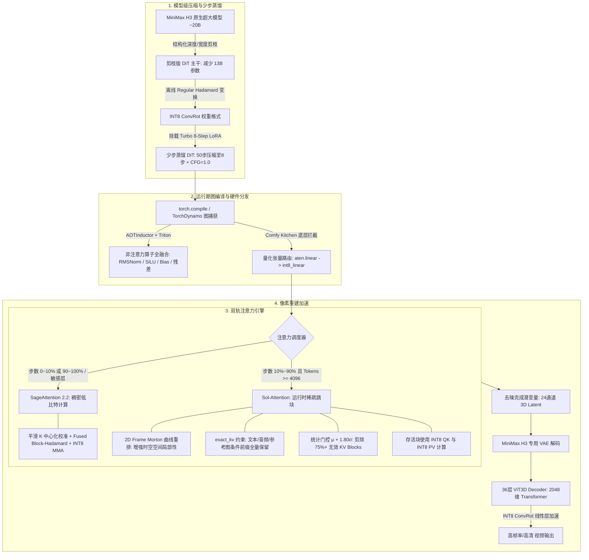
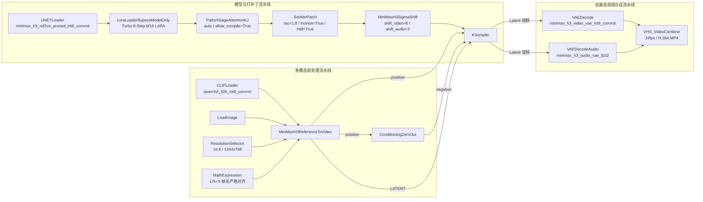

# Kelvoy（可旅）项目报告书

> 适用赛事：第三届 NVIDIA DGX Spark 黑客松
> 文档更新：2026-09-29，依据 [PRD v0.2](AI旅行Vlog生产工作台_PRD_v0.2.md)（含 2026-09 全站对齐方案）与当前仓库代码整理。

---

## 一、项目概述

### 1.1 项目命名

**Kelvoy（中文名："可旅"）** 是一款面向虚拟角色旅行 Vlog 生产的端到端 AI 视频生成系统。

英文名称 **Kelvoy** 源于 *Key* 与 *Voyage* 的结合。其中，*Key* 象征角色资产的锁定与一致性，代表系统对虚拟角色形象、穿搭、风格的持久化管理；*Voyage* 寓意旅程、探索与目的地叙事，体现系统围绕真实旅游目的地批量生产旅行内容的能力。两者结合，意为"用一把钥匙开启一段又一段旅程"。

中文名称"可旅"简洁有力，既表达"可以出发"的动作感，也暗含"可复制的旅行内容生产方式"，贴合产品"一个角色去多个目的地"的核心使用方式。

### 1.2 项目目标

Kelvoy 致力于打造 **"虚拟角色 × 真实目的地"的 AI 旅行 Vlog 生产工作台**。

用户只需选定一个虚拟出镜角色和一个旅游目的地（景区级），系统即可自动完成：

- 目的地符号包检索与叙事骨架生成；
- 5–10 镜分镜脚本与逐镜字幕策划；
- 两条创作路径任选其一：
  - **直出路径（新项目默认）**：角色参考图 + 地标实景图直接双参考图生视频，跳过图片生成；
  - **传统路径**：每镜 1–3 张关键帧候选 → 人工挑选 → 图生视频；
- 片段逐镜审核、起点精修与质量红线确认；
- 每镜 3-4 秒（30 帧 @30fps）剪辑、LUT 调色、字幕、转场、片头片尾与 AI 标识合成；
- 成片输出、版本管理、分享链接与积分 / 用量报告。

最终输出一期 5–10 镜、每镜 3-4 秒、约 30 秒、9:16 竖屏（默认）或 16:9 横屏** 的旅行 Vlog；同一角色可跨目的地复用，形成系列化旅行账号内容。

**项目核心 slogan**：

> **选一个角色，去一个真实的地方，一期旅行 Vlog 自动生成。**
> 可旅，让每一场旅行都有 vlog。

### 1.3 项目背景

Kelvoy 源于团队对"AIGC 复刻旅行内容"需求的观察：虚拟旅游博主、文旅机构与代运营团队需要持续产出目的地内容，但真人出镜成本高、人设跨期难一致、通用视频工具又缺乏"角色 + 目的地"的垂直能力。

参考片验证了"静帧锁一致性 + 3-4秒一镜"的方法可稳定出片，且本质是"同一个虚拟角色去不同地方"的复用模式。市面工具要么是"一键生成一条视频"的黑盒，要么是"通用剪辑器"，没有人把"一个角色持续生产 Vlog"做成产品。

Kelvoy 的护城河不在模型，而在 **角色资产、目的地库和跨期一致性**。

相比通用 AI 视频生成器，Kelvoy 的差异化在于：

- **角色是账号级资产**：人设、外形跨期一致，每期可换穿搭；
- **目的地是共享资产**：地标、饮食、交通、住宿、季节的地域符号包官方维护；
- **叙事骨架模板化**：六种目的地类型对应六种镜头语法；
- **人工审核点**：不确定性压在脚本与静帧阶段，视频环节只让模型"动一下"；
- **成本可控**：本地 DGX Spark 为主，国内 API 做弹性溢出，整期 API 费用上限 ¥20（口径为整期全走 API 的上限）。

---

## 二、作品特点与核心亮点

### 2.1 六阶段流水线与人工审核点

系统将旅行 Vlog 生产拆分为 **六阶段流水线**，配以人工审核点，确保从 Brief 到成片全程可控：

| 阶段 | 名称 | 产出物 | 审核点 |
|------|------|--------|--------|
| Brief | 项目创建 | 角色 + 目的地 + 季节 + 模板 + 画幅 + 创作方式 | — |
| S1 | 脚本生成 | 5–10 镜分镜 JSON（含逐镜字幕） | 审核 1：改脚本 |
| S2 | 角色资产 | 参考图集 + 角色卡（版本快照） | — |
| S3 | 关键帧生成（传统路径） | 每镜 1–3 候选 9:16 / 16:9 画面 | 审核 2：挑关键帧 |
| S4 | 视频生成 | 每镜 3–5 秒片段（供截取 1 秒） | 审核 3：挑片段 |
| S5 | 合成输出 | 每镜 1 秒卡拍 + LUT + 字幕 + 转场 + 片头片尾 + AI 标识 MP4 | 合成设置确认 |

**核心设计理念**：不确定性全部压在 S1–S3 的静帧阶段（迭代便宜），S4 只让模型"动一下"，S5 用剪辑节奏收尾。

### 2.2 双参考图直出视频：省掉图片环节

2026-09 起新项目默认 `video_source: "references"` 直出路径：

- 每镜将 **角色版本快照中的第一张人物参考图** 与 **脚本所指地标的第一张实景参考图**，按顺序送入 MiniMax H3 双参考图生视频工作流（`2_2_DualRef2Video_MinimaxH3`）；未指定地标的镜头使用目的地首个场景参考图；
- 视频提示词合并画面与动作描述，沿用项目的 9:16 / 16:9 比例，生成 3–4 秒素材供用户截取；
- 从脚本审核经过素材检查直接进入视频生成与片段审核，**不产生图片候选、关键帧审核或图片积分**；
- 用户仍可在新建页高级设置中选择 `video_source: "keyframe"` 走传统关键帧流程；旧项目按原流程运行，不自动转换。

### 2.3 虚拟角色 × 真实目的地的垂直体裁

Kelvoy 不做通用 AI 视频生成器，只做 **"虚拟角色 × 旅游目的地"** 这一种体裁：

- **角色是账号级资产**：脸型、发型、体态锁定，每期可换穿搭，跨期一致性人工评审通过率 ≥ 90%；
- **目的地是共享资产**：官方维护景区级符号包，每个地标配 3–10 张实景参考图 + 最佳机位 / 时段 + 必须保真特征；首批内置无锡南长街、无锡拈花湾、无锡灵山大佛、泰山、黄山五条；
- **叙事骨架模板化**：六种 `DestinationType`（名山登顶 / 城市街区夜游 / 主题小镇 / 大型景区 / 古镇水乡 / 海岛）对应六种镜头语法，内置六个官方模板。

### 2.4 固定一秒剪辑与合成工作台

- 新项目保存 `cut_policy: "fixed_1s"`：30fps 时间线上 **每镜恰好 30 帧**，音乐只覆盖全片、不移动切点；
- `trim_start_s` 按 1/30 秒吸附，合成使用整数帧窗口，Worker 验证选段不越过片尾；
- 每镜生成可编辑字幕（`Shot.caption`），字幕按每镜一秒窗口烧录，片头偏移由拼接顺序自然带入；
- 相邻镜头切点前后各 2 帧片内淡出 / 淡入，总帧数不变；字幕与转场默认开启、可在合成设置页关闭；
- 片头片尾默认关闭，可在合成设置阶段选择已交付的片头、片尾和音乐；
- 片段审核完成后进入 `compose_ready` 设置阶段，用户确认设置并点"开始合成"才入队；
- 旧项目缺省回填 `beat_aligned`，保留原节拍切点策略，可显式转换为新版 1 秒剪辑。

### 2.5 积分核算与成本报告

- 积分账户初始为 0，由内部 CLI 发放，**不接入购买或支付**；默认动作价格为脚本 1、图片 1/张、视频 10/段、合成 1；
- 项目创建和阶段提交 **原子预留** 积分，任务成功结算、终态失败释放；同一动作的流水 **不可变且幂等**；
- 任务采用租约（lease），Worker 崩溃后由下一次队列领取恢复；
- 每次模型调用记录 provider / 模型 / 版本 / seed / prompt / 参考图哈希 / 尝试次数 / 费用；GPU 用量作为独立成本估算展示（镜数 × 候选数 × 单位成本 × 1.5 返工系数）；
- 成片按 `final/<期号>_v<版本>.mp4` 版本化写入，ffprobe 校验时长、宽高、帧率、大小与完成时间；重新编辑或合成时暂停旧交付版本，成功后沿用用户此前的分享开关；
- 用量页展示账号可用 / 预留积分与流水，以及按期、按模型的实际 API 费用（USD）。

### 2.6 本地优先、API 溢出的成本可控架构

基于 **2 台单 GPU 的 DGX Spark**（GB10，128GB 统一内存架构），系统采用"本地自部署为主，国内商用 API 做弹性溢出"的策略：

- **本地模型**：图像（Qwen-Image 2.1 via ComfyUI）、视频（MiniMax H3 via ComfyUI）、合成（ffmpeg，Worker 上跑）；
- **API 调用**：脚本生成与指令优化使用 StepFun API；视频生成支持可灵 / 即梦 API 溢出；
- **重试与溢出**：单镜本地失败先重试（≤ 2 次），仍失败自动切到国内 API 同接口实现；API 也失败则该镜 `failed`；失败重试按数据库里的失败任务入队，使用新动作预留并沿用原生成标识以复用已成功落盘的候选；
- **成本红线**：整期所有环节都走 API 的费用上限 ¥20。

### 2.7 可重跑、可复现、可断点续跑

- 每镜产物独立落盘（`projects/<episode_id>/...`）；重跑跳过已 `approved` 的镜；成片可复现；
- 复现键 = (episode_id, shot_no, stage, provider, model, version, seed, prompt 哈希, ref_hashes)；
- 角色与目的地带版本号，期记录生成时快照，后续修改不影响老期；
- 用户素材默认 90 天后清理 **中间产物**（候选图、网格、未选片段），成片、分镜表、分享链接保留。

### 2.8 专业化审片台

- **审核 1 · 脚本**：脚本视图 / 故事板视图逐镜查看，可导出 CSV；可编辑镜头字段、调整顺序、删除镜头（下限 24 镜、不可新增）、编辑字幕；支持写优化指令按指令优化或整份重新生成（行版本原子标记，失败保留原稿并提示重试）；
- **审核 2 · 关键帧**（传统路径）：对照角色与地标参考图逐镜点选候选，支持待审队列、逐镜模式、修改 prompt 后重生成；
- **审核 3 · 片段**：拖动滑块实时预览（新版起点按 30fps 帧格调整），逐条确认五项质量红线（人物一致、手部正常、地标形态、物理合理、无可读文字）；坏镜标记重生成，首次报告坏镜免费重生成一次；
- **合成设置**：标题、字幕、转场、配乐、片头片尾确认后开始合成；进度实时轮询；
- **成片页**：完整播放检查、下载 MP4、开启 / 关闭公开分享链接，查看本期预估与已用积分。

---

## 三、技术实现方案

### 3.1 整体架构

```
┌─────────────────────────────────────────────────────────────┐
│                     浏览器（React + Vite）                   │
│  官网 Landing · 登录 · 建期 · 审片台 · 用量 · 设置 · 分享页  │
└──────────────────────────┬──────────────────────────────────┘
                           │ /api/*（Hono）
┌──────────────────────────▼──────────────────────────────────┐
│                     apps/web（端口 3000）                    │
│  auth · me · personas · destinations · templates            │
│  episodes · review · share · assets                         │
└──────────┬─────────────────────────────────────────────────┘
           │ 直调函数（无内部 HTTP API）
┌──────────▼─────────────────────────────────────────────────┐
│                packages/store（SQLite 唯一真源）            │
│  episodes · personas · destinations · templates · tasks     │
│  sessions · credit_accounts / actions / ledger / prices     │
└──────────▲─────────────────────────────────────────────────┘
           │ 轮询 tasks 表 + 写回
┌──────────┴─────────────────────────────────────────────────┐
│                    apps/worker（消费循环）                   │
│  任务租约 · 生成适配 · 产物归档 · ffmpeg 合成 · 积分结算     │
└───────┬─────────────────────────────────┬─────────────────┘
        │ HTTP（本机）                    │ 本地磁盘
┌───────▼──────────┐          ┌──────────▼──────────────────┐
│ services/inference│          │ projects/<episode_id>/…     │
│ 端口 8100         │          │ kf/ clip/ final/ inference/ │
│ /image /video     │          │ music/ lut/ intro/ outro/   │
└───────┬──────────┘          └─────────────────────────────┘
        │ ComfyUI API（8188）
┌───────▼───────────────────────────────────────────────────┐
│              Qwen-Image 2.1 · MiniMax H3（ComfyUI）        │
│         comfyui-bridge/ 工作流模板（1–9 参考图）           │
└──────────────────────────────────────────────────────────┘
```

**真源与写回**：

- 期 JSON 存本地 SQLite（`episodes.doc`），是唯一真源；
- 产物文件（关键帧、片段、成片）落本地磁盘 `projects/<episode_id>/...`；
- 队列任务只带 `{episode_id, stage, shot_no?, attempt, generation_id}`，存在 SQLite 的 `tasks` 表里；
- worker 出队后直接调 `packages/store` 的 `getEpisode` / `replaceEpisode`（带乐观锁 `row_version`）读写期数据，不经过 HTTP 内部 API；
- 审片台只改期 JSON 里审核决策与产物指针，改完写一条任务进队列；
- 进度靠浏览器轮询 `apps/web`，`apps/web` 读同一个 SQLite。

### 3.2 目录结构

```
Kelvoy/
  apps/web/              # Hono API（src/server）+ React/Vite 前端（src/frontend）
  apps/worker/           # 消费循环：轮询 tasks 表、调推理服务、落本地磁盘、写回、跑 ffmpeg
  services/inference/    # Python 常驻推理服务：/image /video 适配 ComfyUI（/llm /upscale 为占位）
  packages/engine/       # 流水线核心（worker / CLI 共用）：stages/ providers/ schema/ state/ rules/，不碰 IO
  packages/store/        # 唯一拥有 SQLite 的地方：期/角色/目的地/模板/任务 + 积分四表
  packages/cli/          # 内部工具：run / import-* / seed-catalog / create-user / grant-credits
  comfyui-bridge/        # ComfyUI 工作流模板（Qwen-Image 2.1、MiniMax H3、ACE-STEP）与桥接服务
  infra/dgx/             # DGX 侦察记录与部署笔记（systemd user 服务）
  assets/demo/           # 演示用官方角色、目的地实景参考图与目录 catalog.json
  assets/shared/         # 共享素材：音乐、LUT、片头、片尾
  scripts/ spike/        # 基准测试与验收脚本 / 一次性硬件验证
  docs/                  # PRD、架构、ADR、手册、审计记录
```

**模块边界**：

- `engine` 不做任何 IO 假设：输入期 JSON 与文件句柄，输出更新后的 JSON 与产物路径；
- `store` 是唯一拥有 SQLite 连接的地方：不实现业务规则，状态转移合法性调 `engine` 的判断函数，自己只管读写和乐观锁；
- `providers/*` 只做一件事：把统一接口翻译成本机推理服务或各家 API，记录 provider / 模型 / 版本 / seed / 费用；换模型不改上层；
- `compose` 是全系统唯一调用 ffmpeg 的地方，在 worker 上跑：切片、拼接、片头片尾、LUT、字幕、转场、标识、封装；
- `services/inference` 常驻适配 ComfyUI，不自行加载模型权重。

### 3.3 核心设计原则

| 原则 | 说明 |
|------|------|
| 本地优先 | 不用云端基础设施，除了 LLM API 调用；数据存本地 SQLite，产物存本地磁盘 |
| 单一真源 | 期 JSON 存 SQLite，是唯一真源；前端和 worker 都直接调 store |
| 可插拔 Provider | 每个环节一个接口、多个实现，换模型不改上层 |
| 可重跑 / 幂等 | 每镜产物独立落盘；重跑跳过已 approved 的镜；成片可复现 |
| 事务一致 | 任务结果、期状态与积分结算在一个事务里提交（ADR-0007） |
| 成本可控 | 每次调用记录 provider、模型、版本、耗时、费用；期级汇总成成本报告 |

### 3.4 数据模型

五个持久对象：账号（User）、角色（账号级）、目的地（共享资产，官方维护）、模板（官方 / 私有）、期（一次生产）。都是本地 SQLite 一条记录 + 本地磁盘一个目录，字段可扩但不可删。队列任务和登录 session 是瞬态对象，各存在同一个 SQLite 库的一张表里（`tasks`、`sessions`）。

**期级状态机**（`Episode.status`，12 态）：

```
draft → scripting → script_review → assets → keyframing → kf_review
      → clipping → clip_review → compose_ready → composing → done
```

任一生成态可进 `failed`；`failed` 从失败的阶段重跑；`done` 可回到 `composing`（重新合成）。审核态 → 下一生成态由用户在审片台点"继续"触发：关键帧全部选定后才能进入 `clipping`，片段全部批准后进入 `compose_ready`，用户确认合成设置并启动后才进 `composing`。

**镜级状态机**（`Shot.status`，9 态）：

```
draft → generating_kf → kf_ready → kf_selected → generating_clip → clip_ready → approved
```

任一生成态可进 `failed`；用户在审核 2 / 3 标记重生成 → `rejected` 并记 `regen_stage`（`keyframe` / `video`），worker 拾取后回到对应生成态。删镜是审核 1 的显式操作，从 `shots[]` 移除并记入 `removed_shots[]`。重跑跳过 `approved`。

**核心枚举与关键字段**：

- `DestinationType`：`mountain_summit` / `city_night` / `theme_town` / `scenic_area` / `water_town` / `island`
- `EpisodeAspect`：`9:16`（默认）/ `16:9`，服务端据此派生 `render.res`
- `VideoSource`：`references`（直出，新项目默认）/ `keyframe`（传统）
- `cut_policy`：`fixed_1s`（新项目）/ `beat_aligned`（旧项目回填）
- `EpisodeMode`：`per_shot` / `grid`；`grid` 仅用于旧 JSON 读取，新建只接受 `per_shot`
- `SceneTime`：morning / noon / afternoon / evening / night；`size` ∈ wide / medium / close / detail / pov；`camera` ∈ static / pan / push / follow
- `Shot.caption`：逐镜字幕（新版固定一秒剪辑烧录用）
- `Episode.final`：成片版本元数据（版本号、时长、宽高、帧率、大小、完成时间，ffprobe 校验后写入）

### 3.5 流水线各环节模型与端点配置

| 环节 | 实现 | 模型 / 服务 | 说明 |
|------|------|------------|------|
| 脚本 / 分镜 | `providers/stepfun-llm.ts` | StepFun API（`STEPFUN_API_KEY`） | brief + 目的地包 → 镜数自由的 JSON（首次约 28 镜仅为起点）（含逐镜字幕）；结构化输出 + schema 校验；地标条目必须来自目的地库；支持按指令优化重生成 |
| 关键帧（传统路径） | `services/inference /image/` → ComfyUI | Qwen-Image 2.1（单参考 = 角色；双参考 = 角色 + 地标） | 每镜 1–3 候选；9:16 / 16:9；生成预算 240 秒 |
| 图生视频（传统路径） | `services/inference /video/` → ComfyUI | MiniMax H3 单参考（已审核关键帧） | 3–5 秒素材截取 1 秒；预算 240 秒 |
| 双参考直出（默认路径） | `services/inference /video/` → ComfyUI | MiniMax H3 双参考（角色 + 场景） | 3–5 秒素材截取 1 秒；预算 270 秒；无图片积分 |
| 视频溢出 | `providers/kling-api.ts`、`jimeng-api.ts` | 可灵 / 即梦 API | 本地重试 ≤ 2 次后自动切换 |
| 音乐（生成） | `comfyui-bridge /api/music` | ACE-STEP 1.5 XL + **MinimaxMusic 3** | 文生音乐；MinimaxMusic 3 支持风格 + 歌词 + 时长（最长 180s） |
| 音乐（检索） | `providers/music-library.ts` | 授权素材库 | 按语气检索已有曲目 |
| 语音合成 | `comfyui-bridge /api/tts` | **Qwen3-TTS Voice Design** | 英文声音描述 → 高质量多语言语音 |
| 音色克隆 | `comfyui-bridge /api/voice_clone` | **Qwen3-TTS Voice Clone** | 参考音频 + 目标文本 → 克隆语音（内置 Whisper 自动转写） |
| LTX 视频 | `comfyui-bridge /api/video/ltx` | **LTX-2.5 22B Distilled Transformer** | 图生视频；双阶段采样；支持 2–20 秒 |
| 合成 | `apps/worker compose/ffmpeg.ts` | ffmpeg（自研，跑在 worker） | 每镜 30 帧整数窗口、卡拍、LUT、ASS 字幕、2 帧转场、片头片尾、AI 标识 |

**comfyui-bridge 工作流模板**：Qwen-Image 2.1 图像（1 / 2 / 3 / 4 / 9 参考图）与 MiniMax H3 视频（纯文生、单参考、双参考、三 / 四 / 九参考、图 + 视频、图 + 音频）共 20 余份 API 工作流 JSON，另有 ACE-STEP 文生音乐工作流与 `comfyui_api_service.py` / `comfyui_edit_service.py` 桥接服务。

**推理协议与验收边界**：成功响应包含 `paths`、`model`、工作流哈希 `version`、`seed` 与非负 `seconds`；Worker 先校验响应形状，再核对单个产物、种子与暂存目录，归档后记录参考图哈希。ComfyUI 媒体下载采用流式临时文件（单文件上限 512 MiB），发布前用 Pillow 校验完整 PNG、用 ffmpeg 解码视频流，损坏媒体会删除暂存并取消对应任务。

### 3.6 任务队列、租约与积分核算

- **队列**：SQLite `tasks` 表（无 Redis）；worker 每秒轮询，任务带租约，Worker 崩溃后由下一次队列领取恢复；
- **两级锁**：`_JOBS_LOCK`（全局，保护清理、背压、提交与取消集）→ `_PROJECT_LOCKS[project_id]`（按项目保护"load→改→save"全程），锁序恒为 project → jobs，临界区互不重叠；
- **背压**：`MAX_PENDING=8` 未完成作业上限，超出拒绝新建；本地重试 ≤ 2 次后溢出国内 API；
- **积分事务**：建期 / 阶段提交时按 `credit_prices`（script=1、image=1、video=10、compose=1）原子预留；任务成功在同一个事务里结算并写回期状态（ADR-0007）；终态失败释放预留；`credit_ledger` 流水不可变且幂等；团队通过 CLI `grant-credits` 发放（外部幂等键）；
- **失败重试**：按数据库里的失败任务重新入队，使用新动作预留并沿用原 `generation_id`，复用已成功落盘的候选；
- **公开审核接口**：只允许对应阶段的人为修改字段，不能伪造产物或积分。

### 3.7 前后端通信

前端采用 **React 内置状态 + 轮询**模式获取进度。主要 API 端点：

| 端点 | 方法 | 用途 |
|------|------|------|
| `/api/health` | GET | 健康检查 |
| `/api/auth/login` / `logout` | POST | 登录 / 登出（httpOnly cookie session） |
| `/api/me` · `/settings` · `/credits` | GET / PATCH | 账号信息、出片默认值、积分余额与流水 |
| `/api/me/password` | POST | 修改自己密码 |
| `/api/personas` · `/:id` · `/:id/refs` | GET / POST / PATCH | 角色 CRUD 与参考图上传 |
| `/api/destinations` · `/:id/assets/*` | GET | 目的地库与实景参考图 |
| `/api/templates` · `/:id` | GET / POST / DELETE | 模板列表、保存为私有模板、删除 |
| `/api/episodes` | GET / POST / PATCH | 期列表（含 overview / usage / estimate）与建期 |
| `/api/episodes/:id/…` | GET / PATCH | 期详情、修改、文件访问、存为模板 |
| `/api/episodes/:id/script/:action` | POST | 脚本优化指令 / 重新生成 |
| `/api/episodes/:id/shots…` | PATCH / POST | 逐镜编辑、重排、重生成、删除、坏镜报告 |
| `/api/episodes/:id/continue` / `retry` / `recompose` / `convert-cuts` / `share` | POST | 阶段推进、失败重试、重新合成、剪辑转换、分享开关 |
| `/api/share/:slug` · `/:slug/final.mp4` | GET | 公开分享页与成片（不依赖登录态） |
| `/api/assets/:path` | GET | 官方资产访问（行级 owner 过滤） |

### 3.8 部署架构

| 服务 | 端口 | 说明 |
|------|------|------|
| kelvoy-web（apps/web） | 3000 | Hono API + 静态托管 Vite 构建 |
| kelvoy-worker（apps/worker） | — | 任务消费循环 + ffmpeg 合成 |
| kelvoy-inference（services/inference） | 8100 | FastAPI 推理适配 |
| ComfyUI | 8188 | 图像 / 视频模型执行（Qwen-Image 2.1、MiniMax H3） |
| comfyui-bridge | 6000 | ComfyUI HTTP 桥接（图像 / 视频 / 音乐 / 语音 / LTX） |

**关键环境变量**：`KELVOY_PROJECTS_ROOT`（产物根目录，默认 `projects`）、`KELVOY_FONT_FILE`（CJK 字体，drawtext 标题与 AI 标识必需）、`KELVOY_COMFYUI_BASE_URL`（默认 `http://127.0.0.1:8188`）、`INFERENCE_BASE_URL`（默认 `http://127.0.0.1:8100`）、`STEPFUN_API_KEY`（脚本生成）、`PORT`（web 端口）。

**DGX 部署**（详见 `infra/dgx/README.md` 与 `docs/guides/reference-design-migration.md`）：

- 两台 DGX Spark：共享机 `gx10-8e22`（与 visionary、shanhai 项目共用，需人工协调 GPU）+ 黑客松分配节点 spark-63（3.7TB 磁盘，比赛结束后由组委会回收清空）；
- systemd `--user` 服务（`kelvoy-web` / `kelvoy-worker` / `kelvoy-inference`），无需 root；
- 发布次序：备份 SQLite（在线备份接口 + 校验值）→ 更新代码依赖 → `seed-catalog` → 首次开库完成列迁移 → 重启服务 → CLI 给演示账号发放测试额度 → 真机走通 9:16 与 16:9 全流程并用 ffprobe 核对每镜 30 帧。

---

## 四、架构优化方案

### 4.1 DGX Spark 平台适配思路

DGX Spark（GB10，128GB 统一内存）的核心约束是"多模型无法同时驻留"。本项目采用 **分时加载 + 本地服务适配 + 任务租约串行消费** 的策略：

1. **文本阶段**：StepFun API 生成脚本（本地 LLM 环节在 inference 服务保留 501 占位，实测后可切换）；
2. **图像阶段**：`services/inference` 适配 ComfyUI（Qwen-Image 2.1），工作流模板在 `comfyui-bridge/`；
3. **视频阶段**：MiniMax H3 双参考直出 / 单参考图生视频（生成预算 240–270 秒，含上传、排队、采样、下载与校验）；
4. **合成阶段**：ffmpeg 在 worker 上串行执行，整数帧窗口保证每镜严格 30 帧。

### 4.2 已落地的关键优化

- **任务租约与崩溃恢复**：租约到期的任务由下一次队列领取回收，Worker 重启不丢任务；
- **事务化结果提交**（ADR-0007）：任务结果、期状态、积分结算单事务提交，杜绝"产物落盘但状态没写回"的中间态；
- **生成标识复用**：失败重试沿用原 `generation_id`，已成功落盘的候选直接复用，不重复烧 GPU；
- **流式媒体下载与校验**：512 MiB 上限的流式临时文件 + Pillow / ffmpeg 双重完整性校验，损坏媒体自动清理并取消 ComfyUI 任务；
- **优雅停机**：SIGTERM 后停止领取新任务、等待在跑任务收尾再退出；
- **过期产物清理**：Worker 每小时清扫过期推理媒体、发布暂存与未完成期媒体，控制磁盘水位；
- **性能基准脚本**：`scripts/benchmark-*.ts` 覆盖队列、并发、期列表、用量聚合等关键路径。

### 4.3 待优化项

- 真机验收：DGX 上双参考直出、排队取消、Worker 重启及两期完整成片仍需按共享 GPU 排期单独验收（见 `docs/audit/`）；
- 旧共享机磁盘水位（96% 已用）与多项目 GPU 争抢的排期协调；
- 估价常量（GPU 分钟 / 镜）仍为 M0 占位，待实测回填；
- 比赛结束后黑客松节点被回收，第二台算力来源待定。

### 4.4 MiniMax-H3视频生成全链路加速方案

#### 4.4.1 全链路架构概览与加速拓扑

MiniMax H3 是一款音视频联合生成的 Packed-DiT 架构模型，在长序列去噪与高分辨率视频重建中受限于显存带宽（Memory-Bound）、注意力二次方计算复杂度（Compute-Bound）、扩散去噪迭代步数过长以及 ViT3D VAE 解码延迟。

本方案通过底层算子重构、模型结构精简、少步蒸馏与图级编译，构建了“**结构化剪枝 + 权重/激活正交旋转量化 + Turbo LoRA 轨迹蒸馏 + 时空自适应稀疏注意力 + 稠密平滑注意力回退 + ViT3D 解码器量化 + 图编译器融合**”的全栈加速体系。




#### 4.4.2 扩散轨迹蒸馏：Turbo LoRA 8 步极限加速原理

原生扩散与 Flow Matching 模型求解常微分方程（ODE）或随机微分方程（SDE）时，由于积分路径弯曲，通常需要 30~50 个迭代步数（Sampling Steps），且往往依赖无分类器引导（Classifier-Free Guidance, CFG），导致单步需执行正向与负向两次模型前向。

工作流引入的 `minimax_h3_ref2v_turbo_8step_v1.0_768p_comfyui_bf16.safetensors` 从**步数**与**引导前向次数**两个维度实现数量级加速。

**（1）流匹配轨迹拉直（Flow Trajectory Straightening）**

在 Flow Matching 体系中，模型学习的是从高斯噪声分布 p₀(x) 到真实数据流分布 p₁(x) 的速度向量场 v_θ(xₜ, t)：

$$\frac{d x_{t}}{d t} = v_{\theta}(x_{t}, t)$$

未蒸馏的原生模型速度场具有高曲率，采用一阶欧拉求解器步长过大时会严重偏离真实数据流形。Turbo 蒸馏模型采用**渐进一致性蒸馏（Progressive Consistency Distillation）**或**整流流蒸馏（Rectified Flow Distillation / DMD2）**：

1. **学生网络低秩微调**：冻结 INT8 主干，仅在 DiT 的注意力和 FFN 核心线性层注入低秩适配器 $\Delta W = A \cdot B$（秩 $r \ll d$）；
2. **多步到单步跳跃对齐**：强制使学生模型在 tₙ 到 tₙ₊ₖ 的单步大跨度预测，匹配教师模型执行多步 Runge-Kutta 积分后的目标终点：

$$\mathcal{L}_{\text{distill}} = \mathbb{E}\left[ \left\| \hat{x}_{0}^{\text{student}}(x_{t_n}) - \hat{x}_{0}^{\text{teacher-multi-step}}(x_{t_n}) \right\|^2 \right]$$

3. **8 步极速收敛**：原本需要 50 步细致积分的弯曲轨迹被“拉直”为 8 段直线段跃迁，步数直接压缩 **84%**。

**（2）CFG 引导内化蒸馏（Guidance Distillation）**

常规扩散生成必须借助 CFG 维持提示词遵循度：

$$\tilde{v}_{\theta}(x_{t}, c, \emptyset) = v_{\theta}(x_{t}, \emptyset) + s \cdot \left(v_{\theta}(x_{t}, c) - v_{\theta}(x_{t}, \emptyset)\right)$$

这要求模型每一步都分别计算有条件（Conditional）与无条件（Unconditional）两次前向，实际计算量为 $50 \times 2 = 100$ 次模型推断。

Turbo LoRA 在蒸馏阶段利用高 CFG 教师模型作为目标，将大引导系数 $s$ 的语义强度直接蒸馏固化进学生模型的条件分支中：

- **锁定 CFG = 1.0**：推理时完全关闭无条件分支计算，仅保留正向条件前向；
- **负向输入直接置零**：通过 `ConditioningZeroOut` 将无条件分支旁路阻断，避免额外的文本编码器开销。

$$\text{总前向次数压缩比} = \frac{50 \text{ 步} \times 2 \text{ (CFG)}}{8 \text{ 步} \times 1 \text{ (CFG=1.0)}} = \frac{100}{8} = \mathbf{12.5 \times}$$

**仅 Turbo LoRA 单项技术，便带来了整个去噪阶段高达 12.5 倍的算力开销缩减。**

#### 4.4.3 Sol-Attention 原理与配置深度剖析

**（1）数学与算法原理**

自注意力机制计算公式为：

$$\text{Attention}(Q, K, V) = \text{Softmax}\left(\frac{Q K^T}{\sqrt{d}}\right) V$$

在视频生成任务中，序列长度 $S = T \times \frac{H}{16} \times \frac{W}{16}$ 往往达到数万甚至数十万 Token。然而，绝大部分空间与时域距离较远的 Token 对当前 Query 的注意力贡献在经过 Softmax 后接近于 0。

Sol-Attn 采用硬件级动态跳块机制：

1. **分块质心提取（Block Centroid Pooling）**：以 `B_s = 64` 为分块尺寸，预先在 GPU 上聚合计算 Key 质心 `k_c` 与 Value 质心 `v_c`：

   $$k_{c}^{(j)} = \frac{1}{B_{s}} \sum_{i \in \text{block } j} K_{i}$$

2. **动态统计阈值截断（Adaptive Thresholding）**：对于 Query Block 质心 `q_c`，将粗粒度注意力 Logits 视为高斯分布建模，动态计算其均值 $\mu$ 与标准差 $\sigma$：

   $$T_{\text{threshold}} = \mu + \tau \cdot \sigma$$

   若某个 Key Block 的估计响应上限低于 `T_threshold`，该 Block 对最终输出的贡献被判定为不显著，**算子在 Triton 内核层完全跳过该 Block 的加载与 MMA 计算**。

**（2）节点配置参数映射与工程机制**

| 参数项              | 当前设定   | 深度原理与工程逻辑                                           |
| :------------------ | :--------- | :----------------------------------------------------------- |
| `tau`               | `1.80`     | **稀疏截断分位数**。控制统计门控的激进程度（$T = \mu + 1.80\sigma$）。设定为 1.80 可剪除约 75%~85% 的冗余 KV Block，在显著降低 FLOPs 的同时保留核心相关性区域。 |
| `start_percent`     | `0.10`     | **采样起始百分比**。扩散去噪的前 10% 步数处于高噪阶段，主要建立全景几何构图与主体轮廓，在此阶段强制保持 Dense 全量计算，防止结构畸变。 |
| `end_percent`       | `0.90`     | **采样终止百分比**。最后 10% 步数负责高频微结构收敛与噪点消除，关闭稀疏化回退至 Dense 计算，保证最终画面边缘纯净。 |
| `min_tokens`        | `4096`     | **序列长度门槛**。Token 数量小于 4096 时，维护质心与路由掩码的开销超过跳块带来的矩阵乘法收益，此时自动回退到常规稠密算子。 |
| `int8_qk`           | `true`     | **QK 点积量化加速**。在跳块剪枝后，对保留的高相关性 Block，使用 INT8 Tensor Core 执行 $Q K^T$ 矩阵乘法，双重叠加计算吞吐。 |
| `int8_pv`           | `true`     | **PV 点积量化加速**。注意力概率矩阵 $P$ 与 Value 向量点积同样采用 INT8 MMA 执行。 |
| `sink_conditioning` | `exact_kv` | **多模态条件前缀保护**。MiniMax H3 的输入序列格式为 `[text][cond][ref_img][ref_audio][audio][video]`。文本提示词、参考图与音频具有极高的注意力汇聚（Attention Sink）效应，若被稀疏剪枝会导致提示词失效或音视频失步。`exact_kv` 强制所有条件 Token 的 KV Block 执行无损密集计算，仅对后续的视频 Token 实施稀疏化。 |
| `morton`            | `true`     | **时空局部性重排序**。原生光栅扫描（Raster-Scan）展开使空间邻近像素在 1D 内存序列中相距极远。启用 Morton（Z 序曲线）重新排列 Token，使空间临近的 2D 像素打包进相同的 64-token Block 内，大幅强化 Block 质心的表征能力，使注意力权重分布更为尖锐，最大化 Sol-Attn 的剪枝比率。 |
| `morton_curve`      | `2d_frame` | **帧内二维莫顿曲线**。保持时间轴帧序递进，仅在单帧空间网格内应用 Z 序重排。 |
| `use_tma`           | `true`     | **异步张量拷贝**。启用 TMA（Tensor Memory Accelerator）硬件异步直通，在支持硬件（SM90+，如 RTX 50 系列/H100）上利用 TensorDescriptor 实现零拷贝访存；非兼容设备自动优雅回退至 Strided Pointer 内核。 |
| `dense_blocks`      | `(empty)`  | **敏感层稠密保护列表**。为空表示除起止保护步外，所有 Transformer 层均允许稀疏化。 |

---

#### 4.4.4 稠密与回退注意力：SageAttention 2.2 核心机制

在 Sol-Attn 的保护区间（0%~10% 与 90%~100% 步数）或短序列场景下，系统自动链式路由至 **SageAttention 2.2**。

**（1）平滑 Key 中心化校准（Smooth-K）**

注意力计算中，Key 矩阵在不同通道上存在严重的非对称静态偏置，导致直接对称 INT8 量化时大量量化阶被无效浪费。利用 Softmax 的平移不变性：

$$\text{Softmax}\left(\frac{Q K^T}{\sqrt{d}}\right) = \text{Softmax}\left(\frac{Q (K - \bar{k})^T}{\sqrt{d}}\right)$$

在 GPU 端采样代表性 Key 向量 $\bar{k}$ 并从 $K$ 中实时扣除，消除通道直流偏置，将动态范围极度压缩并居中，显著降低 INT8 量化噪声。

**（2）Fused Block-Hadamard 变换**

针对 Q 与 K 矩阵中不可预测的离群孤立峰值（Outliers），引入正交哈达玛矩阵 $H$（$H^T H = I$）：

$$(Q H)(K H)^T = Q (H H^T) K^T = Q K^T$$

通过正交旋转将集中在极少数维度的峰值能量均匀弥散至所有维度，使得数值服从平缓的高斯分布，从而实现无溢出、无截断的高保真 INT8 点积。

**（3）算子级深度融合**

在 Triton 实现中，将缩放、量化、INT8 MMA 计算、Softmax（以 FP32 精度累加保证数值稳定性）以及反量化融合在单个持久化 Kernel 内，完全避免了向 GPU Global Memory（显存）写回中间激活矩阵的带宽瓶颈。

#### 4.4.5. 权重与激活值量化：INT8 ConvRot 原理

MiniMax H3 主干网络的大规模线性层（Linear/MatMul）采用 **INT8 ConvRot** 格式，实现标准 W8A8 高速推理。

**（1）激活值离群点（Activation Outliers）痛点**

随着 Transformer 模型参数与层数加深，激活值中常出现幅值高达常规通道数十倍的“系统性离群通道”。若采用常规每行/每通道对称 INT8 均匀量化，量化缩放因子（Scale）会被异常极大值主导，导致其余 99% 的有效特征通道在量化到 $[-128, 127]$ 时退化为 0。

**（2）正规哈达玛旋转（Regular Hadamard Rotation）**

ConvRot 借鉴 **QuaRot** 与 **SpinQuant** 理论，使用分块构造的阶数为 4 的幂次的正规哈达玛矩阵（Regular Hadamard Matrix）：

$$H_{4} = \frac{1}{2} \begin{bmatrix} 1 & 1 & 1 & -1 \\ 1 & 1 & -1 & 1 \\ 1 & -1 & 1 & 1 \\ -1 & 1 & 1 & 1 \end{bmatrix}, \quad H_{4k} = H_{4} \otimes H_{k}$$

1. **离线权重预旋转（Offline Weight Rotation）**：
   在模型打包转换阶段，对权重矩阵按组（Group Size = 256）执行正交投影并预量化为 INT8 存储：

   $$W_{\text{rot}} = W \cdot H_{\text{block}}^T$$

   此过程在推理期**无任何计算与时间开销**。
2. **在线激活值融合旋转（Online Activation Rotation）**：
   在激活值 $X$ 进入 GEMM 前，通过 Triton / C++ 高性能融合内核执行在线旋转：

   $$X_{\text{rot}} = X \cdot H_{\text{block}}$$

3. **严格数学等价性**：

   $$Y = X_{\text{rot}} W_{\text{rot}}^T = (X H) (W H^T)^T = X (H H^T) W^T = X W^T$$

   因为正交矩阵满足 $H H^T = I$，理论输出与浮点矩阵乘法完全等价。原本聚集在个别特征通道的极端离群点被均匀分散到整个组内，消除量化误差。
4. **硬件级加速**：
   旋转后的激活值与权重均处于 INT8 域，直接下沉至 NVIDIA Tensor Core 执行 `cuBLASLt IMMA`（`torch._int_mm`），相比 FP16 模式：
   - 权重显存带宽占用降低 **50%**；
   - 计算核心利用率提升近 **2 倍**。

#### 4.4.6 结构化剪枝：MiniMax H3 削减 13B 参数的机制

MiniMax 原生模型结构包含多达 50 层 Transformer Block、隐藏维度达 5376、FFN 维度达 14336，全量参数超过 20B，无法在单张消费级显卡（如 24GB 显存的 RTX 4090 / 3090）上加载运行。

本加速版本采用结构化剪枝，直接减除约 13B 参数，具体机制如下：

**（1）层间特征相似度分析（CKA / Residual Delta）**

利用中心核对齐（Centered Kernel Alignment, CKA）与块角度距离（Block Angular Distance）对扩散模型去噪演化过程进行诊断：

- 浅层 Block 负责跨模态特征融合与全局轮廓生成，特征残差更新显著；
- 深入网络中后段的某些相邻 Transformer Block，其输入与输出表征的余弦相似度极高（> 0.98），存在高度参数冗余。

**（2）深度裁剪（Layer Pruning）与宽度收缩（Width Pruning）**

1. **深度裁剪**：识别并安全移除冗余贡献最小的连续深层 Transformer Block，直接抹除整个 Block 所占用的 Self-Attention、AdaLN 调制层与 FFN 参数；
2. **宽度收缩**：对超宽的 SwiGLU FFN 隐藏层进行通道重要性评估（基于 Taylor 展开一阶梯度或激活幅值敏度分析），裁剪非关键投影通道；
3. **物理收益**：
   - 模型参数总量削减约 13B，理论浮点运算量（FLOPs）降低 **60% 以上**；
   - 模型权重从多卡集群级体量压缩至单卡可承载范围，彻底消除显存不足（OOM）问题。

#### 4.4.7. 编解码瓶颈突破：ViT3D VAE 的 INT8 ConvRot 量化

常规生图/视频模型多采用 2D/3D CNN 架构的 VAE 解码器，而 **MiniMax H3 采用了极其庞大的 ViT3D（3D 视觉 Transformer）解码器**。

**（1）传统 FP16 ViT3D 解码痛点**

MiniMax H3 VAE 的解码器包含：

- **36 层 Transformer Block**；
- **32 个注意力头，隐藏维度 2048**；
- 3D 旋转位置编码（RoPE 3D）与长序列 Patch 展开。

在高分辨率长视频解码时，24 通道的潜变量需要展开为海量时空 Token 进行全自注意力与 MLP 投影计算。在 FP16 精度下，仅 VAE 解码环节就常占总体耗时的 30%~40%，并伴随显存瞬间飙升。

**（2）INT8 ConvRot 在 ViT3D 中的落地**

针对 ViT3D 解码器中占据主要计算耗时的线性层（`X_embedder`、Attention QKV 投影、Output 线性投影、两层 FFN 线性变换以及 `P_proj_out`），全部转换为 **INT8 ConvRot** 格式：

1. **显存占用直降 50%**：解除显存峰值溢出风险；
2. **解码延迟削减 60%+**：矩阵运算直接由 Tensor Core IMMA 高速执行，消除“去噪 10 秒，解码 8 秒”的倒挂瓶颈。

#### 4.4.8. 系统级编译与底层框架协同：Comfy Kitchen 与 torch.compile

上述算法的最终性能释放高度依赖底层的软硬件一体化管道协同：

**（1）Comfy Kitchen（底层硬件抽象库）**

作为 ComfyUI 官方维护的下一代计算加速引擎，Kitchen 在框架层发挥关键作用：

- **量化张量抽象**：提供标准化的 `QuantizedTensor` 与 `TensorWiseINT8Layout` / `TensorCoreConvRotW4A4Layout` 协议，使量化权重和常规 Tensor 在同一个计算图内透明流转；
- **原生算子劫持**：在 C++/CUDA 层面直接拦截 PyTorch 的 `aten.linear`、`aten.mm` 与 `aten.addmm`，透明重定向至底层 `torch.ops.comfy_kitchen.int8_linear`，消除了 Python 层的封包/解包与中间反量化开销。

**（2）`torch.compile`（PyTorch 2.x 图模式融合）**

1. **逐元素算子全融合（Kernel Fusion）**：
   MiniMax H3 的 Transformer Block 中存在大量的 AdaLN-Single 调制、RMSNorm、SiLU 门控与残差加法。在原生 PyTorch Eager 模式下，每个算子都会触发一次独立的 GPU Kernel 启动与显存往返读写（Launch Overhead & Memory Roundtrip）。
   通过 `torch.compile`（TorchDynamo + TorchInductor 后端代码生成），Inductor 将上述连续非 GEMM 算子全部融合成单一 Triton 算子，彻底消除内存墙限制。
2. **CPU 调度开销抹除**：
   通过生成静态/半静态执行图，极大减轻了 Python 解释器在每个去噪步内分发数百个微内核的 CPU 瓶颈，使 GPU 计算核心能够以接近 100% 的满载占空比运行。

#### 4.4.9. ComfyUI 生产级工作流拓扑与节点配置工程规范

本节基于完整的生产工作流 JSON，梳理整个加速流水线的节点依赖、选型与精确参数字典。



**（1）模型与组件加载规格清单**

| 节点类型                    | 节点实例名称          | 核心文件 / 模型路径                                          | 运行配置参数                             | 作用与机制                                                   |
| :-------------------------- | :-------------------- | :----------------------------------------------------------- | :--------------------------------------- | :----------------------------------------------------------- |
| `UNETLoader`                | 主干 DiT 加载器       | `minimax_h3_ref2va_pruned_int8_convrot.safetensors`          | `weight_dtype: "default"`                | 载入结构化剪枝 13B、且全权重经 Hadamard 预旋转量化的 INT8 主干模型。 |
| `LoraLoaderBypassModelOnly` | Turbo 蒸馏加速 LoRA   | `minimax_h3_ref2v_turbo_8step_v1.0_768p_comfyui_bf16.safetensors` | `strength_model: 1.0`                    | 注入 8 步蒸馏扩散轨迹，将常规 50 步去噪压缩至 8 步，并内化 CFG 引导。 |
| `CLIPLoader`                | 多模态文本/视觉编码器 | `qwen3vl_32b_minimax_h3_int8_convrot.safetensors`            | `type: "minimax"`<br>`device: "default"` | 载入基于 Qwen3-VL 32B 的多模态编码器，提取第 50 层的联合隐藏状态作为条件注入。 |
| `VAELoader` (Video)         | 视频潜空间解码器      | `minimax_h3_video_vae_int8_convrot.safetensors`              | 默认                                     | 载入 36 层 ViT3D Decoder 架构的 INT8 ConvRot 视频 VAE，解码 24 通道时空潜变量。 |
| `VAELoader` (Audio)         | 音频潜空间解码器      | `minimax_h3_audio_vae_fp32.safetensors`                      | 默认                                     | 载入 32 通道 40Hz 的立体声音频 VAE，保证音频频域高保真合成。 |

---

**（2）链式打补丁流水线（Sequential Patching Chain）**

加速核心通过对 Model 对象进行链式包装，依次挂载各层优化钩子：

1. **`LoraLoaderBypassModelOnly`（挂载 Turbo LoRA）**：

   - 挂载 `minimax_h3_ref2v_turbo_8step`，利用低秩适配器（Rank Adapter）重塑主干模型的流速度场，使之具备 8 步大步长收敛与 CFG=1.0 内化能力；
   - 旁路加载（Bypass Model Only）模式避免对 CLIP 文本编码器产生非必要污染与显存膨胀。

2. **`PathchSageAttentionKJ`（注入 SageAttention）**：

   - `sage_attention`: `"auto"`（自动探测 GPU 架构与可用 Triton/CUDA 内核，激活平滑 K 与正交旋转机制）；
   - `allow_compile`: `true`（关键配置：确保底层的替换算子暴露 PyTorch Dynamo 兼容的 Trace 签名，允许后续与 `torch.compile` 无缝编译）。

3. **`SolAttnPatch`（注入 Sol-Attention）**：

   - 串联在 SageAttention 之后，作为模型的第一道自注意力拦截器（First-Refusal Override）。

   - **实战配置字典**：

     ```json
     {
       "tau": 1.8,
       "start_percent": 0.1,
       "end_percent": 0.9,
       "min_tokens": 4096,
       "int8_qk": true,
       "sink_conditioning": "exact_kv",
       "morton": true,
       "morton_curve": "2d_frame",
       "int8_pv": true,
       "use_tma": true,
       "dense_blocks": ""
     }
     ```

   - **运行机制**：在 10%~90% 去噪步数且 Token 数量 $\ge 4096$ 时，接管 Self-Attention 执行 2D Morton 重排与 $\mu + 1.8\sigma$ 质心剪枝；在不符合条件的步数与层级，自动回退传递给 `PathchSageAttentionKJ` 运行稠密 INT8 计算。

4. **`MiniMaxH3SigmaShift`（时空与音频时间步偏移）**：

   - `shift_video`: `6.0`
   - `shift_audio`: `3.0`
   - **机制**：MiniMax H3 的采样器在统一调度轴运行，但内部视频与音频具有不同的特征演化速率。通过此节点注入时间步映射函数，将单去噪步长动态分配为视频轴较缓、音频轴平滑的闭式时间转换。

---

**（3）时空帧长严格对齐公式（MathExpression 计算）**

MiniMax H3 的时空 VAE 编码器具有时间轴 `vae_ratio_t = 4`、空间轴 `vae_ratio = 16` 的固定压缩率，其时间序列必须严格满足：

$$\text{Frame Count} \equiv 5 \pmod{17} \quad (\text{即 } 17k + 5)$$

若输入的视频帧数不满足此栅格要求，VAE 采样与时空位置编码（3D RoPE）将产生尺寸失配抛出异常。

工作流中使用 `PrimitiveInt`（输入秒数，例如 15 秒）配合 `MathExpression` 节点，通过如下数学表达式实现动态合法帧长闭式计算：

```python
# 输入 a 为设定秒数，24 为目标帧率 FPS
# 核心逻辑：确保最少 5 帧，且不足 17k+5 时向上补齐至最近的周期点
max(5, round(a * 24)) + (5 - (max(5, round(a * 24)) % 17)) % 17
```

**对齐样例**：

- 输入 15 秒 $\to$ 理论帧数 $15 \times 24 = 360$ 帧；
- $360 \pmod{17} = 3$；
- 向上对齐到 $(5 - 3) \pmod{17} = 2$ 帧；
- 输出实际总帧数：$360 + 2 = 362$ 帧（$362 = 17 \times 21 + 5$），完美对齐硬件步进要求。

---

**（4）Turbo 采样去噪超参数调优（KSampler）**

搭配 8 步蒸馏 LoRA 使用时，采样器各项参数需严格遵循蒸馏扩散物理特性：

| KSampler 参数  | 设定值                | 调优依据与工程原理                                           |
| :------------- | :-------------------- | :----------------------------------------------------------- |
| `steps`        | `8`                   | 匹配 `minimax_h3_ref2v_turbo_8step` 的蒸馏轨迹。步骤过多会导致画面过度锐化与高频伪影，少于 8 步则导致未充分去噪。 |
| `cfg`          | `1.0`                 | **蒸馏模型必须锁定为 1.0**。Turbo 蒸馏在训练时已将提示词引导内化，若开启 CFG（> 1.0）将引发严重的色彩过饱和、数值爆炸及对比度溢出。 |
| `negative`     | `ConditioningZeroOut` | 由于 CFG = 1.0，负向提示词不参与梯度外推。通过 `ConditioningZeroOut` 节点直接将正向条件置零作为负向输入，避免二次文本编码的计算开销。 |
| `sampler_name` | `"euler"`             | 一阶单步欧拉求解器，计算延迟最低，与扩散蒸馏流匹配度最高。   |
| `scheduler`    | `"linear_quadratic"`  | 线形-二次混合调度。在初期（大噪声阶段）采用线性步进保证构图平稳，在末期切换为二次平滑步进以极小步长精准收敛高频细节。 |
| `denoise`      | `1.0`                 | 完整去噪模式。                                               |

---

**（5）最终音视频合成（VHS_VideoCombine）**

经 `VAEDecode`（视频图像流）与 `VAEDecodeAudio`（立体声音频流）解压后，送入 `VHS_VideoCombine` 进行封包：

- `frame_rate`: `24.0`
- `format`: `"video/h264-mp4"`
- `pix_fmt`: `"yuv420p"`
- `crf`: `19`（视觉无损恒定质量压缩）
- `save_output`: `true`

---

## 五、AI 合规性处理与敏感信息管理

- **AI 标识**：成片右下角半透明文字"AI 生成 · 虚构角色 · 真实目的地" + 文件元数据；模型自带的 SynthID / C2PA 保留不剥离；按《人工智能生成合成内容标识办法》（2025 年 9 月起施行）加显式与隐式标识；
- **内容安全**：prompt 层关键词拦截（`rules/content-blocklist.ts`），命中即拒绝并提示修改创作要求；
- **肖像权**：允许上传真人参考图，责任归用户（团队自用阶段仅上传已确认授权的照片）；
- **地标保真**：地标镜头必须以实景参考图为条件；真实地标失真是质量红线，人工审核点执行；
- **版权**：不生成他人商标；音乐只用授权曲库；私营店铺一律虚构；
- **数据隔离**：多租户行级 `owner_id` 过滤；模型与 API 密钥只在 worker / 推理服务侧；分享页不暴露账号信息；
- **备案**：ICP / 算法 / 大模型备案属对外上线前置工作，当前比赛阶段不做（调研存档见 `docs/M3-0-备案路径调研.md`）。

---

## 六、项目操作手册

### 6.1 新建一期

登录后在"新建一期"选择：官方角色或自有角色、目的地（看地标与实景参考）、模板、季节、语气、创作要求；高级设置可改模板、穿搭、禁止项、**创作方式（推荐"人物图 + 场景图直出视频"，传统关键帧方式可选每镜 1–3 张候选）** 与画幅（默认 9:16，可选 16:9）。提交前实时显示预估积分。同一账号会话保留未提交的草稿，从首页目的地卡片进入时链接指定的目的地优先。

### 6.2 审核 1：脚本

等待脚本生成后进入"审核 1 · 脚本"，支持脚本视图 / 故事板视图与 CSV 导出。可编辑镜头字段（含字幕）、调整顺序、任意位置增删镜头（镜数、景别连续及地标数量不限制、不告警；至少一镜且字段、场景、地标引用及内容有效才能继续生成）；可写优化指令按指令优化，或重新生成整份脚本（失败保留原稿并提示重试）。确认后，直出方式点击"继续 → 用人物与场景生成视频"，传统方式先生成关键帧。

### 6.3 审核 2：关键帧（传统路径）

每镜展示 1–3 张候选 9:16 / 16:9 关键帧，对照角色与地标参考图逐镜点选；支持待审队列切换、展开全部镜头、策划稿查看（不是审核点）；效果不合适可重生成或修改 prompt 后重生成。全部选定后进入视频生成。

### 6.4 审核 3：片段

每镜生成 3–5 秒片段，拖动滑块预览并截取严格（新版起点按 30fps 帧格调整，保存后再继续）；逐条确认五项质量红线（人物一致、手部正常、地标形态正确、物理合理、无可读文字）；坏镜标记重生成，首次报告坏镜免费一次。全部通过后进入合成设置（`compose_ready`）。

### 6.5 合成设置与成片

检查标题、字幕、转场、配乐、片头与片尾（新版字幕与 2 帧转场默认开启、片头片尾默认关闭），修改后先保存设置，"开始合成"才可用。合成在 worker 上执行：每镜 30 帧整数窗口、LUT、字幕烧录、片内淡入淡出、AI 标识水印 + 元数据，输出 1080×1920 或 1920×1080、30fps MP4，ffprobe 验证后写入 `final/<期号>_v<版本>.mp4`。已完成作品可"重新合成"（不重生成已通过镜头）。

### 6.6 下载与分享

成片页完整播放检查后下载 MP4，查看本期预估与已用积分；用量页展示可用 / 预留积分与流水、按期按模型的实际 API 费用。需要对外时点"开启分享"复制公开链接（分享页支持下载、复制文案和链接、平台入口及二维码），不再需要时点"关闭分享"；分享页不含账号信息，成片与分享链接不随 90 天清理失效。

---

## 七、项目完整性

- **功能完整**：六阶段流水线 + 审核点 + 两条创作路径 + 合成设置 + 审片台 + 积分用量 + 版本化成片 + 导出分享，核心链路全部跑通；
- **ComfyUI 桥接完整**：图像（Qwen-Image 2.1 文生 + 1–10 参考图融合）、视频（MiniMax H3 全系列 + 多模态混合 ≤12 文件 + LTX-2.5 图生视频）、音乐（ACE-STEP + MinimaxMusic 3）、语音（Qwen3-TTS 语音合成 + 音色克隆），共 **18 类 HTTP 端点**，全部通过 Spark 实测；
- **前后端完整**：Web 工作台（Hono + React 18 + Vite 5 + TypeScript，含官网单页、登录、分享页与帮助中心）+ Worker 编排 + 本地 SQLite 存储；
- **模型链路完整**：脚本（StepFun API）+ 图像（ComfyUI + Qwen-Image 2.1）+ 视频（ComfyUI + MiniMax H3 双参考直出 / 图生视频）+ 音乐（授权素材库）+ 合成（ffmpeg）；
- **运行稳定**：DGX Spark 本地部署，systemd user 服务，任务租约 + 优雅停机 + 事务化结果提交；
- **文档规范**：PRD v0.2（含四轮设计稿比对与范围调整记录）、7 条 ADR、部署与迁移手册、M0 手册、审计记录齐全；
- **可演示**：从 Brief 到成片全流程现场走通审核点，展示成本报告、失败重试与重新生成能力。

---

## 八、与第二届获奖作品 WanderInk（景区有声连环画）的区别

| 维度 | 第二届 WanderInk | 本届 Kelvoy |
|------|-----------------|-------------|
| 输出形态 | 有声连环画短视频（画面 + 解说 + BGM） | 旅行 Vlog 短视频（画面 + 字幕 + BGM） |
| 核心场景 | 景区文化 IP 故事化 | 虚拟角色旅行内容生产 |
| 角色一致性 | 三视图参考图 + 固定画风 | 三视图 + 版本快照 + 双参考图直出视频 |
| 生成模式 | 全自动流水线 | 六阶段 + 人工审核点 + 两条创作路径（直出 / 关键帧） |
| 剪辑 | 页面节奏配解说 | 固定剪辑 + 字幕烧录 + 2 帧转场 |
| 架构 | Web + FastAPI | Web + Worker + 本地 SQLite + FastAPI 推理适配 + ComfyUI |
| 资源核算 | 无 | 积分原子预留 / 结算 / 释放 + 版本化成片 + 用量页 |
| 硬件利用 | DGX Spark 本地全栈闭环 | DGX Spark 分时加载 + ComfyUI + API 溢出 + ffmpeg 合成 |

---

## 九、评审标准对照表

| 评审维度 | 权重 | Kelvoy 对应内容 |
|----------|------|----------------|
| 项目实用性、行业落地价值与技术创新性 | 25% | 解决虚拟旅游博主、文旅机构、代运营的持续内容生产痛点；垂直"虚拟角色 × 真实目的地"体裁；双参考图直出视频省掉图片环节 |
| 智能体融合与模型优化技术深度 | 25% | 六阶段流水线 + 审核点；StepFun 脚本生成与指令优化；ComfyUI Qwen-Image 2.1 / MiniMax H3 工作流编排；任务租约与事务化结算；重试与溢出机制 |
| 项目完整性 | 20% | 两条创作路径全功能；Web 工作台 + 审片台 + 积分用量；版本化成片与分享页；PRD + ADR + 部署迁移手册 + 审计记录齐全 |
| 平台适配性 | 15% | DGX Spark 128GB 统一内存分时加载；ComfyUI 图像 / 视频管线；ffmpeg 合成；国内 API 溢出；systemd user 服务部署 |
| 演示效果 | 10% | Web 实时进度 + 关键帧候选 + 片段预览 + 成片播放 + 分享页二维码；现场走审核点并展示成本报告与失败重试 |
| 赛事征文 | 5% | PRD 迭代记录（v0.1→v0.2 + 四轮设计稿比对 + 范围调整记录）、ADR、审计与验收记录完整 |

---

## 十、项目团队及项目动态

### 10.1 项目团队

| 成员           | 职责                                                 |
| -------------- | ---------------------------------------------------- |
| 张小白（张辉） | 队长、项目策划、环境部署、演示准备、DEMO 视频录制    |
| 小腾子         | 队员、原型设计、测试                                 |
| 般度五子       | 队员、ComfyUI 服务部署与开发、图像 / 视频管线        |
| 馄饨           | 队员、PRD 编写、Web 前后台开发、审片台与积分系统实现 |

### 10.2 项目动态

[2026.9.29] **馄饨**继续优化代码，并提交第三版。**张小白**追加4-8参考图生图和生视频接口及[文档](comfyui-bridge/AI_USAGE_GUIDE.md)、制作[DEMO PPT](docs/demo/Kelvoy可旅_DEMO-V0.3.pptx)并制作[DEMO视频](https://www.bilibili.com/video/BV1PWaW6oEo1)、编写[”十日谈“征文](https://zhuanlan.zhihu.com/p/2088388112300892508)、完善[项目说明书](docs/Kelvoy_AI旅行Vlog生产工作台项目说明文档.md)并提交作品。

[2026.9.28] **馄饨** 发现GPT超级慢，重新开了一个Claude用户（保佑他不被再封）。

[2026.9.27] **小腾子**出具新一版原型。

[2026.9.26] **馄饨** 把Vibe Coding工具换成了ChatGPT6，继续进行开发测试， 使用sol medium开发了一天，部署了第二版。项目组成员对此进行测试。测试过程中发现产品需credits，于是给所有项目组成员分配了10万credits。

[2026.9.25] **馄饨** 的Claude Max账号被封，项目开发接近停滞，形成本项目的第一个卡点。**般度五子**编写图像和视频生成的相关开发手册，并强调使用QwenImage2.1支持的提示词效果会更好。

[2026.9.24] **馄饨**在云Spark上部署第一版产品。**般度五子**在ComfyUI基础上配置最新版Qwen Image 2.1、MiniMax-H3、Stepfun ACEStep，支持1-3/9参考图生成图像和生成视频，并在各方面对图像和视频生成做优化。LLM选择赛事方提供的阶跃星辰的StepFun Coding Plan Pro套餐。

[2026.9.23] **馄饨** 使用claude fable 5.1生成第一版原型。**小腾子**在此基础上进一步画出了三个风格的原型。**张小白**创建代码仓。**张小白**从朋友处获取了景区的一些照片集，提供给团队参考。**张小白**制定短期目标。

[2026.9.22] 项目选题为”制作景区Vlog“，并邀请 **小腾子** 加入团队。项目成员 **馄饨** 跟x.com 的朋友交流，获取产品灵感，并制作PRD。**小腾子**对项目起名为 **可旅（Kelvoy）**并获得大家认可。

[2026.8.31] 团队成立，起名**金银铜铁队**，寓意队员均来自“无锡”，完成比赛报名手续，并申请了云端Spark设备。


---

## 十一、结语

Kelvoy 不是一个"AI 生成视频"的玩具，而是一个面向虚拟角色旅行内容生产的 **专业化、可干预、可落地** 的 AI 工作台。它充分发挥了 NVIDIA DGX Spark 的统一内存优势，融合了 StepFun 脚本生成、ComfyUI 图像与视频管线、授权音乐库与 FFmpeg 合成能力，把"角色资产 + 目的地库 + 跨期一致性 + 每镜一秒的工业化剪辑"做成了完整闭环，代表了"AI 视频工业化"的一次完整实践。

> **选一个角色，去一个真实的地方，一期旅行 Vlog 自动生成。**
> Kelvoy，让每一次出发都有故事可说。
