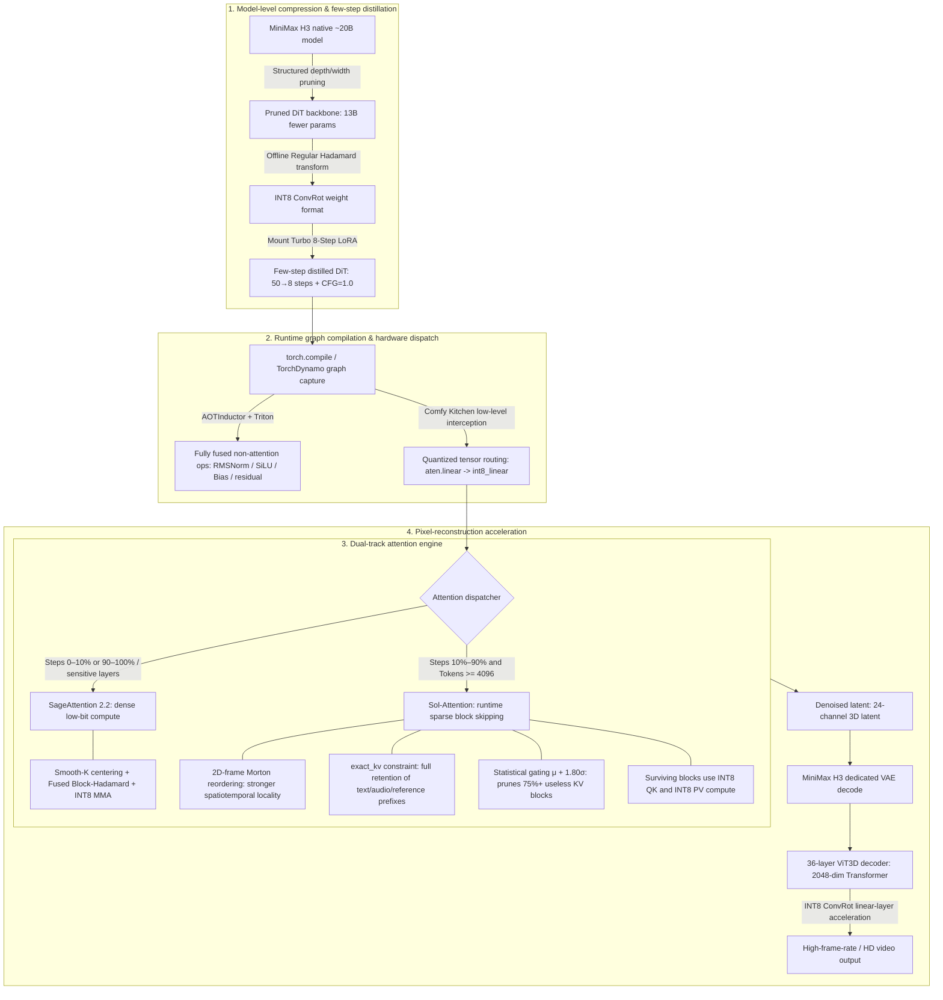
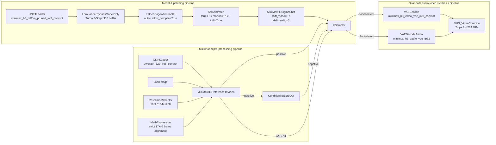

# Kelvoy Project Report

> Competition: 3rd NVIDIA DGX Spark Hackathon  
> Document updated: 2026-09-30 · Based on [PRD v0.2](AI旅行Vlog生产工作台_PRD_v0.2.md) (including the 2026-09 site-wide alignment plan) and the current repository.  
> English edition of [Kelvoy_AI旅行Vlog生产工作台项目说明文档.md](Kelvoy_AI旅行Vlog生产工作台项目说明文档.md)

---

## 1. Project Overview

### 1.1 Naming

**Kelvoy (Chinese name: "可旅", "travel-ready")** is an end-to-end AI video generation system for producing travel vlogs with virtual on-camera characters.

The English name **Kelvoy** combines *Key* and *Voyage*. *Key* stands for locking character assets and consistency — the system's persistent management of a virtual character's appearance, outfits, and style; *Voyage* evokes journeys, exploration, and destination storytelling — the system's ability to mass-produce travel content around real destinations. Together: "one key that opens journey after journey."

The Chinese name "可旅" is short and punchy: it expresses both the readiness to set off and a repeatable way to produce travel content — a perfect fit for the core use case of "one character traveling to many destinations."

### 1.2 Goals

Kelvoy is an **AI travel-vlog production workbench for "virtual character × real destination"** content.

Users pick one virtual on-camera character and one scenic-level destination; the system then automatically handles:

- Destination symbol-pack retrieval and narrative-skeleton generation;
- A 24–30-shot storyboard script with per-shot captions;
- Either creation path:
  - **Direct path (default for new projects)**: character reference image + landmark photo go straight to dual-reference video generation, skipping image generation entirely;
  - **Classic path**: 1–3 keyframe candidates per shot → manual selection → image-to-video;
- Per-shot clip review, trim-point refinement, and quality red-line confirmation;
- Fixed one-second-per-shot cutting (30 frames @30fps), LUT grading, subtitles, transitions, intro/outro, and AI labeling in the compose stage;
- Final-cut delivery, versioning, share links, and credit/usage reporting.

Each episode delivers a **24–30-shot, one-second-per-shot, ~30-second travel vlog in 9:16 portrait (default) or 16:9 landscape**; the same character can be reused across destinations, forming the content of a serialized travel account.

**Core slogan**:

> **Pick a character, go to a real place, and a travel vlog is generated.**
> Kelvoy — let every journey have its vlog.

### 1.3 Background

Kelvoy comes from the team's observation of the "AIGC-replicated travel content" demand: virtual travel bloggers, destination marketing organizations, and agencies need to produce destination content continuously, but live-action filming is expensive, on-camera personas drift across episodes, and general-purpose video tools lack vertical "character + destination" capability.

Reference videos validated the "lock consistency in still frames + one second per shot" method for stable output — and both reference pieces are essentially "the same virtual character visiting different places." Existing tools are either one-shot "generate a video" black boxes or general-purpose editors; nobody has built "one character continuously producing vlogs" as a product.

Kelvoy's moat is not the models, but **character assets, the destination library, and cross-episode consistency**.

Compared with general AI video generators, Kelvoy differentiates on:

- **Characters are account-level assets**: persona and appearance stay consistent across episodes, outfits can change each time;
- **Destinations are shared assets**: landmark/food/transport/stay/season symbol packs are officially maintained;
- **Narrative skeletons are templated**: six destination types map to six shot grammars;
- **Human review gates**: uncertainty is compressed into the script and still-frame stages; the video stage only asks the model to "move a little";
- **Controllable cost**: DGX Spark runs locally first with domestic API overflow; the all-API budget cap per episode is ¥20.

---

## 2. Highlights

### 2.1 Six-Stage Pipeline with Human Review Gates

Production is decomposed into a **six-stage pipeline** with human review gates, keeping the full path from brief to final cut under control:

| Stage | Name | Output | Review gate |
|---|---|---|---|
| Brief | Project creation | Character + destination + season + template + aspect + creation mode | — |
| S1 | Script generation | 24–30-shot storyboard JSON (with per-shot captions) | Review 1: revise script |
| S2 | Character assets | Reference set + character card (version snapshot) | — |
| S3 | Keyframe generation (classic path) | 1–3 candidates per shot, 9:16 / 16:9 | Review 2: pick keyframes |
| S4 | Video generation | 3–5s clip per shot (for a strict 1s cut) | Review 3: pick clips |
| S5 | Compose & deliver | 1s-per-shot beat cutting + LUT + subtitles + transitions + intro/outro + AI-labeled MP4 | Compose-setup confirmation |

**Core idea**: push all uncertainty into the cheap still-frame stages (S1–S3); let the model "move a little" in S4; finish with editing rhythm in S5.

### 2.2 Dual-Reference Direct Video: Skipping the Image Stage

Since 2026-09, new projects default to the `video_source: "references"` direct path:

- Each shot feeds the **first character reference image from the persona version snapshot** and the **first real-photo reference of the script's landmark**, in that order, into the MiniMax H3 dual-reference video workflow (`2_2_DualRef2Video_MinimaxH3`); shots without a landmark use the destination's first scene reference;
- The video prompt merges scene and action descriptions and follows the project's 9:16 / 16:9 aspect, generating 3–5 seconds of material for the user to cut down to exactly one second;
- The flow goes script review → asset checks → video generation → clip review — **no image candidates, no keyframe review, and no image credits**;
- Users can still choose `video_source: "keyframe"` in advanced settings for the classic keyframe path; old projects keep their original flow with no automatic conversion.

### 2.3 A Vertical Genre: Virtual Character × Real Destination

Kelvoy is not a general-purpose AI video generator — it does exactly one genre:

- **Characters are account-level assets**: face, hair, and build are locked; outfits can change per episode; the cross-episode consistency pass rate in manual review is ≥ 90%;
- **Destinations are shared assets**: officially maintained scenic-level symbol packs; each landmark carries 3–10 real reference photos + best viewpoint/time + must-preserve features; the initial catalog ships five destinations (Wuxi Nanchang Street, Wuxi Nianhua Bay, Wuxi Lingshan Buddha, Mount Tai, Huangshan);
- **Narrative skeletons are templated**: six `DestinationType` values (mountain summit / city night / theme town / scenic area / water town / island) map to six shot grammars, with six built-in official templates.

### 2.4 Fixed One-Second Cutting and the Compose Workbench

- New projects store `cut_policy: "fixed_1s"`: **exactly 30 frames per shot** on a 30fps timeline; music only covers the full film and never moves cut points;
- `trim_start_s` snaps to 1/30-second grid; composing uses integer-frame windows, and the Worker validates that selections never run past the clip end;
- Each shot gets an editable caption (`Shot.caption`); subtitles are burned into the one-second window per shot, with intro offsets naturally carried by the concatenation order;
- Adjacent shots cross-dissolve over 2 frames before/after each cut point with no change in total frame count; subtitles and transitions default on and can be turned off in compose setup;
- Intro/outro default off and can be selected in compose setup from delivered assets;
- After clip review the episode enters the `compose_ready` setup stage; composing is enqueued only after the user confirms settings and clicks "Start compose";
- Old projects fall back to `beat_aligned`, keep their original beat-cut strategy, and can be explicitly converted to the new one-second cutting.

### 2.5 Credit Accounting and Cost Reports

- Credit accounts start at zero and are granted by an internal CLI — **no purchase or payment is integrated**; default action prices are script 1, image 1 per image, video 10 per clip, compose 1;
- Project creation and stage submission **atomically reserve** credits; successful tasks settle, terminal failures release; ledger entries are **immutable and idempotent**;
- Tasks use leases; crashed Workers are recovered by the next queue claim;
- Every model call records provider / model / version / seed / prompt / reference hashes / attempts / cost; GPU usage is shown as an independent estimate (shot count × candidates × unit cost × 1.5 rework factor);
- Final cuts are written as versioned `final/<episode>_v<version>.mp4`, verified by ffprobe for duration, resolution, frame rate, size, and completion time; re-editing or re-composing pauses the previous delivery and preserves the user's share toggle on success;
- The usage page shows available/reserved credits and the ledger, plus per-episode and per-model actual API costs (USD).

### 2.6 Local-First, API-Overflow Cost-Controlled Architecture

Running on **two single-GPU DGX Spark machines** (GB10, 128GB unified memory), the system is "self-hosted first, domestic commercial APIs as elastic overflow":

- **Local models**: images (Qwen-Image 2.1 via ComfyUI), video (MiniMax H3 via ComfyUI), compose (ffmpeg on the Worker);
- **API calls**: script generation and instruction-based optimization use StepFun API; video supports Kling/Jimeng API overflow;
- **Retry & overflow**: a failed local shot retries (≤ 2 times), then automatically switches to the same interface on a domestic API; if the API also fails the shot goes `failed`; failed tasks are re-queued from the database with a new action reservation while reusing the original generation ID to keep already-saved candidates;
- **Budget red line**: ¥20 cap for an entire episode with all stages on APIs.

### 2.7 Rerunnable, Reproducible, Resumable

- Every shot's artifacts land independently on disk (`projects/<episode_id>/...`); reruns skip `approved` shots; final cuts are reproducible;
- Reproduction key = (episode_id, shot_no, stage, provider, model, version, seed, prompt hash, ref_hashes);
- Characters and destinations carry version numbers snapshotted at episode creation — later edits never affect old episodes;
- Intermediate artifacts (candidate images, grids, unselected clips) are cleaned after 90 days by default; final cuts, storyboards, and share links are kept.

### 2.8 A Professional Review Desk

- **Review 1 · Script**: script view / storyboard view, CSV export; edit shot fields, reorder, delete shots (floor of 24, no additions), edit captions; instruction-based optimization or full regeneration (row-version atomic marking; failures keep the current script and prompt retry);
- **Review 2 · Keyframes** (classic path): pick a candidate per shot against character and landmark references; pending queue, per-shot mode, regenerate after editing the prompt;
- **Review 3 · Clips**: drag the slider to preview in real time (snap-to-grid at 30fps in the new version), confirm five quality red lines per shot (character consistency, hands OK, landmark shape, physics, no readable text); mark bad shots for regeneration — the first bad-shot report per shot is free;
- **Compose setup**: confirm title, subtitles, transitions, music, intro/outro, then start composing; progress polls in real time;
- **Delivery page**: play the full cut, download the MP4, toggle the public share link, and view this episode's estimated vs. used credits.

---

## 3. Technical Design

### 3.1 Overall Architecture

```
┌─────────────────────────────────────────────────────────────┐
│                    Browser (React + Vite)                    │
│  Landing · Login · New episode · Review desk · Usage ·      │
│  Settings · Share page                                      │
└──────────────────────────┬──────────────────────────────────┘
                           │ /api/* (Hono)
┌──────────────────────────▼──────────────────────────────────┐
│                    apps/web (port 3000)                      │
│  auth · me · personas · destinations · templates            │
│  episodes · review · share · assets                         │
└──────────┬─────────────────────────────────────────────────┘
           │ direct function calls (no internal HTTP API)
┌──────────▼─────────────────────────────────────────────────┐
│            packages/store (SQLite single source of truth)   │
│  episodes · personas · destinations · templates · tasks     │
│  sessions · credit_accounts / actions / ledger / prices     │
└──────────▲─────────────────────────────────────────────────┘
           │ polls tasks table + writes back
┌──────────┴─────────────────────────────────────────────────┐
│                  apps/worker (consumption loop)              │
│  task leases · generation adapters · artifact archival ·    │
│  ffmpeg compose · credit settlement                         │
└───────┬─────────────────────────────────┬─────────────────┘
        │ HTTP (local)                   │ local disk
┌───────▼──────────┐          ┌──────────▼──────────────────┐
│ services/inference│          │ projects/<episode_id>/…     │
│ port 8100         │          │ kf/ clip/ final/ inference/ │
│ /image /video     │          │ music/ lut/ intro/ outro/   │
└───────┬──────────┘          └─────────────────────────────┘
        │ ComfyUI API (8188)
┌───────▼───────────────────────────────────────────────────┐
│           Qwen-Image 2.1 · MiniMax H3 (ComfyUI)            │
│      comfyui-bridge/ workflow templates (1–9 refs)         │
└───────────────────────────────────────────────────────────┘
```

**Source of truth and write-back**:

- Episode JSON lives in local SQLite (`episodes.doc`) as the single source of truth;
- Artifacts (keyframes, clips, final cuts) land on local disk under `projects/<episode_id>/...`;
- Queue tasks carry only `{episode_id, stage, shot_no?, attempt, generation_id}` in the SQLite `tasks` table;
- After dequeuing, the Worker reads/writes episode data directly through `packages/store` (`getEpisode` / `replaceEpisode` with optimistic-lock `row_version`) — no internal HTTP API;
- The review desk only edits review decisions and artifact pointers in the episode JSON, then enqueues a task;
- Progress is browser-polled against `apps/web`, which reads the same SQLite.

### 3.2 Directory Layout

```
Kelvoy/
  apps/web/              # Hono API (src/server) + React/Vite frontend (src/frontend)
  apps/worker/           # Consumption loop: polls tasks, calls inference, writes artifacts, runs ffmpeg
  services/inference/    # Resident Python inference: /image /video over ComfyUI (/llm /upscale placeholders)
  packages/engine/       # Pipeline core (shared by worker/CLI): stages/ providers/ schema/ state/ rules/, IO-free
  packages/store/        # The only SQLite owner: episodes/personas/destinations/templates/tasks + credit tables
  packages/cli/          # Internal tools: run / import-* / seed-catalog / create-user / grant-credits
  comfyui-bridge/        # ComfyUI workflow templates (Qwen-Image 2.1, MiniMax H3, ACE-STEP) + bridge services
  infra/dgx/             # DGX recon notes and deployment (systemd user services)
  assets/demo/           # Demo personas, destination reference photos, catalog.json
  assets/shared/         # Shared assets: music, LUTs, intro, outro
  scripts/ spike/        # Benchmarks & acceptance scripts / one-off hardware validation
  docs/                  # PRD, architecture, ADRs, handbooks, audits
```

**Module boundaries**:

- `engine` makes no IO assumptions: episode JSON and file handles in, updated JSON and artifact paths out;
- `store` is the only place with a SQLite connection: no business rules — state-transition legality is delegated to `engine`'s predicates; store handles reads/writes and optimistic locking;
- `providers/*` do exactly one thing: translate a unified interface to a local inference service or a vendor API, recording provider/model/version/seed/cost; swapping models never touches upper layers;
- `compose` is the only place that touches ffmpeg, running on the worker: slicing, concatenation, intro/outro, LUT, subtitles, transitions, labeling, muxing;
- `services/inference` stays resident in front of ComfyUI and never loads model weights itself.

### 3.3 Core Design Principles

| Principle | Notes |
|---|---|
| Local first | No cloud infrastructure except LLM API calls; data in local SQLite, artifacts on local disk |
| Single source of truth | Episode JSON in SQLite; both frontend and worker call store directly |
| Pluggable providers | One interface per stage, multiple implementations; swapping models never changes upper layers |
| Rerunnable / idempotent | Per-shot artifacts on disk; reruns skip approved shots; cuts are reproducible |
| Transactional consistency | Task result, episode state, and credit settlement commit in one transaction (ADR-0007) |
| Cost visibility | Every call records provider/model/version/duration/cost; episodes roll up into cost reports |

### 3.4 Data Model

Five persistent objects: User, Persona (account-level), Destination (shared, official), Template (official/private), and Episode (one production run). Each is one SQLite record plus one local-disk directory; fields may be extended but never deleted. Queue tasks and login sessions are transient objects, each in one table (`tasks`, `sessions`) of the same SQLite database.

**Episode state machine** (`Episode.status`, 12 states):

```
draft → scripting → script_review → assets → keyframing → kf_review
      → clipping → clip_review → compose_ready → composing → done
```

Any generating state may enter `failed`; `failed` reruns from the failed stage; `done` may return to `composing` (re-compose). Review states advance to the next generating state when the user clicks "continue" in the review desk: clipping starts only after every keyframe is selected, and the episode enters `compose_ready` only after every clip is approved; composing starts only after the user confirms settings.

**Shot state machine** (`Shot.status`, 9 states):

```
draft → generating_kf → kf_ready → kf_selected → generating_clip → clip_ready → approved
```

Any generating state may enter `failed`; marking regeneration in reviews 2/3 moves the shot to `rejected` with a `regen_stage` (`keyframe` / `video`), and the Worker returns it to the corresponding generating state. Deleting a shot is an explicit review-1 action that removes it from `shots[]` into `removed_shots[]`. Reruns skip `approved`.

**Key enums and fields**:

- `DestinationType`: `mountain_summit` / `city_night` / `theme_town` / `scenic_area` / `water_town` / `island`
- `EpisodeAspect`: `9:16` (default) / `16:9`; the server derives `render.res` from it
- `VideoSource`: `references` (direct, default for new projects) / `keyframe` (classic)
- `cut_policy`: `fixed_1s` (new projects) / `beat_aligned` (backfilled for old projects)
- `EpisodeMode`: `per_shot` / `grid`; `grid` is read-only for old JSON, new episodes accept only `per_shot`
- `SceneTime`: morning / noon / afternoon / evening / night; `size` ∈ wide / medium / close / detail / pov; `camera` ∈ static / pan / push / follow
- `Shot.caption`: per-shot caption (burned by the fixed one-second cutting)
- `Episode.final`: final-cut metadata (version, duration, resolution, frame rate, size, completion time; written after ffprobe verification)

### 3.5 Models and Endpoints per Pipeline Stage

| Stage | Implementation | Model / service | Notes |
|---|---|---|---|
| Script / storyboard | `providers/stepfun-llm.ts` | StepFun API (`STEPFUN_API_KEY`) | brief + destination pack → 24–30-shot JSON (with captions); structured output + schema validation; landmark entries must come from the destination library; supports instruction-based regeneration |
| Keyframes (classic) | `services/inference /image/` → ComfyUI | Qwen-Image 2.1 (single ref = character; dual ref = character + landmark) | 1–3 candidates per shot; 9:16 / 16:9; 240s generation budget |
| Image-to-video (classic) | `services/inference /video/` → ComfyUI | MiniMax H3 single-reference (approved keyframe) | 3–5s material cut to 1s; 240s budget |
| Dual-reference direct (default) | `services/inference /video/` → ComfyUI | MiniMax H3 dual-reference (character + scene) | 3–5s material cut to 1s; 270s budget; no image credits |
| Video overflow | `providers/kling-api.ts`, `jimeng-api.ts` | Kling / Jimeng APIs | Automatic switch after ≤ 2 local retries |
| Music | `providers/music-library.ts` | Licensed-library retrieval (not generated) | File names and BPM must match MUSIC_CATALOG |
| Compose | `apps/worker compose/ffmpeg.ts` | ffmpeg (in-house, on the worker) | Integer 30-frame windows, beat cutting, LUT, ASS subtitles, 2-frame transitions, intro/outro, AI label |

**comfyui-bridge workflow templates**: Qwen-Image 2.1 image workflows (text-to-image plus 1–9 references) and MiniMax H3 video workflows (image-to-video, 1–9 references, image+video, image+audio) — 20+ API workflow JSONs in total — plus an ACE-STEP text-to-music workflow and the `comfyui_api_service.py` / `comfyui_edit_service.py` bridge services.

**Inference protocol & acceptance boundary**: successful responses carry `paths`, `model`, workflow-hash `version`, `seed`, and a non-negative `seconds`; the Worker validates the response shape, then checks artifacts, seeds, and staging directories before archiving and recording reference hashes. ComfyUI media downloads stream through temp files (512 MiB per-file cap); PNGs are verified with Pillow and videos decoded with ffmpeg before publication — corrupt media is deleted and the corresponding job canceled.

### 3.6 Task Queue, Leases, and Credit Accounting

- **Queue**: the SQLite `tasks` table (no Redis); the Worker polls every second; tasks carry leases and crashed Workers are recovered by the next claim;
- **Two-level locking**: `_JOBS_LOCK` (global; guards cleanup, backpressure, submission, and the cancellation set) → `_PROJECT_LOCKS[project_id]` (per-project load→edit→save); lock order is always project → jobs, with non-overlapping critical sections;
- **Backpressure**: `MAX_PENDING=8` unfinished jobs; beyond that, new ones are rejected; ≤ 2 local retries before domestic-API overflow;
- **Credit transactions**: creation/stage submissions atomically reserve per `credit_prices` (script=1, image=1, video=10, compose=1); successful tasks settle and write back episode state in one transaction (ADR-0007); terminal failures release; `credit_ledger` entries are immutable and idempotent; the team grants credits via CLI `grant-credits` (external idempotency key);
- **Failure retry**: failed tasks re-queue from the database with a new action reservation while reusing the original `generation_id`, keeping already-saved candidates;
- **Public review endpoints**: only human-editable fields of the corresponding stage can be modified — artifacts and credits cannot be forged.

### 3.7 Frontend–Backend Communication

The frontend uses **React built-in state + polling**. Main API endpoints:

| Endpoint | Method | Purpose |
|---|---|---|
| `/api/health` | GET | Health check |
| `/api/auth/login` / `logout` | POST | Login / logout (httpOnly cookie session) |
| `/api/me` · `/settings` · `/credits` | GET / PATCH | Account info, output defaults, credit balance & ledger |
| `/api/me/password` | POST | Change own password |
| `/api/personas` · `/:id` · `/:id/refs` | GET / POST / PATCH | Persona CRUD and reference uploads |
| `/api/destinations` · `/:id/assets/*` | GET | Destination library and reference photos |
| `/api/templates` · `/:id` | GET / POST / DELETE | Template list, save-as-private, delete |
| `/api/episodes` | GET / POST / PATCH | Episode list (overview / usage / estimate) and creation |
| `/api/episodes/:id/…` | GET / PATCH | Episode detail, edits, file access, save-as-template |
| `/api/episodes/:id/script/:action` | POST | Script optimize / regenerate |
| `/api/episodes/:id/shots…` | PATCH / POST | Per-shot edits, reorder, regenerate, remove, bad-shot report |
| `/api/episodes/:id/continue` / `retry` / `recompose` / `convert-cuts` / `share` | POST | Stage advance, failure retry, re-compose, cut conversion, share toggle |
| `/api/share/:slug` · `/:slug/final.mp4` | GET | Public share page and final cut (no login required) |
| `/api/assets/:path` | GET | Official asset access (row-level owner filtering) |

### 3.8 Deployment

| Service | Port | Notes |
|---|---|---|
| kelvoy-web (apps/web) | 3000 | Hono API + static hosting of the Vite build |
| kelvoy-worker (apps/worker) | — | Task consumption loop + ffmpeg compose |
| kelvoy-inference (services/inference) | 8100 | FastAPI inference adapter |
| ComfyUI | 8188 | Image/video model execution (Qwen-Image 2.1, MiniMax H3) |

**Key environment variables**: `KELVOY_PROJECTS_ROOT` (artifact root, default `projects`), `KELVOY_FONT_FILE` (CJK font, required by drawtext titles and the AI label), `KELVOY_COMFYUI_BASE_URL` (default `http://127.0.0.1:8188`), `INFERENCE_BASE_URL` (default `http://127.0.0.1:8100`), `STEPFUN_API_KEY` (script generation), `PORT` (web port).

**DGX deployment** (see `infra/dgx/README.md` and `docs/guides/reference-design-migration.md`):

- Two DGX Sparks: the shared machine `gx10-8e22` (shared with visionary/shanhai; GPU time manually coordinated) plus hackathon node spark-63 (3.7TB disk; to be reclaimed and wiped by the organizer after the event);
- systemd `--user` services (`kelvoy-web` / `kelvoy-worker` / `kelvoy-inference`), no root required;
- Release order: back up SQLite (online backup + checksums) → update code and dependencies → `seed-catalog` → first open migrates columns → restart services → CLI-grant demo credits to the demo account → walk one full 9:16 and one 16:9 episode on real hardware and verify 30 frames per shot with ffprobe.

---

## 4. Architecture Optimizations

### 4.1 Adapting to DGX Spark

The core constraint of DGX Spark (GB10, 128GB unified memory) is that multiple models cannot stay resident at once. The project therefore adopts **time-sliced loading + local service adapters + serialized task-lease consumption**:

1. **Text stage**: StepFun API generates scripts (a local-LLM slot remains a 501 placeholder in the inference service and can be swapped in after live validation);
2. **Image stage**: `services/inference` adapts ComfyUI (Qwen-Image 2.1) with workflow templates in `comfyui-bridge/`;
3. **Video stage**: MiniMax H3 dual-reference direct / single-reference image-to-video (240–270s generation budgets covering upload, queueing, sampling, download, and validation);
4. **Compose stage**: ffmpeg runs serialized on the worker; integer-frame windows guarantee exactly 30 frames per shot.

### 4.2 Key Optimizations Already Landed

- **Task leases & crash recovery**: expired leases are reclaimed by the next queue claim; a Worker restart never loses tasks;
- **Transactional result commits** (ADR-0007): task result, episode state, and credit settlement commit in one transaction — no "artifact saved but state not written" limbo;
- **Generation-ID reuse**: failed retries keep the original `generation_id`; already-saved candidates are reused instead of burning GPU again;
- **Streaming media download & validation**: streamed temp files capped at 512 MiB + dual integrity checks (Pillow / ffmpeg); corrupt media is auto-cleaned and the ComfyUI job canceled;
- **Graceful shutdown**: SIGTERM stops new claims and lets in-flight tasks finish before exit;
- **Stale-artifact sweeps**: the Worker hourly reclaims stale inference media, publish temp files, and incomplete-episode media to control disk usage;
- **Benchmark scripts**: `scripts/benchmark-*.ts` cover the queue, concurrency, episode lists, and usage aggregation hot paths.

### 4.3 Open Items

- Real-hardware acceptance: dual-reference generation, queue cancellation, Worker restarts, and two complete episodes still need scheduled acceptance on shared GPUs (see `docs/audit/`);
- Disk headroom on the old shared machine (96% used) and GPU contention across projects;
- Estimation constants (GPU minutes per shot) are still M0 placeholders pending live calibration;
- The hackathon node will be reclaimed after the event; the second compute source is undecided.

### 4.4 MiniMax-H3 Full-Stack Video Generation Acceleration

#### 4.4.1 Full-Chain Architecture and Acceleration Topology

MiniMax H3 is a packed-DiT model with joint audio-video generation. Long-sequence denoising and high-resolution video reconstruction are bottlenecked by memory bandwidth (memory-bound), the quadratic complexity of attention (compute-bound), overly long diffusion iterations, and ViT3D VAE decoding latency.

This solution rebuilds low-level operators, prunes the model structure, applies few-step distillation and graph-level compilation, forming a full-stack acceleration system of "**structured pruning + weight/activation orthogonal-rotation quantization + Turbo LoRA trajectory distillation + spatiotemporal adaptive sparse attention + dense smooth-attention fallback + ViT3D decoder quantization + graph-compiler fusion**".



#### 4.4.2 Diffusion-Trajectory Distillation: Turbo LoRA 8-Step Extreme Acceleration

The `minimax_h3_ref2v_turbo_8step_v1.0_768p_comfyui_bf16.safetensors` introduced in the workflow delivers order-of-magnitude speedups along two dimensions: **step count** and **guidance forward passes**.

**(1) Flow-trajectory straightening**

In flow matching, the model learns the velocity field v_θ(xₜ, t) from the Gaussian noise distribution p₀(x) to the real data distribution p₁(x):

$$\frac{d x_{t}}{d t} = v_{\theta}(x_{t}, t)$$

The undistilled velocity field is highly curved; a first-order Euler solver with large steps drifts badly off the data manifold. The Turbo-distilled model uses **progressive consistency distillation** or **rectified-flow distillation (DMD2)**:

1. **Low-rank student fine-tuning**: the INT8 backbone is frozen; low-rank adapters $\Delta W = A \cdot B$ (rank $r \ll d$) are injected into the attention and FFN linear layers of the DiT;
2. **Multi-step-to-single-step jump alignment**: the student is forced to predict, in one large jump from tₙ to tₙ₊ₖ, the same endpoint the teacher reaches with multi-step Runge–Kutta integration:

$$\mathcal{L}_{\text{distill}} = \mathbb{E}\left[ \left\| \hat{x}_{0}^{\text{student}}(x_{t_n}) - \hat{x}_{0}^{\text{teacher-multi-step}}(x_{t_n}) \right\|^2 \right]$$

3. **8-step convergence**: the originally 50-step curved trajectory is "straightened" into 8 straight-line jumps — a **84%** reduction in steps.

**(2) CFG guidance-internalizing distillation**

Conventional diffusion relies on CFG for prompt adherence:

$$\tilde{v}_{\theta}(x_{t}, c, \emptyset) = v_{\theta}(x_{t}, \emptyset) + s \cdot \left(v_{\theta}(x_{t}, c) - v_{\theta}(x_{t}, \emptyset)\right)$$

This forces two forward passes per step — conditional and unconditional — for 50 × 2 = 100 model invocations.

Turbo LoRA distills against a high-CFG teacher, baking the semantic strength of large guidance scales directly into the student's conditional branch:

- **CFG locked to 1.0**: the unconditional branch is skipped entirely at inference; only the positive conditional pass remains;
- **Negative input zeroed out**: `ConditioningZeroOut` bypasses the unconditional branch and saves the extra text-encoder pass.

$$\text{Total forward-pass compression ratio} = \frac{50 \text{ steps} \times 2 \text{ (CFG)}}{8 \text{ steps} \times 1 \text{ (CFG=1.0)}} = \frac{100}{8} = \mathbf{12.5 \times}$$

**The Turbo LoRA alone cuts the entire denoising stage by 12.5× in compute.**

#### 4.4.3 Sol-Attention: Principle and Configuration Deep-Dive

**(1) Mathematical & algorithmic principle**

Self-attention computes:

$$\text{Attention}(Q, K, V) = \text{Softmax}\left(\frac{Q K^T}{\sqrt{d}}\right) V$$

In video generation the sequence length $S = T \times \frac{H}{16} \times \frac{W}{16}$ easily reaches tens or hundreds of thousands of tokens, yet most distant tokens contribute ~0 after Softmax. Sol-Attn uses hardware-level dynamic block skipping:

1. **Block centroid pooling**: with block size `B_s = 64`, Key centroids `k_c` and Value centroids `v_c` are pre-aggregated on the GPU:

   $$k_{c}^{(j)} = \frac{1}{B_{s}} \sum_{i \in \text{block } j} K_{i}$$

2. **Adaptive statistical thresholding**: for query-block centroid `q_c`, coarse attention logits are modeled as Gaussian; the mean $\mu$ and standard deviation $\sigma$ yield:

   $$T_{\text{threshold}} = \mu + \tau \cdot \sigma$$

   Key blocks whose estimated response ceiling falls below `T_threshold` are judged insignificant, and **the Triton kernel skips loading and MMA compute for those blocks entirely**.

**(2) Node configuration mapping and engineering mechanics**

| Parameter | Setting | Rationale & engineering logic |
| :--- | :--- | :--- |
| `tau` | `1.80` | **Sparse-cut quantile** controlling gating aggressiveness ($T = \mu + 1.80\sigma$). 1.80 prunes ~75–85% of redundant KV blocks while keeping core relevance regions. |
| `start_percent` | `0.10` | High-noise early steps build global geometry and subject silhouettes; dense compute is enforced to prevent structural distortion. |
| `end_percent` | `0.90` | The last 10% of steps converges high-frequency microstructure and noise removal; densify again for clean edges. |
| `min_tokens` | `4096` | Below 4096 tokens the centroid/routing overhead exceeds the MMA savings; fall back to the dense operator. |
| `int8_qk` | `true` | After pruning, surviving blocks run the $Q K^T$ matmul on INT8 Tensor Cores — a second layer of throughput. |
| `int8_pv` | `true` | The probability matrix $P$ times Value likewise runs as INT8 MMA. |
| `sink_conditioning` | `exact_kv` | The input layout is `[text][cond][ref_img][ref_audio][audio][video]`; text/reference/audio tokens exhibit attention-sink behavior and must not be pruned. `exact_kv` forces dense KV compute for all conditioning prefixes and sparsifies only video tokens. |
| `morton` | `true` | Raster-scan ordering scatters spatial neighbors across the 1D sequence; Morton (Z-order) re-packing puts neighboring pixels into the same 64-token block, sharpening centroid representativeness and maximizing pruning. |
| `morton_curve` | `2d_frame` | Apply Z-order within each frame only, preserving temporal frame order. |
| `use_tma` | `true` | Use TMA hardware async copies (SM90+, e.g. RTX 50-series/H100) via TensorDescriptor for zero-copy access; gracefully falls back to strided-pointer kernels elsewhere. |
| `dense_blocks` | `(empty)` | Sensitive-layer dense-protection list; empty means all Transformer layers may sparsify outside the protected step ranges. |

#### 4.4.4 Dense & Fallback Attention: SageAttention 2.2

During Sol-Attn's protected intervals (0–10% and 90–100% of steps) or on short sequences, the system routes to **SageAttention 2.2**.

**(1) Smooth-K centering**

Key matrices carry asymmetric per-channel bias that wastes quantization bins under symmetric INT8. Exploiting Softmax's shift invariance:

$$\text{Softmax}\left(\frac{Q K^T}{\sqrt{d}}\right) = \text{Softmax}\left(\frac{Q (K - \bar{k})^T}{\sqrt{d}}\right)$$

A representative Key vector $\bar{k}$ is sampled on-GPU and subtracted from $K$ in real time, removing DC bias, compressing the dynamic range, and sharply reducing INT8 quantization noise.

**(2) Fused Block-Hadamard transform**

For unpredictable outlier spikes in Q and K, an orthogonal Hadamard matrix $H$ ($H^T H = I$) is introduced:

$$(Q H)(K H)^T = Q (H H^T) K^T = Q K^T$$

The orthogonal rotation spreads spike energy concentrated in a few dimensions uniformly across all dimensions, yielding a flat Gaussian distribution and enabling overflow-free, truncation-free, high-fidelity INT8 dot products.

#### 4.4.5 Weight & Activation Quantization: INT8 ConvRot

Large linear layers (Linear/MatMul) of the MiniMax H3 backbone adopt the **INT8 ConvRot** format for standard W8A8 high-speed inference.

**(1) The activation-outlier pain point**

As Transformers deepen, "systematic outlier channels" tens of times larger than normal appear in activations. Under per-row/per-channel symmetric INT8 quantization, the scale factor is dominated by the extreme values and 99% of useful channels quantize to 0 within $[-128, 127]$.

**(2) Regular Hadamard rotation**

ConvRot draws on **QuaRot** and **SpinQuant**, using block-constructed regular Hadamard matrices of order a power of 4:

$$H_{4} = \frac{1}{2} \begin{bmatrix} 1 & 1 & 1 & -1 \\ 1 & 1 & -1 & 1 \\ 1 & -1 & 1 & 1 \\ -1 & 1 & 1 & 1 \end{bmatrix}, \quad H_{4k} = H_{4} \otimes H_{k}$$

1. **Offline weight pre-rotation**: during model packaging, weight matrices are orthogonally projected per group (Group Size = 256) and pre-quantized to INT8 storage:

   $$W_{\text{rot}} = W \cdot H_{\text{block}}^T$$

   This step has **zero runtime cost**.
2. **Online activation rotation**: before activations $X$ enter the GEMM, a fused Triton / C++ kernel rotates them in-flight:

   $$X_{\text{rot}} = X \cdot H_{\text{block}}$$

3. **Strict mathematical equivalence**:

   $$Y = X_{\text{rot}} W_{\text{rot}}^T = (X H) (W H^T)^T = X (H H^T) W^T = X W^T$$

   Since $H H^T = I$, the output is mathematically identical to floating-point matmul; extreme outliers are dispersed uniformly across the group, eliminating quantization error.
4. **Hardware acceleration**: rotated activations and weights are both in INT8, sinking directly into NVIDIA Tensor Cores via `cuBLASLt IMMA` (`torch._int_mm`); versus FP16:
   - Weight memory-bandwidth usage drops **50%**;
   - Compute-core utilization improves nearly **2×**.

#### 4.4.6 Structured Pruning: Cutting 13B Parameters from MiniMax H3

The native model stacks up to 50 Transformer blocks with hidden dim 5376 and FFN dim 14336 — over 20B parameters, impossible to load on a single consumer GPU (e.g. a 24GB RTX 4090/3090).

The accelerated version applies structured pruning to remove ~13B parameters:

**(1) Inter-layer feature-similarity analysis (CKA / residual delta)**

Centered Kernel Alignment (CKA) and block angular distance diagnose the denoising trajectory:

- Shallow blocks handle cross-modal fusion and global silhouettes, with significant residual updates;
- Some adjacent deep blocks show input/output cosine similarity above 0.98 — highly redundant parameters.

**(2) Depth pruning and width shrinkage**

1. **Depth pruning**: safely remove the least-contributing contiguous deep blocks, erasing their Self-Attention, AdaLN modulation, and FFN parameters;
2. **Width shrinkage**: evaluate channel importance of the wide SwiGLU FFN hidden layers (first-order Taylor gradients or activation-magnitude sensitivity) and prune non-critical projection channels;
3. **Physical gains**:
   - ~13B fewer parameters and **60%+** lower theoretical FLOPs;
   - Weights shrink from multi-card-cluster scale to single-card capacity, eliminating OOM entirely.

#### 4.4.7 Breaking the Codec Bottleneck: INT8 ConvRot for the ViT3D VAE

The compute-heavy linear layers of the ViT3D decoder (`X_embedder`, attention QKV projections, output projections, two FFN transforms, and `P_proj_out`) are all converted to **INT8 ConvRot**:

1. **Memory footprint down 50%**, removing peak-memory overflow risk;
2. **Decode latency cut 60%+** — matmuls run directly on Tensor Core IMMA, eliminating the inverted "10s denoise, 8s decode" bottleneck.

#### 4.4.8 System-Level Compilation: Comfy Kitchen & torch.compile

**(1) Comfy Kitchen (low-level hardware abstraction)**

As ComfyUI's next-generation compute-acceleration engine, Kitchen:

- **Quantized-tensor abstraction**: standardized `QuantizedTensor` with `TensorWiseINT8Layout` / `TensorCoreConvRotW4A4Layout` protocols let quantized weights and regular tensors flow transparently through one graph;
- **Native operator interception**: intercepts PyTorch's `aten.linear`, `aten.mm`, and `aten.addmm` at the C++/CUDA layer and transparently redirects to `torch.ops.comfy_kitchen.int8_linear`, eliminating Python-level packing/unpacking and intermediate dequantization.

**(2) `torch.compile` (PyTorch 2.x graph-mode fusion)**

1. **Full elementwise-op fusion**: AdaLN-Single modulation, RMSNorm, SiLU gating, and residual adds each launch separate kernels and round-trip memory in eager mode. TorchDynamo + TorchInductor fuse all consecutive non-GEMM ops into single Triton kernels, dismantling the memory wall;
2. **CPU dispatch overhead erased**: static/semi-static execution graphs relieve the Python interpreter from dispatching hundreds of micro-kernels per denoise step, letting GPU cores run at near-100% duty cycle.

#### 4.4.9 Production ComfyUI Workflow Topology & Node Configuration

This section maps the full production workflow JSON: node dependencies, choices, and exact parameter dictionaries.



**(1) Model & component loading checklist**

| Node type | Role | Core file / model path | Runtime params | Purpose & mechanism |
| :--- | :--- | :--- | :--- | :--- |
| `UNETLoader` | Backbone DiT loader | `minimax_h3_ref2va_pruned_int8_convrot.safetensors` | `weight_dtype: "default"` | Loads the structured-pruned (13B fewer) INT8 backbone with Hadamard-pre-rotated weights. |
| `LoraLoaderBypassModelOnly` | Turbo distillation LoRA | `minimax_h3_ref2v_turbo_8step_v1.0_768p_comfyui_bf16.safetensors` | `strength_model: 1.0` | Injects the 8-step distilled trajectory, compressing 50 denoise steps to 8 while internalizing CFG. |
| `CLIPLoader` | Multimodal text/vision encoder | `qwen3vl_32b_minimax_h3_int8_convrot.safetensors` | `type: "minimax"`<br>`device: "default"` | Loads the Qwen3-VL-32B-based multimodal encoder; layer-50 joint hidden states are injected as conditioning. |
| `VAELoader` (Video) | Video latent decoder | `minimax_h3_video_vae_int8_convrot.safetensors` | default | Loads the 36-layer ViT3D-decoder INT8 ConvRot video VAE; decodes 24-channel spatiotemporal latents. |
| `VAELoader` (Audio) | Audio latent decoder | `minimax_h3_audio_vae_fp32.safetensors` | default | Loads the 32-channel 40Hz stereo audio VAE for high-fidelity spectral synthesis. |

**(2) Sequential patching chain**

Acceleration hooks wrap the Model object in sequence:

1. **`LoraLoaderBypassModelOnly` (mount Turbo LoRA)**: mounts `minimax_h3_ref2v_turbo_8step`; the low-rank adapter reshapes the flow-velocity field for 8-step convergence and CFG=1.0; bypass-model-only mode avoids polluting the CLIP encoder and bloating VRAM.
2. **`PathchSageAttentionKJ` (inject SageAttention)**:
   - `sage_attention`: `"auto"` (auto-detects GPU architecture and available Triton/CUDA kernels, enabling Smooth-K and orthogonal rotation);
   - `allow_compile`: `true` (key setting: replacement operators expose Dynamo-compatible trace signatures so `torch.compile` can compile through).
3. **`SolAttnPatch` (inject Sol-Attention)**: chained after SageAttention as the first-refusal override for self-attention.

   Practical configuration dictionary:

   ```json
   {
     "tau": 1.8,
     "start_percent": 0.1,
     "end_percent": 0.9,
     "min_tokens": 4096,
     "int8_qk": true,
     "sink_conditioning": "exact_kv",
     "morton": true,
     "morton_curve": "2d_frame",
     "int8_pv": true,
     "use_tma": true,
     "dense_blocks": ""
   }
   ```

   Runtime: between 10%–90% of denoise steps with ≥ 4096 tokens it takes over self-attention with 2D Morton reordering and $\mu + 1.8\sigma$ centroid pruning; otherwise it falls through to `PathchSageAttentionKJ` dense INT8 compute.

4. **`MiniMaxH3SigmaShift` (spatiotemporal & audio timestep shift)**: `shift_video: 6.0`, `shift_audio: 3.0`. MiniMax H3's sampler runs on a unified schedule while video and audio evolve at different rates; this node injects a timestep mapping that splits each denoise step into slower video-axis and smoother audio-axis transitions.

**(3) Strict frame-count alignment (MathExpression)**

The spatiotemporal VAE has fixed compression ratios `vae_ratio_t = 4` (time) and `vae_ratio = 16` (space); the temporal sequence must satisfy:

$$\text{Frame Count} \equiv 5 \pmod{17} \quad (\text{i.e. } 17k + 5)$$

Violating this raster requirement makes VAE sampling and the 3D RoPE throw size-mismatch exceptions. The workflow uses `PrimitiveInt` (seconds, e.g. 15) plus a `MathExpression` node computing a legal frame count in closed form:

```python
# a is the requested duration in seconds; 24 is the target FPS
# Core logic: keep at least 5 frames, and round up to the nearest 17k+5 point
max(5, round(a * 24)) + (5 - (max(5, round(a * 24)) % 17)) % 17
```

Alignment example: 15s → 15 × 24 = 360 frames; 360 mod 17 = 3; round up by (5 − 3) mod 17 = 2 frames; output 362 frames (362 = 17 × 21 + 5), perfectly matching the hardware stepping requirement.

**(4) Turbo sampling hyperparameters (KSampler)**

| KSampler param | Value | Rationale |
| :--- | :--- | :--- |
| `steps` | `8` | Matches the `minimax_h3_ref2v_turbo_8step` distilled trajectory; more steps over-sharpen, fewer under-denoise. |
| `cfg` | `1.0` | **Distilled models must lock CFG at 1.0** — guidance is already internalized; higher CFG causes color oversaturation, numeric blow-up, and contrast overflow. |
| `negative` | `ConditioningZeroOut` | With CFG=1.0 the negative prompt contributes nothing; zeroing the positive conditioning avoids a second text-encoding pass. |
| `sampler_name` | `"euler"` | First-order single-step Euler — lowest latency and the best match for distilled flow matching. |
| `scheduler` | `"linear_quadratic"` | Linear stepping early (heavy-noise, stable composition) then quadratic small-step refinement for high-frequency detail. |
| `denoise` | `1.0` | Full denoise mode. |

**(5) Final audio-video muxing (VHS_VideoCombine)**

After `VAEDecode` (video stream) and `VAEDecodeAudio` (stereo audio stream), `VHS_VideoCombine` packages:

- `frame_rate`: `24.0`
- `format`: `"video/h264-mp4"`
- `pix_fmt`: `"yuv420p"`
- `crf`: `19` (visually lossless constant-quality compression)
- `save_output`: `true`

---

## 5. AI Compliance & Sensitive-Information Handling

- **AI labeling**: a semi-transparent "AI 生成 · 虚构角色 · 真实目的地" (AI-generated · fictional character · real destination) watermark in the lower-right corner plus file metadata; model-native SynthID / C2PA markers are preserved, never stripped — explicit and implicit labels per China's *Measures for Labeling AI-Generated Synthetic Content* (effective September 2025);
- **Content safety**: prompt-layer keyword blocking (`rules/content-blocklist.ts`); violations are rejected with a request to revise the creative brief;
- **Portrait rights**: uploading real-person reference photos is allowed at the user's own responsibility (during the in-house phase only photos the team has confirmed rights to are uploaded);
- **Landmark fidelity**: landmark shots must be conditioned on real reference photos; landmark distortion is a quality red line enforced at human review gates;
- **Copyright**: no third-party trademarks are generated; music comes only from the licensed library; private shops are always fictional;
- **Data isolation**: multi-tenant row-level `owner_id` filtering; model and API keys live only on the worker / inference side; share pages expose no account information;
- **Filing**: ICP / algorithm / foundation-model filing is a pre-launch activity outside the current competition scope (research note: `docs/M3-0-备案路径调研.md`).

---

## 6. Operation Manual

### 6.1 Creating an Episode

After signing in, "New episode" offers: an official or personal character, a destination (with landmarks and reference photos), a template, season, tone, and creative requirements. Advanced settings cover template, outfit, banned terms, **creation mode (dual-reference direct video recommended; the classic keyframe mode allows 1–3 candidates per shot)**, and aspect (9:16 default, 16:9 optional). A live credit estimate is shown before submission. Unsubmitted drafts persist in the current browser session; entering from a home-page destination card prioritizes the linked destination.

### 6.2 Review 1: Script

When the script is ready, "Review 1 · Script" provides a script view / storyboard view and CSV export. Edit shot fields (including captions), reorder, or delete shots (floor of 24, no additions; deletions automatically re-validate shot-type continuity and landmark coverage); write an optimization instruction or regenerate the whole script (failures keep the current script and prompt retry). When done, click "Continue → generate video with character & scene" (direct mode) or "Continue → generate assets & keyframes" (classic mode).

### 6.3 Review 2: Keyframes (Classic Path)

Each shot shows 1–3 candidate 9:16 / 16:9 keyframes for side-by-side selection against character and landmark references; a pending queue, expand-all view, and planning grids (view-only) are available; regenerate directly or after editing the prompt. Once every shot is selected, video generation starts.

### 6.4 Review 3: Clips

Each shot generates a 3–5s clip; drag the slider to preview and cut exactly one second (snap-to-30fps grid in the new version; save the start point before continuing); confirm the five quality red lines per shot (character consistency, hands OK, landmark shape, physics, no readable text); mark bad shots for regeneration — the first report per shot is free. When all shots pass, the episode enters compose setup (`compose_ready`).

### 6.5 Compose Setup & Final Cut

Confirm title, subtitles, transitions, music, intro, and outro (new versions enable subtitles and 2-frame transitions by default and disable intro/outro); save settings before "Start compose" becomes available. Composing runs on the worker: integer 30-frame windows per shot, LUT, subtitle burn-in, cross-dissolves, AI watermark + metadata, outputting a 1080×1920 or 1920×1080, 30fps MP4 verified by ffprobe and written to `final/<episode>_v<version>.mp4`. Finished episodes support "Re-compose" (never regenerating approved shots).

### 6.6 Download & Share

Play the full cut, download the MP4, and view this episode's estimated and used credits; the usage page shows available/reserved credits, the ledger, and per-episode/per-model API costs. Toggle "Enable share" for a public link (the share page supports download, copy caption & link, platform shortcuts, and a QR code); disable anytime. Share pages contain no account data, and neither final cuts nor share links expire with the 90-day cleanup.

---

## 7. Completeness

- **Functionally complete**: six-stage pipeline + review gates + two creation paths + compose setup + review desk + credits/usage + versioned delivery + export & sharing — the core loop is fully wired;
- **Full frontend & backend**: web workbench (Hono + React 18 + Vite 5 + TypeScript, with the landing page, login, share page, and help center) + worker orchestration + local SQLite storage;
- **Complete model chain**: scripts (StepFun API) + images (ComfyUI + Qwen-Image 2.1) + video (ComfyUI + MiniMax H3 dual-reference / image-to-video) + music (licensed library) + compose (ffmpeg);
- **Stable operation**: local DGX Spark deployment, systemd user services, task leases + graceful shutdown + transactional commits;
- **Well-documented**: PRD v0.2 (four rounds of design-canvas comparison and scope adjustments), 7 ADRs, deployment & migration guides, the M0 handbook, and audit records;
- **Demoable**: the full brief-to-final flow runs live through the review gates, with cost reports, failure retry, and regeneration on display.

---

## 8. Differences from the 2nd Hackathon Winner WanderInk

| Dimension | WanderInk (2nd edition) | Kelvoy (this edition) |
|---|---|---|
| Output form | Illustrated audio comic short (images + narration + BGM) | Travel-vlog short (video + subtitles + BGM) |
| Core scenario | Scenic-cultural-IP storytelling | Virtual-character travel content production |
| Character consistency | Three-view references + fixed art style | Three-view + version snapshots + dual-reference direct video |
| Generation mode | Fully automatic pipeline | Six stages + human review gates + two creation paths (direct / keyframe) |
| Editing | Page rhythm with narration | Strict one-second (30-frame) fixed cutting + subtitle burn-in + 2-frame transitions |
| Architecture | Web + FastAPI | Web + Worker + local SQLite + FastAPI inference adapter + ComfyUI |
| Resource accounting | None | Atomic credit reserve/settle/release + versioned delivery + usage page |
| Hardware utilization | Full DGX Spark local stack | DGX Spark time-slicing + ComfyUI + API overflow + ffmpeg compose |

---

## 9. Judging-Criteria Mapping

| Criterion | Weight | Kelvoy coverage |
|---|---|---|
| Practicality, industry value & technical innovation | 25% | Solves continuous content production for virtual travel bloggers, destination marketers, and agencies; vertical "virtual character × real destination" genre; dual-reference direct video skips the image stage; fixed one-second cutting |
| Agent integration & model-optimization depth | 25% | Six-stage pipeline + review gates; StepFun script generation & instruction optimization; full-stack MiniMax H3 acceleration (pruning + INT8 ConvRot + Turbo LoRA + Sol/Sage attention + torch.compile); task leases and transactional settlement; retry & overflow |
| Completeness | 20% | Both creation paths fully functional; web workbench + review desk + credits/usage; versioned delivery and share pages; PRD + ADRs + deployment/migration guides + audits |
| Platform fit | 15% | Time-sliced loading on DGX Spark's 128GB unified memory; ComfyUI image/video pipelines; ffmpeg compose; domestic API overflow; systemd user services |
| Demo quality | 10% | Live web progress + keyframe candidates + clip preview + final playback + share QR code; walk the review gates live with cost reports and failure retry |
| Hackathon essay | 5% | PRD iteration records (v0.1→v0.2 + four design-canvas comparisons + scope adjustments), ADRs, audits, and acceptance records |

---

## 10. Team & Project Timeline

### 10.1 Team

| Member | Responsibility |
|---|---|
| 张小白 (Zhang Xiaobai / Zhang Hui) | Lead · product planning · PRD · environment setup · demo prep |
| 小腾子 (Xiaotengzi) | Prototype design · testing · demo video recording |
| 般度五子 (Bandukids) | ComfyUI deployment & development · image/video pipeline |
| 馄饨 (Huntun) | Web frontend & backend · review desk · credit system |

### 10.2 Project Timeline

[2026.9.29] **馄饨** kept optimizing the code and shipped the third release. **张小白** added the 4–8-reference image/video generation interfaces with [documentation](../comfyui-bridge/AI_USAGE_GUIDE.md), produced the [demo deck](demo/Kelvoy可旅_DEMO-V0.3.pptx) and the [demo video](https://www.bilibili.com/video/BV1PWaW6oEo1), wrote the ["Ten-Day Diary" hackathon essay](https://zhuanlan.zhihu.com/p/2088388112300892508), finalized the [project report](Kelvoy_AI旅行Vlog生产工作台项目说明文档.md), and submitted the entry.

[2026.9.28] **馄饨** found GPT extremely slow and opened a new Claude account (fingers crossed it won't be banned again).

[2026.9.27] **小腾子** delivered a new round of prototypes.

[2026.9.26] **馄饨** switched the vibe-coding tool to ChatGPT6, kept developing and testing, spent a day building with sol medium, and deployed the second release. Team testing found the product needed credits, so 100,000 credits were allocated to every member.

[2026.9.25] **馄饨**'s Claude Max account was banned and development nearly stalled — the project's first major blocker. **般度五子** wrote the image/video generation development handbooks and emphasized that prompts supported by QwenImage2.1 work better.

[2026.9.24] **馄饨** deployed the first release on the cloud Spark. **般度五子** configured the latest Qwen Image 2.1, MiniMax-H3, and StepFun ACEStep on ComfyUI — enabling 1–3/9-reference image and video generation — and optimized generation across the board. For the LLM, the team chose the StepFun Coding Plan Pro package from the organizer.

[2026.9.23] **馄饨** generated the first prototype with claude fable 5.1; **小腾子** drew three more prototype variants on top of it. **张小白** created the code repository, obtained a set of scenic photos from a friend for reference, and set short-term goals.

[2026.9.22] The topic was set to "scenic-area vlogs" and **小腾子** joined the team. **馄饨** exchanged ideas with friends on x.com for product inspiration and wrote the PRD. **小腾子** named the project **可旅 (Kelvoy)**, which everyone approved.

[2026.8.31] The team was founded as **"金银铜铁队" (Gold-Silver-Copper-Iron)** — a nod to all members being from Wuxi — completed registration, and applied for the cloud Spark device.

---

## 11. Closing

Kelvoy is not an "AI generates a video" toy — it is a **professional, intervention-friendly, deployable** AI workbench for virtual-character travel content. It makes full use of NVIDIA DGX Spark's unified memory, combines StepFun script generation, ComfyUI image and video pipelines (with the full-stack MiniMax H3 acceleration suite: structured pruning, INT8 ConvRot quantization, Turbo LoRA distillation, Sol/Sage attention, and graph compilation), the licensed music library, and FFmpeg compositing — closing the loop on "character assets + destination library + cross-episode consistency + one-second-per-shot industrial cutting". It is a complete practice of industrialized AI video.

> **Pick a character, go to a real place, and a travel vlog is generated.**
> Kelvoy — let every departure have a story to tell.
