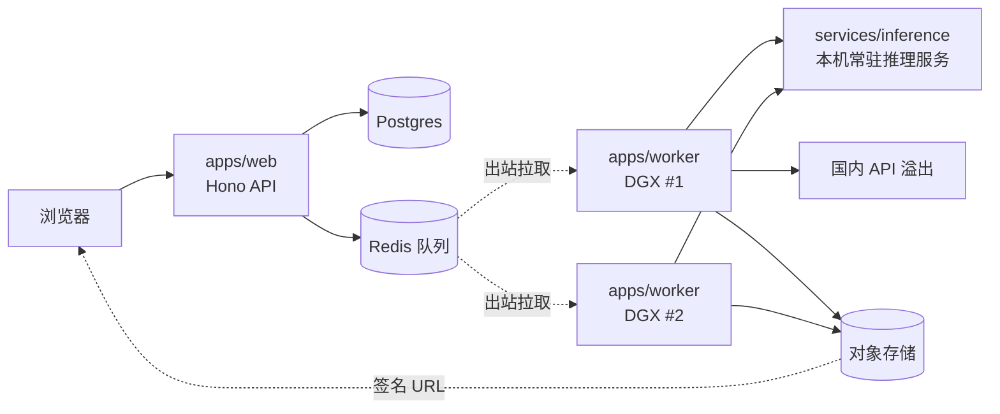

# Kelvoy Architecture

> 实现状态同步文档,不是设计文档——设计依据见 `docs/AI旅行Vlog生产工作台_PRD_v0.1.md` 第 9 节和 `docs/decisions/0002-...md`。目前所有模块都还是骨架占位,没有真实逻辑。

## 目录

```
Kelvoy/
├── apps/
│   ├── web/          # Hono API + React/Vite 前端
│   └── worker/         # GPU worker(TS)，跑在 DGX，只做出站连接
├── services/
│   └── inference/       # 常驻 Python 推理服务：llm/image/video/upscale
├── packages/
│   ├── engine/            # 流水线核心：stages/ providers/ schema/ templates/，worker 和 cli 共用
│   └── cli/                # 内部工具：run <stage> --episode <id>
└── infra/                    # docker-compose(本地) + DGX 编排占位
```

## 数据流(PRD §9)



web 不碰模型;DGX 只做出站连接,公网无入站端口;一台 DGX 宕机容量减半但不停服;ffmpeg 合成在 worker 上跑。

## 实现状态

| 模块 | 状态 |
|---|---|
| `packages/engine` schema(Persona/Destination/Episode) | 类型已按 PRD §6 落实,无运行时校验 |
| `packages/engine` stages/providers | 骨架占位,`throw new Error("not implemented")` |
| `apps/web` | Hono `/api/health` 可用,其余路由空壳 |
| `apps/worker` | 骨架占位,队列客户端库未选 |
| `services/inference` | FastAPI `/health` 可用,四个模型 router 占位 501 |
| `infra` | 仅本地 docker-compose 占位,DGX 编排待定 |

待定项见 `docs/decisions/0002-...md` 和 PRD 第 11 节。
