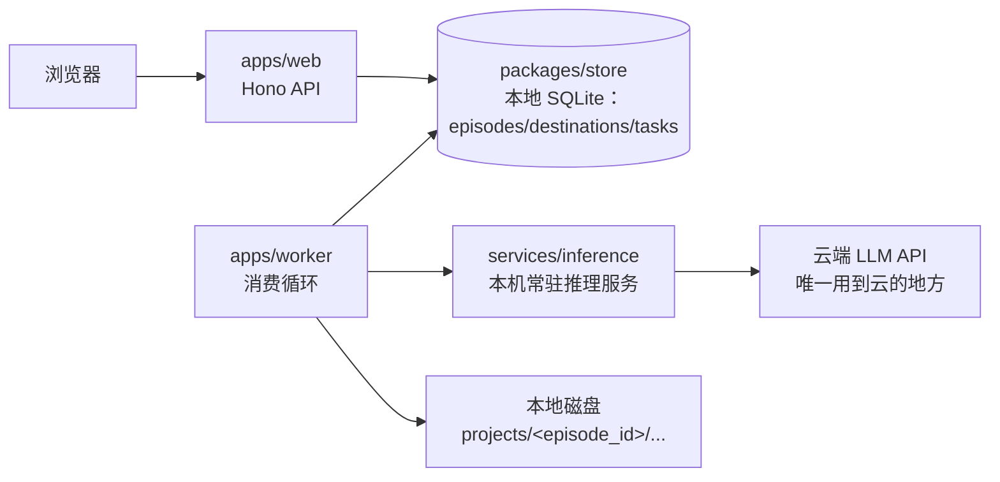

# Kelvoy Architecture

> 实现状态同步文档,不是设计文档——设计依据见 `docs/AI旅行Vlog生产工作台_PRD_v0.2.md`(§9 的云端架构描述已被 `docs/decisions/0004-local-sqlite-no-cloud-infra.md` 取代,PRD 正文待同步更新)和 `docs/decisions/0002-...md`。

## 目录

```
Kelvoy/
├── apps/
│   ├── web/          # Hono API + React/Vite 前端
│   └── worker/         # GPU worker(TS)，跑本地任务队列消费循环
├── services/
│   └── inference/       # 常驻 Python 推理服务：llm/image/video/upscale
├── packages/
│   ├── engine/            # 流水线核心：stages/ providers/ schema/ state/ rules/，worker 和 cli 共用，不碰 IO
│   ├── store/               # 唯一拥有 SQLite 的地方：episodes/destinations/tasks，apps/web 和 apps/worker 都调它
│   └── cli/                  # 内部工具：run <stage> --episode <id>、import-destination
└── infra/                      # DGX 编排笔记，无需本地容器编排（ADR-0004）
```

## 数据流(ADR-0004)



读法:web 和 worker 暂时在同一台机器上,都直接调 `packages/store` 的函数——没有 HTTP 内部 API,没有 Redis,没有 Postgres,没有对象存储。产物文件直接落本地磁盘。除了脚本/分镜阶段可能调云端 LLM API,其余都是本地自部署。`packages/store` 是刻意留出的边界:以后如果要把生图/生视频/ffmpeg 拆到不同 DGX,只需要把这一层的实现换掉,`apps/web`/`apps/worker` 的调用代码不用动。

## 实现状态

| 模块 | 状态 |
|---|---|
| `packages/engine` schema(Persona/Destination/Episode) | 类型已按 PRD §6 落实,`schema/validate.ts` 有运行时校验 |
| `packages/engine` state(状态机) | Episode/Shot 转移函数 + 合法性判断已完成，有测试 |
| `packages/engine` rules(FR-02) | 镜数/景别连续/地标覆盖/地标引用规则已实现 |
| `packages/engine` stages/providers | brief/script/compose 已实现;compose 出 ComposePlan(卡拍 `rules/beat.ts`、账号级 LUT、片头片尾、AI 标识水印+元数据、选曲),ffmpeg 执行在 `apps/worker`;assets/keyframe/video 仍是 `throw new Error("not implemented")` |
| `packages/store` | episodes(读/patch/replace,乐观锁)、destinations(读/upsert)、tasks(入队/出队/完成/失败重试)均已实现，有测试 |
| `apps/web` | Hono `/api/health` 可用,其余 `/api/*` 路由空壳,没有 `/internal/*` 了 |
| `apps/worker` | 消费循环真实实现（轮询 `packages/store` 的 tasks 表），产物存本地 `projects/` 目录;`compose/ffmpeg.ts` 是全系统唯一调 ffmpeg 的地方（环境要求见 `apps/worker/README.md`） |
| `services/inference` | FastAPI `/health` 可用,四个模型 router 占位 501 |
| `infra` | 不需要本地容器编排；DGX 侦察记录见 `infra/dgx/README.md` |

待定项见 PRD 第 11 节和各 ADR。
