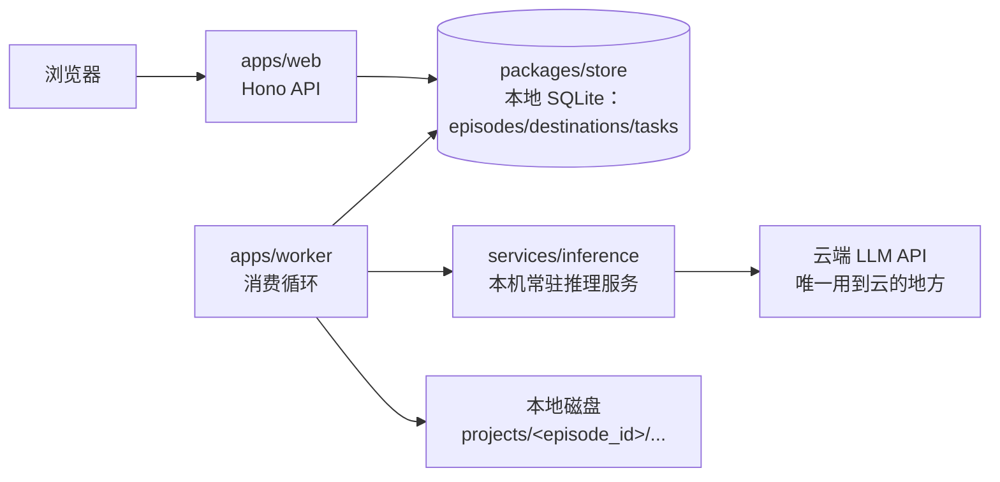

# Kelvoy Architecture

> 实现状态同步文档,不是设计文档——设计依据见 `docs/AI旅行Vlog生产工作台_PRD_v0.2.md`(§9 的云端架构描述已被 `docs/decisions/0004-local-sqlite-no-cloud-infra.md` 取代,PRD 正文待同步更新)和 `docs/decisions/0002-...md`。

## 目录

```
Kelvoy/
├── apps/
│   ├── web/          # Hono API + React/Vite 前端
│   └── worker/         # GPU worker(TS)，跑本地任务队列消费循环
├── services/
│   └── inference/       # 常驻 Python 推理服务：llm/image/video/upscale
├── packages/
│   ├── engine/            # 流水线核心：stages/ providers/ schema/ state/ rules/，worker 和 cli 共用，不碰 IO
│   ├── store/               # 唯一拥有 SQLite 的地方：episodes/destinations/tasks，apps/web 和 apps/worker 都调它
│   └── cli/                  # 内部工具：run <stage> --episode <id>、import-destination
└── infra/                      # DGX 编排笔记，无需本地容器编排（ADR-0004）
```

## 数据流(ADR-0004)


```mermaid
flowchart LR
  U[浏览器] --> W[apps/web<br/>Hono API]
  W --> ST[(packages/store<br/>本地 SQLite：episodes/destinations/tasks)]
  K[apps/worker<br/>消费循环] --> ST
  K --> M[services/inference<br/>本机常驻推理服务]
  M --> LLM[云端 LLM API<br/>唯一用到云的地方]
  K --> D[本地磁盘<br/>projects/&lt;episode_id&gt;/...]
```

读法:web 和 worker 暂时在同一台机器上,都直接调 `packages/store` 的函数——没有 HTTP 内部 API,没有 Redis,没有 Postgres,没有对象存储。产物文件直接落本地磁盘。除了脚本/分镜阶段可能调云端 LLM API,其余都是本地自部署。`packages/store` 是刻意留出的边界:以后如果要把生图/生视频/ffmpeg 拆到不同 DGX,只需要把这一层的实现换掉,`apps/web`/`apps/worker` 的调用代码不用动。

## 实现状态

| 模块 | 状态 |
|---|---|
| `packages/engine` schema(Persona/Destination/Episode) | 类型已按 PRD §6 落实,`schema/validate.ts` 有运行时校验 |
| `packages/engine` state(状态机) | Episode/Shot 转移函数 + 合法性判断已完成，有测试 |
| `packages/engine` rules(FR-02) | 镜数/景别连续/地标覆盖/地标引用规则已实现 |
| `packages/engine` stages/providers | brief/script/assets/keyframe/video/compose 主流程已实现；engine 产出生成及合成请求，实际推理与 ffmpeg 由 Worker 注入；模型契约和真机验收仍待完成 |
| `packages/store` | SQLite 期/目录/任务/积分；目的地版本快照、一次性旧库回填和任务结果事务见 [ADR-0007](decisions/0007-transactional-results-and-catalog-snapshots.md) |
| `apps/web` | Hono 账号、期、审核、上传、分享 API 与 React 前端已实现；首页/作品页使用概览列表，性能和交互审计仍在进行 |
| `apps/worker` | 消费循环真实实现（轮询 `packages/store` 的 tasks 表），产物存本地 `projects/` 目录;`compose/ffmpeg.ts` 是全系统唯一调 ffmpeg 的地方（环境要求见 `apps/worker/README.md`） |
| `services/inference` | FastAPI 图像/视频通过 ComfyUI；`/llm` 与 `/upscale` 仍为 501；四份生产工作流已静态检查，真实 DGX 验收待做 |
| `infra` | 不需要本地容器编排；DGX 侦察记录见 `infra/dgx/README.md` |

待定项见 PRD 第 11 节和各 ADR。

目的地共享发布：engine 定义草稿内容与发布完整性校验；store 独占私有草稿与发布快照的 SQLite 事务；web 负责会话、上传与路径授权；worker 继续读取旧期冻结的目的地版本。协议见 [草稿 API](api/destination-drafts.md)。

### 全站系统配置与检测（ADR-0010）

Web `/api/system/*` 认证与运维白名单 → `@kelvoy/store` 单例配置／版本／全站活跃任务事务锁；Web 使用与 Worker 相同的 `INFERENCE_BASE_URL` 调 Inference `/system/diagnostics`，由推理机器只读检查 ComfyUI 和 bridge。Worker 每任务读取冻结配置，生成请求传入 ComfyUI 覆盖，缓存纳入后端标识。普通账号不接收内部地址或静态依赖详情。bridge 不属于生成必需链路，系统检测不证明 Worker 存活或模型可实际出图。
