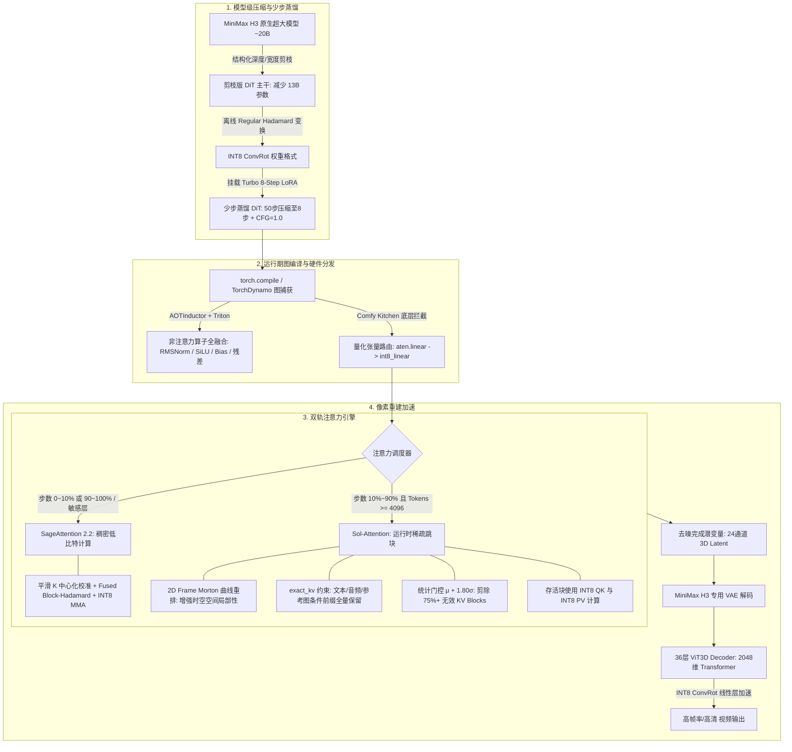
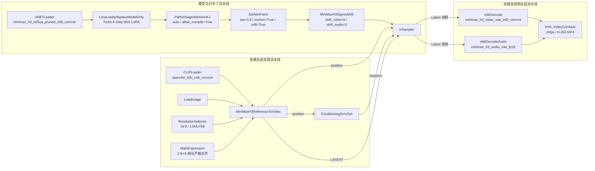

# MiniMax H3 视频生成全链路加速技术规格与工作流实战手册

## 1. 全链路架构概览与加速拓扑

MiniMax H3 是一款音视频联合生成的 Packed-DiT 架构模型，在长序列去噪与高分辨率视频重建中受限于显存带宽（Memory-Bound）、注意力二次方计算复杂度（Compute-Bound）、扩散去噪迭代步数过长以及 ViT3D VAE 解码延迟。

本方案通过底层算子重构、模型结构精简、少步蒸馏与图级编译，构建了“**结构化剪枝 + 权重/激活正交旋转量化 + Turbo LoRA 轨迹蒸馏 + 时空自适应稀疏注意力 + 稠密平滑注意力回退 + ViT3D 解码器量化 + 图编译器融合**”的全栈加速体系。



---

## 2. 扩散轨迹蒸馏：Turbo LoRA 8 步极限加速原理

原生扩散与 Flow Matching 模型求解常微分方程（ODE）或随机微分方程（SDE）时，由于积分路径弯曲，通常需要 30~50 个迭代步数（Sampling Steps），且往往依赖无分类器引导（Classifier-Free Guidance, CFG），导致单步需执行正向与负向两次模型前向。

工作流引入的 `minimax_h3_ref2v_turbo_8step_v1.0_768p_comfyui_bf16.safetensors` 从**步数**与**引导前向次数**两个维度实现数量级加速。

### 2.1 流匹配轨迹拉直（Flow Trajectory Straightening）
在 Flow Matching 体系中，模型学习的是从高斯噪声分布 p₀(x) 到真实数据流分布 p₁(x) 的速度向量场 v_θ(xₜ, t)：

$$\frac{d x_{t}}{d t} = v_{\theta}(x_{t}, t)$$

未蒸馏的原生模型速度场具有高曲率，采用一阶欧拉求解器步长过大时会严重偏离真实数据流形。Turbo 蒸馏模型采用**渐进一致性蒸馏（Progressive Consistency Distillation）**或**整流流蒸馏（Rectified Flow Distillation / DMD2）**：
1. **学生网络低秩微调**：冻结 INT8 主干，仅在 DiT 的注意力和 FFN 核心线性层注入低秩适配器 $\Delta W = A \cdot B$（秩 $r \ll d$）；
2. **多步到单步跳跃对齐**：强制使学生模型在 tₙ 到 tₙ₊ₖ 的单步大跨度预测，匹配教师模型执行多步 Runge-Kutta 积分后的目标终点：

   $$\mathcal{L}_{\text{distill}} = \mathbb{E}\left[ \left\| \hat{x}_{0}^{\text{student}}(x_{t_n}) - \hat{x}_{0}^{\text{teacher-multi-step}}(x_{t_n}) \right\|^2 \right]$$

3. **8 步极速收敛**：原本需要 50 步细致积分的弯曲轨迹被“拉直”为 8 段直线段跃迁，步数直接压缩 **84%**。

### 2.2 CFG 引导内化蒸馏（Guidance Distillation）
常规扩散生成必须借助 CFG 维持提示词遵循度：

$$\tilde{v}_{\theta}(x_{t}, c, \emptyset) = v_{\theta}(x_{t}, \emptyset) + s \cdot \left(v_{\theta}(x_{t}, c) - v_{\theta}(x_{t}, \emptyset)\right)$$

这要求模型每一步都分别计算有条件（Conditional）与无条件（Unconditional）两次前向，实际计算量为 $50 \times 2 = 100$ 次模型推断。

Turbo LoRA 在蒸馏阶段利用高 CFG 教师模型作为目标，将大引导系数 $s$ 的语义强度直接蒸馏固化进学生模型的条件分支中：
- **锁定 CFG = 1.0**：推理时完全关闭无条件分支计算，仅保留正向条件前向；
- **负向输入直接置零**：通过 `ConditioningZeroOut` 将无条件分支旁路阻断，避免额外的文本编码器开销。

$$\text{总前向次数压缩比} = \frac{50 \text{ 步} \times 2 \text{ (CFG)}}{8 \text{ 步} \times 1 \text{ (CFG=1.0)}} = \frac{100}{8} = \mathbf{12.5 \times}$$

**仅 Turbo LoRA 单项技术，便带来了整个去噪阶段高达 12.5 倍的算力开销缩减。**

---

## 3. 稀疏注意力：Sol-Attention 原理与配置深度剖析

### 3.1 数学与算法原理
自注意力机制计算公式为：

$$\text{Attention}(Q, K, V) = \text{Softmax}\left(\frac{Q K^T}{\sqrt{d}}\right) V$$

在视频生成任务中，序列长度 $S = T \times \frac{H}{16} \times \frac{W}{16}$ 往往达到数万甚至数十万 Token。然而，绝大部分空间与时域距离较远的 Token 对当前 Query 的注意力贡献在经过 Softmax 后接近于 0。

Sol-Attn 采用硬件级动态跳块机制：
1. **分块质心提取（Block Centroid Pooling）**：以 `B_s = 64` 为分块尺寸，预先在 GPU 上聚合计算 Key 质心 `k_c` 与 Value 质心 `v_c`：

   $$k_{c}^{(j)} = \frac{1}{B_{s}} \sum_{i \in \text{block } j} K_{i}$$

2. **动态统计阈值截断（Adaptive Thresholding）**：对于 Query Block 质心 `q_c`，将粗粒度注意力 Logits 视为高斯分布建模，动态计算其均值 $\mu$ 与标准差 $\sigma$：

   $$T_{\text{threshold}} = \mu + \tau \cdot \sigma$$

   若某个 Key Block 的估计响应上限低于 `T_threshold`，该 Block 对最终输出的贡献被判定为不显著，**算子在 Triton 内核层完全跳过该 Block 的加载与 MMA 计算**。

### 3.2 节点配置参数映射与工程机制

| 参数项 | 当前设定 | 深度原理与工程逻辑 |
| :--- | :--- | :--- |
| `tau` | `1.80` | **稀疏截断分位数**。控制统计门控的激进程度（$T = \mu + 1.80\sigma$）。设定为 1.80 可剪除约 75%~85% 的冗余 KV Block，在显著降低 FLOPs 的同时保留核心相关性区域。 |
| `start_percent` | `0.10` | **采样起始百分比**。扩散去噪的前 10% 步数处于高噪阶段，主要建立全景几何构图与主体轮廓，在此阶段强制保持 Dense 全量计算，防止结构畸变。 |
| `end_percent` | `0.90` | **采样终止百分比**。最后 10% 步数负责高频微结构收敛与噪点消除，关闭稀疏化回退至 Dense 计算，保证最终画面边缘纯净。 |
| `min_tokens` | `4096` | **序列长度门槛**。Token 数量小于 4096 时，维护质心与路由掩码的开销超过跳块带来的矩阵乘法收益，此时自动回退到常规稠密算子。 |
| `int8_qk` | `true` | **QK 点积量化加速**。在跳块剪枝后，对保留的高相关性 Block，使用 INT8 Tensor Core 执行 $Q K^T$ 矩阵乘法，双重叠加计算吞吐。 |
| `int8_pv` | `true` | **PV 点积量化加速**。注意力概率矩阵 $P$ 与 Value 向量点积同样采用 INT8 MMA 执行。 |
| `sink_conditioning` | `exact_kv` | **多模态条件前缀保护**。MiniMax H3 的输入序列格式为 `[text][cond][ref_img][ref_audio][audio][video]`。文本提示词、参考图与音频具有极高的注意力汇聚（Attention Sink）效应，若被稀疏剪枝会导致提示词失效或音视频失步。`exact_kv` 强制所有条件 Token 的 KV Block 执行无损密集计算，仅对后续的视频 Token 实施稀疏化。 |
| `morton` | `true` | **时空局部性重排序**。原生光栅扫描（Raster-Scan）展开使空间邻近像素在 1D 内存序列中相距极远。启用 Morton（Z 序曲线）重新排列 Token，使空间临近的 2D 像素打包进相同的 64-token Block 内，大幅强化 Block 质心的表征能力，使注意力权重分布更为尖锐，最大化 Sol-Attn 的剪枝比率。 |
| `morton_curve` | `2d_frame` | **帧内二维莫顿曲线**。保持时间轴帧序递进，仅在单帧空间网格内应用 Z 序重排。 |
| `use_tma` | `true` | **异步张量拷贝**。启用 TMA（Tensor Memory Accelerator）硬件异步直通，在支持硬件（SM90+，如 RTX 50 系列/H100）上利用 TensorDescriptor 实现零拷贝访存；非兼容设备自动优雅回退至 Strided Pointer 内核。 |
| `dense_blocks` | `(empty)` | **敏感层稠密保护列表**。为空表示除起止保护步外，所有 Transformer 层均允许稀疏化。 |

---

## 4. 稠密与回退注意力：SageAttention 2.2 核心机制

在 Sol-Attn 的保护区间（0%~10% 与 90%~100% 步数）或短序列场景下，系统自动链式路由至 **SageAttention 2.2**。

### 4.1 平滑 Key 中心化校准（Smooth-K）
注意力计算中，Key 矩阵在不同通道上存在严重的非对称静态偏置，导致直接对称 INT8 量化时大量量化阶被无效浪费。利用 Softmax 的平移不变性：

$$\text{Softmax}\left(\frac{Q K^T}{\sqrt{d}}\right) = \text{Softmax}\left(\frac{Q (K - \bar{k})^T}{\sqrt{d}}\right)$$

在 GPU 端采样代表性 Key 向量 $\bar{k}$ 并从 $K$ 中实时扣除，消除通道直流偏置，将动态范围极度压缩并居中，显著降低 INT8 量化噪声。

### 4.2 Fused Block-Hadamard 变换
针对 Q 与 K 矩阵中不可预测的离群孤立峰值（Outliers），引入正交哈达玛矩阵 $H$（$H^T H = I$）：

$$(Q H)(K H)^T = Q (H H^T) K^T = Q K^T$$

通过正交旋转将集中在极少数维度的峰值能量均匀弥散至所有维度，使得数值服从平缓的高斯分布，从而实现无溢出、无截断的高保真 INT8 点积。

### 4.3 算子级深度融合
在 Triton 实现中，将缩放、量化、INT8 MMA 计算、Softmax（以 FP32 精度累加保证数值稳定性）以及反量化融合在单个持久化 Kernel 内，完全避免了向 GPU Global Memory（显存）写回中间激活矩阵的带宽瓶颈。

---

## 5. 权重与激活值量化：INT8 ConvRot 原理

MiniMax H3 主干网络的大规模线性层（Linear/MatMul）采用 **INT8 ConvRot** 格式，实现标准 W8A8 高速推理。

### 5.1 激活值离群点（Activation Outliers）痛点
随着 Transformer 模型参数与层数加深，激活值中常出现幅值高达常规通道数十倍的“系统性离群通道”。若采用常规每行/每通道对称 INT8 均匀量化，量化缩放因子（Scale）会被异常极大值主导，导致其余 99% 的有效特征通道在量化到 $[-128, 127]$ 时退化为 0。

### 5.2 正规哈达玛旋转（Regular Hadamard Rotation）
ConvRot 借鉴 **QuaRot** 与 **SpinQuant** 理论，使用分块构造的阶数为 4 的幂次的正规哈达玛矩阵（Regular Hadamard Matrix）：

$$H_{4} = \frac{1}{2} \begin{bmatrix} 1 & 1 & 1 & -1 \\ 1 & 1 & -1 & 1 \\ 1 & -1 & 1 & 1 \\ -1 & 1 & 1 & 1 \end{bmatrix}, \quad H_{4k} = H_{4} \otimes H_{k}$$

1. **离线权重预旋转（Offline Weight Rotation）**：
   在模型打包转换阶段，对权重矩阵按组（Group Size = 256）执行正交投影并预量化为 INT8 存储：

   $$W_{\text{rot}} = W \cdot H_{\text{block}}^T$$

   此过程在推理期**无任何计算与时间开销**。
2. **在线激活值融合旋转（Online Activation Rotation）**：
   在激活值 $X$ 进入 GEMM 前，通过 Triton / C++ 高性能融合内核执行在线旋转：

   $$X_{\text{rot}} = X \cdot H_{\text{block}}$$

3. **严格数学等价性**：

   $$Y = X_{\text{rot}} W_{\text{rot}}^T = (X H) (W H^T)^T = X (H H^T) W^T = X W^T$$

   因为正交矩阵满足 $H H^T = I$，理论输出与浮点矩阵乘法完全等价。原本聚集在个别特征通道的极端离群点被均匀分散到整个组内，消除量化误差。
4. **硬件级加速**：
   旋转后的激活值与权重均处于 INT8 域，直接下沉至 NVIDIA Tensor Core 执行 `cuBLASLt IMMA`（`torch._int_mm`），相比 FP16 模式：
   - 权重显存带宽占用降低 **50%**；
   - 计算核心利用率提升近 **2 倍**。

---

## 6. 结构化剪枝：MiniMax H3 削减 13B 参数的机制

MiniMax 原生模型结构包含多达 50 层 Transformer Block、隐藏维度达 5376、FFN 维度达 14336，全量参数超过 20B，无法在单张消费级显卡（如 24GB 显存的 RTX 4090 / 3090）上加载运行。

本加速版本采用结构化剪枝，直接减除约 13B 参数，具体机制如下：

### 6.1 层间特征相似度分析（CKA / Residual Delta）
利用中心核对齐（Centered Kernel Alignment, CKA）与块角度距离（Block Angular Distance）对扩散模型去噪演化过程进行诊断：
- 浅层 Block 负责跨模态特征融合与全局轮廓生成，特征残差更新显著；
- 深入网络中后段的某些相邻 Transformer Block，其输入与输出表征的余弦相似度极高（> 0.98），存在高度参数冗余。

### 6.2 深度裁剪（Layer Pruning）与宽度收缩（Width Pruning）
1. **深度裁剪**：识别并安全移除冗余贡献最小的连续深层 Transformer Block，直接抹除整个 Block 所占用的 Self-Attention、AdaLN 调制层与 FFN 参数；
2. **宽度收缩**：对超宽的 SwiGLU FFN 隐藏层进行通道重要性评估（基于 Taylor 展开一阶梯度或激活幅值敏度分析），裁剪非关键投影通道；
3. **物理收益**：
   - 模型参数总量削减约 13B，理论浮点运算量（FLOPs）降低 **60% 以上**；
   - 模型权重从多卡集群级体量压缩至单卡可承载范围，彻底消除显存不足（OOM）问题。

---

## 7. 编解码瓶颈突破：ViT3D VAE 的 INT8 ConvRot 量化

常规生图/视频模型多采用 2D/3D CNN 架构的 VAE 解码器，而 **MiniMax H3 采用了极其庞大的 ViT3D（3D 视觉 Transformer）解码器**。

### 7.1 传统 FP16 ViT3D 解码痛点
MiniMax H3 VAE 的解码器包含：
- **36 层 Transformer Block**；
- **32 个注意力头，隐藏维度 2048**；
- 3D 旋转位置编码（RoPE 3D）与长序列 Patch 展开。

在高分辨率长视频解码时，24 通道的潜变量需要展开为海量时空 Token 进行全自注意力与 MLP 投影计算。在 FP16 精度下，仅 VAE 解码环节就常占总体耗时的 30%~40%，并伴随显存瞬间飙升。

### 7.2 INT8 ConvRot 在 ViT3D 中的落地
针对 ViT3D 解码器中占据主要计算耗时的线性层（`X_embedder`、Attention QKV 投影、Output 线性投影、两层 FFN 线性变换以及 `P_proj_out`），全部转换为 **INT8 ConvRot** 格式：
1. **显存占用直降 50%**：解除显存峰值溢出风险；
2. **解码延迟削减 60%+**：矩阵运算直接由 Tensor Core IMMA 高速执行，消除“去噪 10 秒，解码 8 秒”的倒挂瓶颈。

---

## 8. 系统级编译与底层框架协同：Comfy Kitchen 与 torch.compile

上述算法的最终性能释放高度依赖底层的软硬件一体化管道协同：

### 8.1 Comfy Kitchen（底层硬件抽象库）
作为 ComfyUI 官方维护的下一代计算加速引擎，Kitchen 在框架层发挥关键作用：
- **量化张量抽象**：提供标准化的 `QuantizedTensor` 与 `TensorWiseINT8Layout` / `TensorCoreConvRotW4A4Layout` 协议，使量化权重和常规 Tensor 在同一个计算图内透明流转；
- **原生算子劫持**：在 C++/CUDA 层面直接拦截 PyTorch 的 `aten.linear`、`aten.mm` 与 `aten.addmm`，透明重定向至底层 `torch.ops.comfy_kitchen.int8_linear`，消除了 Python 层的封包/解包与中间反量化开销。

### 8.2 `torch.compile`（PyTorch 2.x 图模式融合）
1. **逐元素算子全融合（Kernel Fusion）**：
   MiniMax H3 的 Transformer Block 中存在大量的 AdaLN-Single 调制、RMSNorm、SiLU 门控与残差加法。在原生 PyTorch Eager 模式下，每个算子都会触发一次独立的 GPU Kernel 启动与显存往返读写（Launch Overhead & Memory Roundtrip）。
   通过 `torch.compile`（TorchDynamo + TorchInductor 后端代码生成），Inductor 将上述连续非 GEMM 算子全部融合成单一 Triton 算子，彻底消除内存墙限制。
2. **CPU 调度开销抹除**：
   通过生成静态/半静态执行图，极大减轻了 Python 解释器在每个去噪步内分发数百个微内核的 CPU 瓶颈，使 GPU 计算核心能够以接近 100% 的满载占空比运行。

---

## 9. ComfyUI 生产级工作流拓扑与节点配置工程规范

本节基于完整的生产工作流 JSON，梳理整个加速流水线的节点依赖、选型与精确参数字典。



### 9.1 模型与组件加载规格清单

| 节点类型 | 节点实例名称 | 核心文件 / 模型路径 | 运行配置参数 | 作用与机制 |
| :--- | :--- | :--- | :--- | :--- |
| `UNETLoader` | 主干 DiT 加载器 | `minimax_h3_ref2va_pruned_int8_convrot.safetensors` | `weight_dtype: "default"` | 载入结构化剪枝 13B、且全权重经 Hadamard 预旋转量化的 INT8 主干模型。 |
| `LoraLoaderBypassModelOnly` | Turbo 蒸馏加速 LoRA | `minimax_h3_ref2v_turbo_8step_v1.0_768p_comfyui_bf16.safetensors` | `strength_model: 1.0` | 注入 8 步蒸馏扩散轨迹，将常规 50 步去噪压缩至 8 步，并内化 CFG 引导。 |
| `CLIPLoader` | 多模态文本/视觉编码器 | `qwen3vl_32b_minimax_h3_int8_convrot.safetensors` | `type: "minimax"`<br>`device: "default"` | 载入基于 Qwen3-VL 32B 的多模态编码器，提取第 50 层的联合隐藏状态作为条件注入。 |
| `VAELoader` (Video) | 视频潜空间解码器 | `minimax_h3_video_vae_int8_convrot.safetensors` | 默认 | 载入 36 层 ViT3D Decoder 架构的 INT8 ConvRot 视频 VAE，解码 24 通道时空潜变量。 |
| `VAELoader` (Audio) | 音频潜空间解码器 | `minimax_h3_audio_vae_fp32.safetensors` | 默认 | 载入 32 通道 40Hz 的立体声音频 VAE，保证音频频域高保真合成。 |

---

### 9.2 链式打补丁流水线（Sequential Patching Chain）

加速核心通过对 Model 对象进行链式包装，依次挂载各层优化钩子：

1. **`LoraLoaderBypassModelOnly`（挂载 Turbo LoRA）**：
   - 挂载 `minimax_h3_ref2v_turbo_8step`，利用低秩适配器（Rank Adapter）重塑主干模型的流速度场，使之具备 8 步大步长收敛与 CFG=1.0 内化能力；
   - 旁路加载（Bypass Model Only）模式避免对 CLIP 文本编码器产生非必要污染与显存膨胀。
2. **`PathchSageAttentionKJ`（注入 SageAttention）**：
   - `sage_attention`: `"auto"`（自动探测 GPU 架构与可用 Triton/CUDA 内核，激活平滑 K 与正交旋转机制）；
   - `allow_compile`: `true`（关键配置：确保底层的替换算子暴露 PyTorch Dynamo 兼容的 Trace 签名，允许后续与 `torch.compile` 无缝编译）。
3. **`SolAttnPatch`（注入 Sol-Attention）**：
   - 串联在 SageAttention 之后，作为模型的第一道自注意力拦截器（First-Refusal Override）。
   - **实战配置字典**：
     ```json
     {
       "tau": 1.8,
       "start_percent": 0.1,
       "end_percent": 0.9,
       "min_tokens": 4096,
       "int8_qk": true,
       "sink_conditioning": "exact_kv",
       "morton": true,
       "morton_curve": "2d_frame",
       "int8_pv": true,
       "use_tma": true,
       "dense_blocks": ""
     }
     ```
   - **运行机制**：在 10%~90% 去噪步数且 Token 数量 $\ge 4096$ 时，接管 Self-Attention 执行 2D Morton 重排与 $\mu + 1.8\sigma$ 质心剪枝；在不符合条件的步数与层级，自动回退传递给 `PathchSageAttentionKJ` 运行稠密 INT8 计算。
4. **`MiniMaxH3SigmaShift`（时空与音频时间步偏移）**：
   - `shift_video`: `6.0`
   - `shift_audio`: `3.0`
   - **机制**：MiniMax H3 的采样器在统一调度轴运行，但内部视频与音频具有不同的特征演化速率。通过此节点注入时间步映射函数，将单去噪步长动态分配为视频轴较缓、音频轴平滑的闭式时间转换。

---

### 9.3 时空帧长严格对齐公式（MathExpression 计算）

MiniMax H3 的时空 VAE 编码器具有时间轴 `vae_ratio_t = 4`、空间轴 `vae_ratio = 16` 的固定压缩率，其时间序列必须严格满足：

$$\text{Frame Count} \equiv 5 \pmod{17} \quad (\text{即 } 17k + 5)$$

若输入的视频帧数不满足此栅格要求，VAE 采样与时空位置编码（3D RoPE）将产生尺寸失配抛出异常。

工作流中使用 `PrimitiveInt`（输入秒数，例如 15 秒）配合 `MathExpression` 节点，通过如下数学表达式实现动态合法帧长闭式计算：

```python
# 输入 a 为设定秒数，24 为目标帧率 FPS
# 核心逻辑：确保最少 5 帧，且不足 17k+5 时向上补齐至最近的周期点
max(5, round(a * 24)) + (5 - (max(5, round(a * 24)) % 17)) % 17
```

**对齐样例**：
- 输入 15 秒 $\to$ 理论帧数 $15 \times 24 = 360$ 帧；
- $360 \pmod{17} = 3$；
- 向上对齐到 $(5 - 3) \pmod{17} = 2$ 帧；
- 输出实际总帧数：$360 + 2 = 362$ 帧（$362 = 17 \times 21 + 5$），完美对齐硬件步进要求。

---

### 9.4 Turbo 采样去噪超参数调优（KSampler）

搭配 8 步蒸馏 LoRA 使用时，采样器各项参数需严格遵循蒸馏扩散物理特性：

| KSampler 参数 | 设定值 | 调优依据与工程原理 |
| :--- | :--- | :--- |
| `steps` | `8` | 匹配 `minimax_h3_ref2v_turbo_8step` 的蒸馏轨迹。步骤过多会导致画面过度锐化与高频伪影，少于 8 步则导致未充分去噪。 |
| `cfg` | `1.0` | **蒸馏模型必须锁定为 1.0**。Turbo 蒸馏在训练时已将提示词引导内化，若开启 CFG（> 1.0）将引发严重的色彩过饱和、数值爆炸及对比度溢出。 |
| `negative` | `ConditioningZeroOut` | 由于 CFG = 1.0，负向提示词不参与梯度外推。通过 `ConditioningZeroOut` 节点直接将正向条件置零作为负向输入，避免二次文本编码的计算开销。 |
| `sampler_name` | `"euler"` | 一阶单步欧拉求解器，计算延迟最低，与扩散蒸馏流匹配度最高。 |
| `scheduler` | `"linear_quadratic"` | 线形-二次混合调度。在初期（大噪声阶段）采用线性步进保证构图平稳，在末期切换为二次平滑步进以极小步长精准收敛高频细节。 |
| `denoise` | `1.0` | 完整去噪模式。 |

---

### 9.5 最终音视频合成（VHS_VideoCombine）

经 `VAEDecode`（视频图像流）与 `VAEDecodeAudio`（立体声音频流）解压后，送入 `VHS_VideoCombine` 进行封包：
- `frame_rate`: `24.0`
- `format`: `"video/h264-mp4"`
- `pix_fmt`: `"yuv420p"`
- `crf`: `19`（视觉无损恒定质量压缩）
- `save_output`: `true`

---

## 10. 参考文献与学术支撑

1. **Diffusion Step Distillation & Flow Straightening (步数蒸馏与轨迹拉直)**:
   - *Sauer, A., Lorenz, D., Blattmann, A., & Rombach, R. (2023).* **Adversarial Diffusion Distillation.** *arXiv:2311.17042.*
   - *Yin, T., Gharbi, M., Zhang, R., Shechtman, E., Durand, F., & Freeman, W. T. (2024).* **One-step Diffusion with Distribution Matching Distillation (DMD).** *CVPR 2024.*
   - *Liu, X., Zhang, X., Ma, C., Peng, J., & Qi, G. J. (2023).* **InstaFlow: One Step is Enough for High-Quality Diffusion-Based Text-to-Image Generation.** *ICLR 2024.*
   - *Wang, Z. et al. (2024).* **Phased Consistency Model (PCM).** *arXiv:2406.02696.*
2. **Sol-Attention (稀疏注意力)**:  
   *Li, H., Li, Y., Chen, J., Ye, T., Liu, H., Yu, J., Wang, D., Zhang, R., Xie, Z., Xie, E., & Han, S. (2026).*  
   **Sol-Attn: Accelerating Video Generation Inference via On-the-Fly Attention Sparsification.**  
   *arXiv preprint arXiv:2607.24027 (NVlabs / MIT HAN Lab).*
3. **SageAttention (低比特高效注意力)**:  
   *Zhang, J., Wei, F., Zhang, R., Zhang, J., & Guo, Y. (2025).*  
   **SageAttention: Accurate and Efficient 8-Bit Attention for Plug-and-play Inference Acceleration.**  
   *International Conference on Learning Representations (ICLR 2025) / arXiv:2410.02367.*  
   *Zhang, J. et al. (2024).* **SageAttention2: Efficient 4-Bit Attention for LLMs and Visual Generation.** *arXiv:2411.10958.*
4. **QuaRot (基于哈达玛旋转消除异常值)**:  
   *Ashkboos, S., Mohtashami, A., Croci, M. L., Li, B., Jaggi, M., Alistarh, D., Hoefler, T., & Hensman, J. (2024).*  
   **QuaRot: Outlier-Free 4-Bit Inference of Large Language Models via Hadamard Transformations.**  
   *arXiv preprint arXiv:2404.00456.*
5. **SpinQuant (旋转量化体系)**:  
   *Liu, Z., Zhao, Y., Cheng, M., Shen, C., & Darrell, T. (2024).*  
   **SpinQuant: LLM Quantization with Learned Rotation.**  
   *arXiv preprint arXiv:2405.16406.*
6. **模型深度结构化剪枝理论**:  
   *Men, X., Yao, M., Lin, Q., Wang, B., Zhang, P., & Han, X. (2024).*  
   **ShortGPT: Layers in Large Language Models are More Redundant Than You Expect.**  
   *arXiv preprint arXiv:2403.03853.*  
   *Ashkboos, S. et al. (2024).* **SliceGPT: Compress Large Language Models by Deleting Rows and Columns.** *ICLR 2024.*
7. **PyTorch 2.x 图模式编译器**:  
   *Ansel, J., Yang, E., He, H., Gimelshein, N., Jain, A., Voznesensky, M., ... & Chintala, S. (2024).*  
   **PyTorch 2: Faster Machine Learning Through Dynamic Python Bytecode Transformation and Graph Compilation.**  
   *Proceedings of the 29th ACM International Conference on Architectural Support for Programming Languages and Operating Systems (ASPLOS 2024).*
